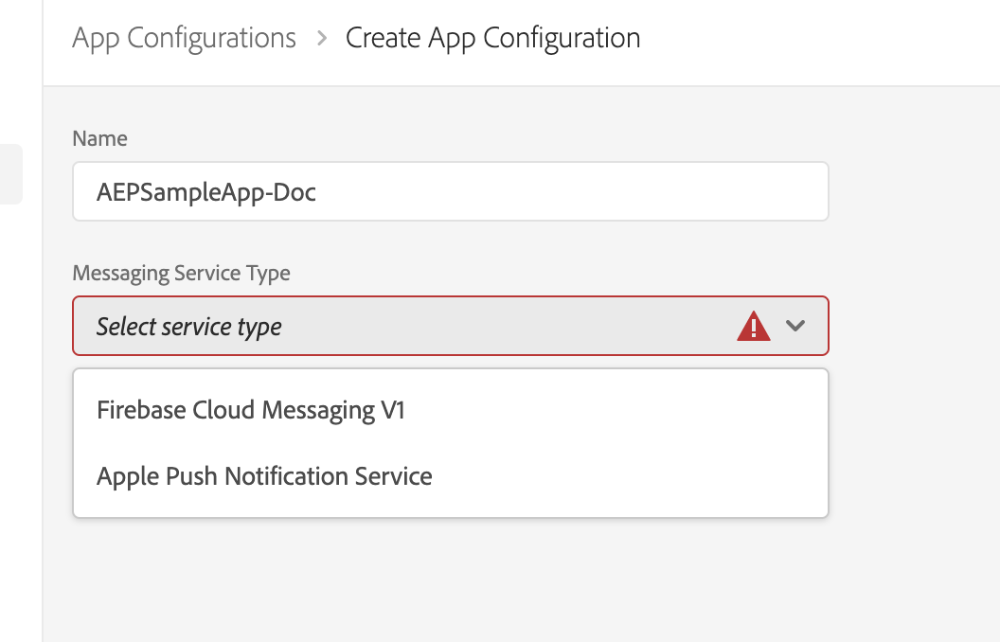
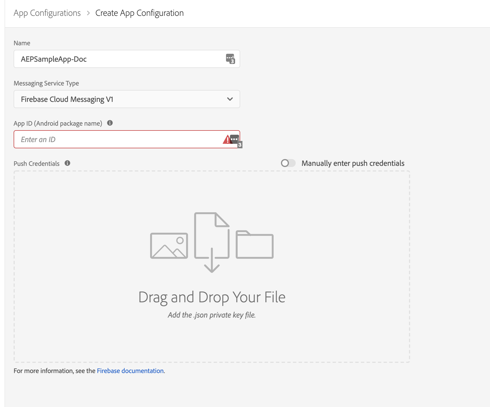
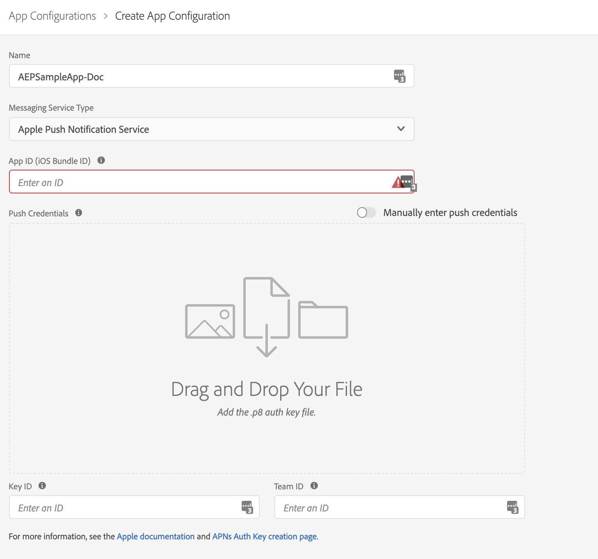

# Adobe Journey Optimizer

The [Adobe Journey Optimizer](https://business.adobe.com/products/journey-optimizer/adobe-journey-optimizer.html) extension for Adobe Experience Platform Mobile SDKs powers push notifications for your mobile apps. This extension helps you collects user push tokens and manages interaction measurement with Adobe Experience Platform services.


Adobe Journey Optimizer is a beta product.

Please contact your Adobe Customer Success Manager for more details.



### Prerequisites

As this extension supports Adobe Journey Optimizer, which is currently a beta product, your Adobe administrator may need to provide your workspace with additional permissions. Please contact your Adobe Customer Success Manager for further detail.


## Update Datastream with Profile Dataset

1. Ensure you have a properly configured Datastream by following [Configure datastreams](../../getting-started/configure-datastreams.md)
2. Navigate to your previously configured Datastream and select **CJM Push Profile Dataset**

   in **Profile Dataset** dropdown \(found in **Adobe Experience Platform** section\) and hit **Save**.


## Configure the Journey Optimizer extension in Launch

1. Navigate to [Experience Platform Launch](https://launch.adobe.com) - select mobile property, click the **Extensions** tab.
2. On the **Catalog** tab, locate the **Adobe Journey Optimizer** extension, and click on **Install**.
3. Select the **Event Dataset** for Production, Stage and Development Environments. The datasets selected should use a schema that uses the Push Notification Tracking mixin. For more information, see [Setup Schemas & Datasets](https://github.com/Adobe-Marketing-Cloud/aep-sdks-documentation/tree/62a861aec745af2d8237c287656c68d8f8cdd5ed/getting-started/configure-schema-and-dataset.md).
4. Click **Save**.
5. Follow the publishing process to update SDK configuration.


## Configure Application Configuration

1. In Experience Platform Launch, click the **App Configurations** tab on the left pane.
2. Click the **Add App Configuration** button.
3. Provide a **Name** and select the **Messaging Service Type**





1. Provide the **App ID \(Android package name\)**. Usually the package name is the app id in your `build.gradle` file.
2. Drag and drop the FCM push credentials. For more details on how to get the push credentials follow [the Firebase documentation](https://firebase.google.com/docs/admin/setup#initialize-sdk).





1. Provide the **App ID \(iOS Bundle ID\)**. Bundle Id can be found in the `General` tab of the primary target in **XCode**.
2. Drag and drop the **Apple Push Notification Authentication Key** for your Apple developer account. This key can be acquired from the **Certificates, Identifiers & Profiles** page. 
3. Provide the **Key ID**. This is a 10 character string assigned during the creation of p8 auth key. It can be found under **Keys** tab in **Certificates, Identifiers & Profiles** page.
4. Provide the **Team ID**. This is a string value which can be found under the Membership tab.



For more information follow this [Apple's documentation](https://help.apple.com/developer-account/#/deva05921840)



## Configure the application to allow push notification



To add Firebase Messaging Service to your app please follow the [Firebase documentation](https://firebase.google.com/docs/cloud-messaging/android/client)



To add APNs to your app please follow the [Apple's documentation](https://developer.apple.com/documentation/usernotifications/registering_your_app_with_apns)



## Add the AEP Messaging extension to your application

After you have integrated [Mobile Core](../../foundation-extensions/mobile-core/), [Adobe Experience Platform Edge Network](../../foundation-extensions/experience-platform-extension/), and [Identity for Edge Network](../../foundation-extensions/identity-for-edge-network/) extensions, follow these steps to also integrate the Adobe Journey Optimizer extension.

### Download and import the Messaging extension



### Java

1. Add the Mobile Core, Edge, EdgeIdentity and Messaging extensions to your project using the app's Gradle file.

   ```java
   implementation 'com.adobe.marketing.mobile:core:1.+'
   implementation 'com.adobe.marketing.mobile:edge:1.+'
   implementation 'com.adobe.marketing.mobile:edgeidentity:1.+'
   implementation 'com.adobe.marketing.mobile:messaging:1.0.0-beta-1'
   ```

2. Import the Mobile Core, Edge, EdgeIdentity and Messaging extensions in your application class.

   ```java
    import com.adobe.marketing.mobile.*;
    import com.adobe.marketing.mobile.edge.identity.Identity;
   ```



1. Add the Mobile Core, Edge, EdgeIdentity and Messaging extensions to your project using Cocoapods. Add following pods in your `Podfile`:

   ```swift
   use_frameworks!
   target 'YourTargetApp' do
       pod 'AEPCore'
       pod 'AEPEdge'
       pod 'AEPEdgeIdentity'
       pod 'AEPMessaging', :git => 'git@github.com:adobe/aepsdk-messaging-ios.git', :branch => 'main'
   end
   ```

2. Import the Mobile Core, Edge, EdgeIdentity and Messaging libraries:

### Swift

```swift
// AppDelegate.swift
import AEPCore
import AEPEdge
import AEPEdgeIdentity
import AEPMessaging
```

### Objective-C

```text
// AppDelegate.h
@import AEPCore;
@import AEPEdge;
@import AEPEdgeIdentity;
@import AEPMessaging;
```



### Register Messaging extensions with Mobile Core



### Java

```java
public class MobileApp extends Application {
    @Override
    public void onCreate() {
      super.onCreate();
      MobileCore.setApplication(this);
      MobileCore.configureWithAppID("yourLaunchEnvironmentID");
      try {
        Edge.registerExtension();
        Identity.registerExtension();
        Messaging.registerExtension(); // register Messaging
        MobileCore.start(new AdobeCallback() {
          @Override
          public void call(final Object o) {
            // processing after start
          }});
      } catch (Exception e) {
        //Log the exception
      }
    }
}
```



### Swift

```swift
// AppDelegate.swift
func application(_ application: UIApplication, didFinishLaunchingWithOptions launchOptions: [UIApplication.LaunchOptionsKey: Any]?) -> Bool {
    MobileCore.registerExtensions([Identity.self, Edge.self, Messaging.self], {
        MobileCore.configureWith(appId: "yourLaunchEnvironmentID")
    })
  ...
}
```

### Objective-C

```text
// AppDelegate.m
- (BOOL)application:(UIApplication *)application didFinishLaunchingWithOptions:(NSDictionary *)launchOptions {
    [AEPMobileCore registerExtensions:@[AEPMobileEdgeIdentity.class, AEPMobileEdge.class, AEPMobileMessaging.class] completion:^{
    [AEPMobileCore configureWithAppId: @"yourLaunchEnvironmentID"];
  }];
  ...
}
```



## Configuration keys

To update the SDK configuration programmatically, use the following information to change the Messaging configuration values.

| Key | Required | Description | Data Type | Platform |
| :--- | :--- | :--- | :--- | :--- |
| messaging.eventDataset | Yes | Experience Event Dataset Id which can be found from experience platform | String | Android/iOS |
| messaging.useSandbox | No | See more details in the [Messaging documentation](https://github.com/adobe/aepsdk-messaging-ios/blob/dev/Documentation/SetupSDK.md#using-apnssandbox-environment-for-push-notification) | Boolean | iOS |

## What OS & platform versions are supported?

* Android versions 4.4 or later \(API levels 19 or later\)
* iOS versions 10 or later

