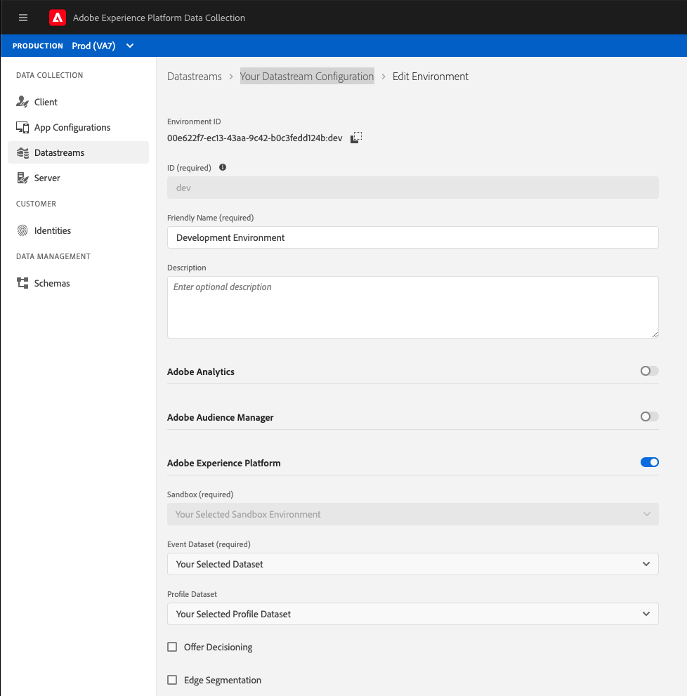
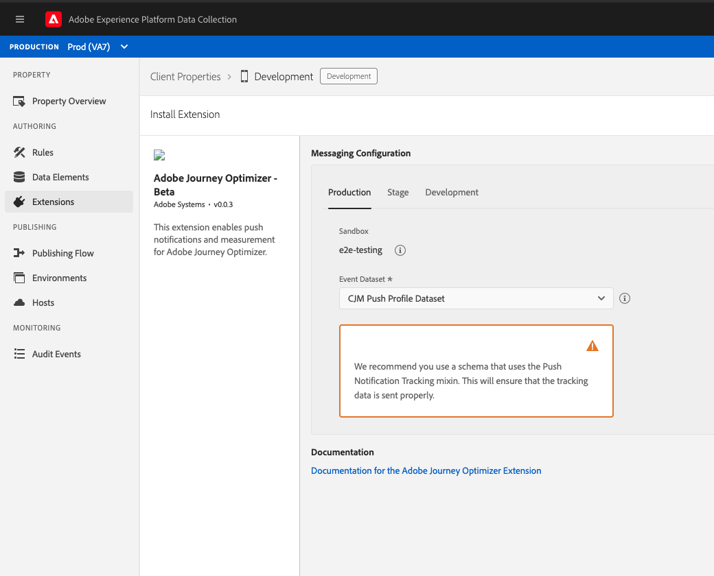

# Adobe Journey Optimizer

The [Adobe Journey Optimizer](https://business.adobe.com/products/journey-optimizer/adobe-journey-optimizer.html) extension for Adobe Experience Platform Mobile SDKs powers push notifications for your mobile apps. This extension helps you collects user push tokens and manages interaction measurement with Adobe Experience Platform services.

The following documentation details how to use the extension as well as the required configuration across Adobe Experience Platform services, app stores, and your apps to get started with push notifications for Adobe Journey Optimizer.


### Beta

Adobe Journey Optimizer is a beta product. Your Adobe administrator may need to provide your workspace with additional permissions. Please contact your Adobe Customer Success Manager for more details. 


## Getting Started

To get started with the Adobe Journey Optimizer extension, you'll need to follow these steps:

1. [Update your app's Datastream](./#update-datastream-with-profile-dataset) in [Adobe Experience Platform Data Collection](https://launch.adobe.com)
2. 
### Update Datastream with Profile Dataset

Navigate to a previously configured Datastream by following [Configure datastreams](../../getting-started/configure-datastreams.md) in [Adobe Experience Platform Data Collection](https://launch.adobe.com), then:

Select the pre-created **CJM Push Profile Dataset** in **Profile Dataset** dropdown \(under _Adobe Experience Platform_ section\) and select **Save**.



### Setup app for push notifications

Before you can integrate push notifications with Adobe Journey Optimizer for Apple iOS and Google Android apps, you will need to follow steps with respective developer programs. Please see the following links:

#### Apple iOS

See [Registering Your App with APNs](https://developer.apple.com/documentation/usernotifications/registering_your_app_with_apns)

#### Google Android

See [Setup up a Firebase Cloud Messaging client app on Android](https://firebase.google.com/docs/cloud-messaging/android/client)

### Setup an App Configuration

1. In Experience Platform Launch, click the **App Configurations** tab on the left pane.
2. Click the **Add App Configuration** button.
3. Provide a **Name** and select the **Messaging Service Type**



1. Provide the **App ID \(Android package name\)**. Usually the package name is the app id in your `build.gradle` file.
2. Drag and drop the FCM push credentials. For more details on how to get the push credentials follow [the Firebase documentation](https://firebase.google.com/docs/admin/setup#initialize-sdk).





1. Provide the **App ID \(iOS Bundle ID\)**. Bundle Id can be found in the `General` tab of the primary target in **XCode**.
2. Drag and drop the **Apple Push Notification Authentication Key** for your Apple developer account. This key can be acquired from the **Certificates, Identifiers & Profiles** page. 
3. Provide the **Key ID**. This is a 10 character string assigned during the creation of p8 auth key. It can be found under **Keys** tab in **Certificates, Identifiers & Profiles** page.
4. Provide the **Team ID**. This is a string value which can be found under the Membership tab.


For more information follow this [Apple's documentation](https://help.apple.com/developer-account/#/deva05921840)



## Setup Adobe Journey Optimizer extension

### Configure extension in Launch

Navigate to [Experience Platform Data Collection](https://launch.adobe.com) - select mobile property and navigate to **Extensions** from the left navigation panel**:**

1. Navigate to the **Catalog** tab, locate the **Adobe Journey Optimizer** extension, and select **Install**
2. Select the pre-created **CJM Push Profile Dataset** from the **Event Dataset** dropdown.
3. Click **Save**.
4. Follow the publishing process to update SDK configuration.


The datasets selected should use a schema that uses the Push Notification Tracking XDM mixin. The pre-created CJM Push Tracking Dataset contains this XDM mixin in its schema definition. For more information, see [Setup Schemas & Datasets](https://github.com/Adobe-Marketing-Cloud/aep-sdks-documentation/tree/62a861aec745af2d8237c287656c68d8f8cdd5ed/getting-started/configure-schema-and-dataset.md).




### Implement extension in mobile app

After you have integrated [Mobile Core](../../foundation-extensions/mobile-core/), [Adobe Experience Platform Edge Network](../../foundation-extensions/experience-platform-extension/), and [Identity for Edge Network](../../foundation-extensions/identity-for-edge-network/) extensions, follow these steps to also integrate the Adobe Journey Optimizer extension.

#### Import the extension



### Java

1. Add the Mobile Core, Edge, EdgeIdentity and Messaging extensions to your project using the app's Gradle file.

   ```java
   implementation 'com.adobe.marketing.mobile:core:1.+'
   implementation 'com.adobe.marketing.mobile:edge:1.+'
   implementation 'com.adobe.marketing.mobile:edgeidentity:1.+'
   implementation 'com.adobe.marketing.mobile:messaging:1.0.0-beta-1'
   ```

2. Import the Mobile Core, Edge, EdgeIdentity and Messaging extensions in your application class.

   ```java
    import com.adobe.marketing.mobile.*;
    import com.adobe.marketing.mobile.edge.identity.Identity;
   ```



1. Add the Mobile Core, Edge, EdgeIdentity and Messaging extensions to your project using Cocoapods. Add following pods in your `Podfile`:

   ```swift
   use_frameworks!
   target 'YourTargetApp' do
       pod 'AEPCore'
       pod 'AEPEdge'
       pod 'AEPEdgeIdentity'
       pod 'AEPMessaging', :git => 'git@github.com:adobe/aepsdk-messaging-ios.git', :branch => 'main'
   end
   ```

2. Import the Mobile Core, Edge, EdgeIdentity and Messaging libraries:

### Swift

```swift
// AppDelegate.swift
import AEPCore
import AEPEdge
import AEPEdgeIdentity
import AEPMessaging
```

### Objective-C

```text
// AppDelegate.h
@import AEPCore;
@import AEPEdge;
@import AEPEdgeIdentity;
@import AEPMessaging;
```



#### Register extension with Mobile Core



### Java

```java
public class MobileApp extends Application {
    @Override
    public void onCreate() {
      super.onCreate();
      MobileCore.setApplication(this);
      MobileCore.configureWithAppID("yourLaunchEnvironmentID");
      try {
        Edge.registerExtension();
        Identity.registerExtension();
        Messaging.registerExtension(); // register Messaging
        MobileCore.start(new AdobeCallback() {
          @Override
          public void call(final Object o) {
            // processing after start
          }});
      } catch (Exception e) {
        //Log the exception
      }
    }
}
```



### Swift

```swift
// AppDelegate.swift
func application(_ application: UIApplication, didFinishLaunchingWithOptions launchOptions: [UIApplication.LaunchOptionsKey: Any]?) -> Bool {
    MobileCore.registerExtensions([Identity.self, Edge.self, Messaging.self], {
        MobileCore.configureWith(appId: "yourLaunchEnvironmentID")
    })
  ...
}
```

### Objective-C

```text
// AppDelegate.m
- (BOOL)application:(UIApplication *)application didFinishLaunchingWithOptions:(NSDictionary *)launchOptions {
    [AEPMobileCore registerExtensions:@[AEPMobileEdgeIdentity.class, AEPMobileEdge.class, AEPMobileMessaging.class] completion:^{
    [AEPMobileCore configureWithAppId: @"yourLaunchEnvironmentID"];
  }];
  ...
}
```



#### Synch user push token with Adobe

Use the setPushIdentifier API to sync user push token from the device with Adobe Experience Platform services.



To retrieve the push token from Firebase Messaging Service follow this [Firebase documentation](https://firebase.google.com/docs/cloud-messaging/android/client#retrieve-the-current-registration-token). After retrieving the push token use the below core API to sync it with profile in platform.

### Java

#### Syntax

```java
public static void setPushIdentifier(final String pushIdentifier);
```

* _pushIdentifier_ - A `String` value denoting the push token.

#### Examples

```java
FirebaseMessaging.getInstance().getToken()
        .addOnCompleteListener(new OnCompleteListener<String>() {
            @Override
            public void onComplete(@NonNull Task<String> task) {
                if (task.isSuccessful()) {
                    String token = task.getResult();
                    MobileCore.setPushIdentifier(token);
                }
            }
        });
```



### Swift

To retrieve the push token in iOS, checkout the apple documentation [Apple's documentation](https://developer.apple.com/documentation/usernotifications/registering_your_app_with_apns).  
After retrieving the push token use the below core API to sync it with profile in platform.

#### Syntax

```swift
public static func setPushIdentifier(_ deviceToken: Data?)
```

* _deviceToken_ - A `Data` value denoting the push token.

#### Examples

```swift
func application(_: UIApplication, didRegisterForRemoteNotificationsWithDeviceToken deviceToken: Data) {
    MobileCore.setPushIdentifier(deviceToken)
}
```

### Objective-C

#### Syntax

```text
public static func setPushIdentifier(_ deviceToken: Data?)
```

* _deviceToken_ - A `Data` value denoting the push token.

#### Examples

```text
- (void)application:(UIApplication *)application didRegisterForRemoteNotificationsWithDeviceToken:(NSData *)deviceToken { 
    [AEPMobileCore setPushIdentifier:deviceToken];
}
```



## Next Steps

* [Track Push Interactions](api-reference.md#addpushtrackingdetails)

## Configuration keys

To update the SDK configuration programmatically, use the following information to change the Messaging configuration values.

| Key | Required | Description | Data Type | Platform |
| :--- | :--- | :--- | :--- | :--- |
| messaging.eventDataset | Yes | Experience Event Dataset Id which can be found from experience platform | String | Android/iOS |
| messaging.useSandbox | No | See more details in the [Messaging documentation](https://github.com/adobe/aepsdk-messaging-ios/blob/dev/Documentation/SetupSDK.md#using-apnssandbox-environment-for-push-notification) | Boolean | iOS |

