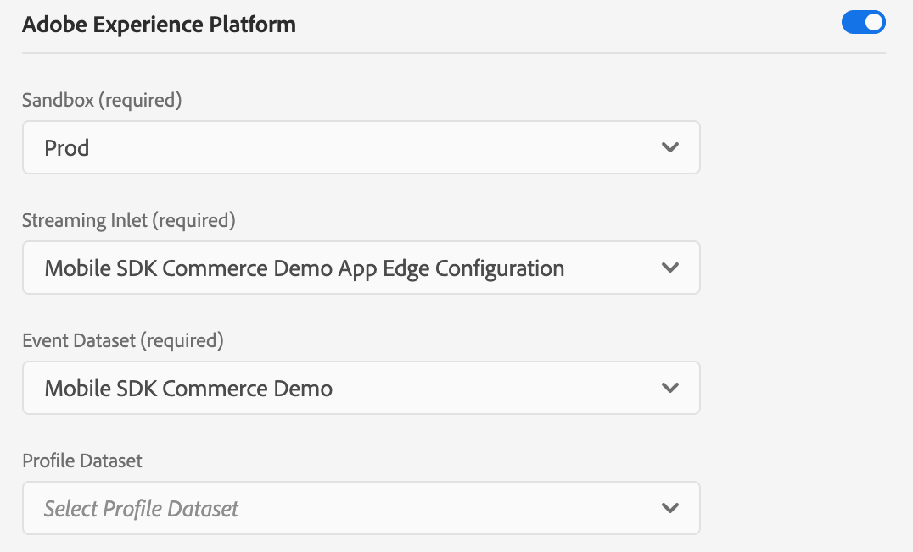

# Generate Environment Identifier


The Adobe Experience Platform - Experience Edge - Mobile extension is currently in **beta**. Use of this extension is by invitation only. Please contact your Adobe Customer Success Manager to learn more.


## Initialize Adobe Experience Platform for data collection

Before you can start collecting data in [Adobe Experience Platform](https://experience.adobe.com/platform), you will need to first create an XDM schema and a dataset that uses the schema. Follow these steps to get started:

1. [Create a schema](https://docs.adobe.com/content/help/en/experience-platform/xdm/tutorials/create-schema-ui.html)
2. Assign the XDM ExperienceEvent class to your schema.
3. Add the following mixins: 
   * ExperienceEvent Application Details
   * ExperienceEvent Environment Details
   * ExperienceEvent Commerce Details
4. [Create a dataset](https://docs.adobe.com/content/help/en/experience-platform/catalog/datasets/user-guide.html#create) where your data should be sent by using the schema that you created earlier.

## Generate a Experience Edge environment identifier

To start sending events to Experience Edge, the SDK will require a configuration identifier to ensure the implementation matches server-side configuration and data is routed/received to/from the correct destination. 

To create a configuration identifier use the following steps:

1. In [Adobe Experience Platform Launch](https://experience.adobe.com/launch), navigate to your mobile property and select _Edge Configurations_ from the left panel, then select _New Edge Configuration_.
2. Provide a name and description and then proceed to set up the default environment settings. These settings are used as defaults across the Experience Edge environments.
3. To send events to Adobe Experience Platform, you will need to enable the Adobe Experience Platform section as shown below:
   * Select the AEP Sandbox.
   * Select \(or create a new\) the Streaming Inlet from the dropdown.
   * Select the XDM dataset you created in [Initialize Adobe Experience Platform for data collection](experience-platform-setup.md#initialize-adobe-experience-platform-for-data-collection)

After these settings are saved, environment identifiers will be generated, and you may continue with the [Set up the SDK](https://aep-sdks.gitbook.io/docs/beta/experience-platform-extension/set-up-the-sdk) steps.

