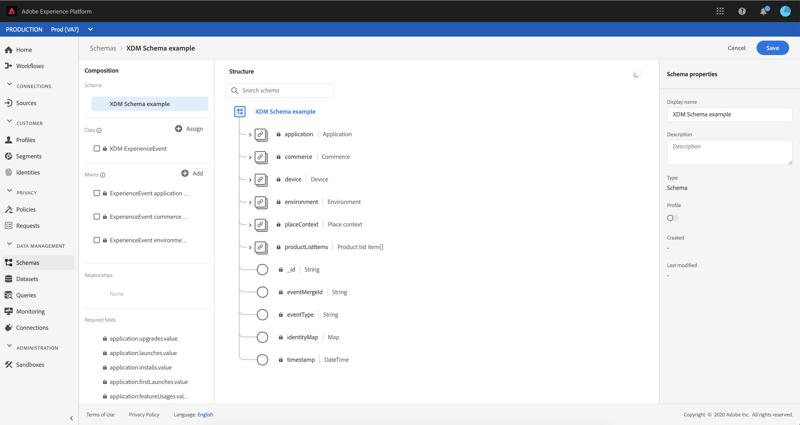
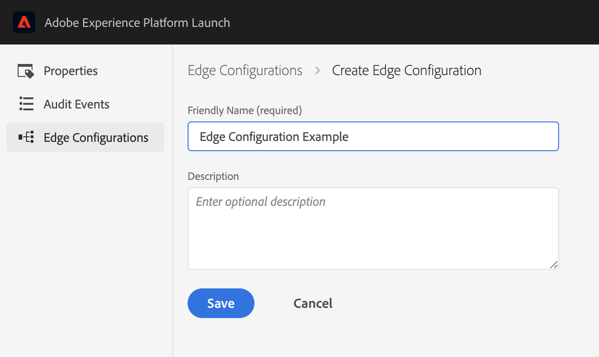

# Generate Environment Identifier


The Adobe Experience Platform Edge mobile extension is currently in BETA. Use of this extension is by invitation only. Please contact your Adobe Customer Success Manager to learn more.


## Initialize Adobe Experience Platform for data collection

To start collecting data in [Adobe Experience Platform](https://experience.adobe.com/platform), an XDM schema and a Dataset need to be created. Follow these steps to get started:

1. In your browser, navigate to [Adobe Experience Platform](https://experience.adobe.com/platform) and login with your credentials.

2. Create an [XDM Schema](https://docs.adobe.com/content/help/en/experience-platform/xdm/tutorials/create-schema-ui.html) as follows:

   - From the left panel, select Schemas
   - Click `Create schema`
   - Select `XDM Experience event`

   - Add the following existing mixins: 

     - ExperienceEvent Application Details
     - ExperienceEvent Environment Details
     - ExperienceEvent Commerce Details

   - Set a name for this schema and click `Save`.

     

     **Note:** on the top left corner, observer that the selected AEP Sandbox is Prod.

3. [Create a dataset from this schema](https://docs.adobe.com/content/help/en/experience-platform/catalog/datasets/user-guide.html#schema). 

## Generate an Experience Edge environment identifier

The SDK requires a configuration identifier that ensures the implementation matches the server-side Edge configuration and data is routed/received to/from the correct destination.

To create a configuration identifier use the following steps:

1. In [Adobe Experience Platform Launch](https://experience.adobe.com/launch), navigate to your mobile property and select _Edge Configurations_ from the left panel, then select _New Edge Configuration_.

2. Provide a name and description and then proceed to set up the default environment settings. These settings are used as defaults across the Experience Edge environments.

   

3. To send events to Adobe Experience Platform, enable the `Adobe Experience Platform` section as shown below:
   * Select `Prod ` as `AEP Sandbox`.
   * Select the `Streaming Inlet` from the dropdown or create a new one. A streaming inlet is an HTTP source in the Adobe Experience Platform.
   * For the `Event Dataset`, select the XDM dataset you created in [Initialize Adobe Experience Platform for data collection](experience-platform-setup.md#initialize-adobe-experience-platform-for-data-collection).
   * Click `Save`.

