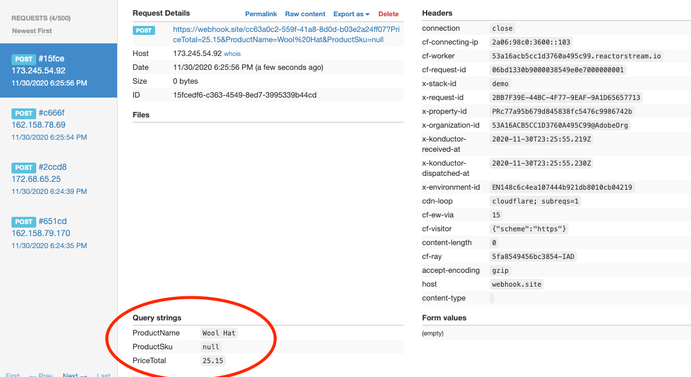

# Launch Server Side


The Adobe Experience Platform Edge mobile extension is currently in BETA. Use of this extension is by invitation only. Please contact your Adobe Customer Success Manager to learn more and get access to the materials for this tutorial.


## Prerequisites for this tutorial

* Access to Adobe Experience Platform
* Access to create Launch Server Side properties using [http://launch-demo.adobe.com](http://launch-demo.adobe.com)
* Knowledge about the AEP Edge extension
* Completion of [Assignment 1 - AEP Edge extension setup and XDM usage](https://aep-sdks.gitbook.io/docs/beta/experience-platform-extension/tutorials/tutorial-1-edge-extension-setup) \(required to have a mobile property in Launch with Edge configuration setup\).

#### Create a Launch Server Side Property

We will create a Launch Server Side property that can be used to manipulate and forward data from our Mobile application to 3rd party vendors or internal systems. Launch Server Side rules can be used with data sent from Web and Mobile properties at the same time. Follow the steps below to create your Launch Server Side property.

1. Login to [http://launch-demo.adobe.com](http://launch-demo.adobe.com)
2. In the upper-left menu select `Server Side` as the configuration type
3. With Server Side selected. Click the `New Property` button
4. Give your Server Side property a name and click the `Save` button

1. Next - select the Server Side property you just created and click on the `Extensions` menu
2. Go into the extension catalog and install the `Adobe Cloud Connector` extension
3. Now go to the Publishing Flow menu and click `Add New Library`
4. Give your library a name, such as Dev library and under the Environment drop-down select development. 
5. Click the `+ Add All Changed Resources` button and then the `Save and Build for Development` button at the top. 

#### Link your Launch Server Side Property to your Edge Configuration

Do not close your Launch Server Side property as we will need additional information in a minute. Open a new window and login to your Launch property that we have used thus far in the beta by going to either [http://launch.adobe.com](http://launch.adobe.com) or [http://experience.adobe.com/launch](http://experience.adobe.com/launch)

1. Once you are logged-in you will click on `Edge Configurations` and search for or select your Edge Configuration
2. Click on Development Environment and scroll down to where you see a toggle for `Launch Server Side`. Turn this on.
3. As our Launch Server Side property was created on the [http://launch-demo.adobe.com](http://launch-demo.adobe.com) environement it will not appear under the drop-down list. 
4. Click on the blue text that says `Manually Enter IDs`
5. Now - here is where we are going to use the information we have in the other Launch window. Looking at your Launch Server Side property on [http://launch-demo.adobe.com](http://launch-demo.adobe.com) click on the `Environments` menu and copy the `Environment ID`
6. Paste this ID in the `Environment ID` field for the Launch Server Side edge configuration.
7. Click back on your Launch Server Side property window and in the Window URL copy the value after the `properties/`
8. The values should look similar to the below. Once finished click the `Save` button

#### Create your first Server Side Forwarding Rule

For this next activity we are going to use Launch Server Side rules to forward XDM product information to a 3rd party. For this exercise we are going to work with three browser windows or tabs open. The first window should be your Launch Server Side propery \([http://launch-demo.adobe.com](http://launch-demo.adobe.com)\), the second window should be Project Griffon \([http://experience.adobe.com/griffon](http://experience.adobe.com/griffon)\) and the third window should be Webhook.site \([https://webhook.site/](https://webhook.site/)\)

1. First login to Project Griffon and connect to a session with your sample app or simulator
2. On your device or simulator go to the `Edge` tab and create a few purchase events by adding products to the cart and tapping the `Purchase` button
3. Looking at the Griffon event list you should see the `AEP Request Event` for each action. 
4. Clicking on the Request you should be to click and expand the raw event looking similar to the image below

1. In your Launch Server Side window select the Data Element menu and click `Add Data Element`
2. Name the Data Element as ProductName, the extension should be Core and the Data Element Type should be Path
3. In the Path Value enter the following: `arc.event.xdm.productListItems.0.name` and click `Save to Library`
4. Looking at the value above that we just pasted in, you can see that we are using an annotation to denote that it is an XDM experience event. We are looking at the productListItems array and capturing the name value. 
5. Following the same procedure, create two additional data elements for sku and price total. 
6. Once you have created the data elements we will create a rule.
7. Click on the `Rules` menu option on the left sidebar and then click `Add Rule`
8. Name the rule `Send Product Values`
9. At this time we can skip adding Conditions, but this would allow us to only fire the rule if certain values were present. 
10. Click the `Add` option under the Actions Menu
11. Under extension choose `Adobe Cloud Connector` \(note, if this is not available you did not previously install this extension\). The action type should be `Send Data`
12. The request type should be switched to POST
13. Go to your third open browser window that has [https://webhook.site/](https://webhook.site/) loaded and click the New button in the upper right corner. 
14. You will see a unique URL created with a button that says `Copy to Clipboard` copy this value
15. Back in the Launch Server Side window paste the webhook URL into the URL field
16. Under the Query Params create a key for `ProductName` and for the value select the product name data element that you previously created. 
17. Repeat this process for ProductSku and PriceTotal. When finished your action should look similar to the image below. 

1. Click the `Keep changes` button and then the `Save to Library` button 
2. Publish all of these changes using the Build button 

1. Back on your device or your app simulator start to add more items to your cart and create new purchase events
2. With the `http://webhook.site` window open you should start to see new posts come in each time you generate a new purchase action
3. Looking at the Query strings at the bottom you will see the data captured from the mobile app sent through the edge!

