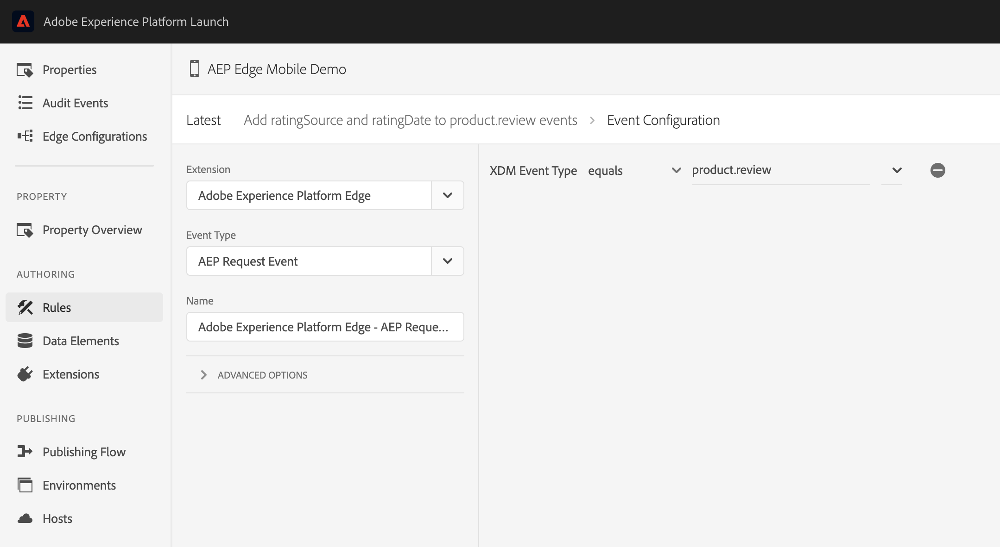

# Rules for XDM events in Adobe Experience Launch


The Adobe Experience Platform Edge mobile extension is currently in BETA. Use of this extension is by invitation only. Please contact your Adobe Customer Success Manager to learn more and get access to the materials for this tutorial.


## Prerequisites for this tutorial

* Access to Adobe Experience Platform
* Minimal Swift / Android development knowledge 
* Knowledge about the AEP Edge extension
* Completion of [Assignment 1 - AEP Edge extension setup and XDM usage](https://aep-sdks.gitbook.io/docs/beta/experience-platform-extension/tutorials/tutorial-1-edge-extension-setup) (required to have a mobile property in Launch with Edge configuration setup).
* Completion of [Assignment 3 - XDM implementation](https://aep-sdks.gitbook.io/docs/beta/experience-platform-extension/tutorials/tutorial-3-xdm-implementation) (required to have a Product reviews schema and dataset).

### Download the sample application

**Note:** This step is not required if you already implemented the steps described in [Assignment 3 - XDM implementation](https://aep-sdks.gitbook.io/docs/beta/experience-platform-extension/tutorials/tutorial-3-xdm-implementation).




#### Java

Download the Android Sample application from [https://github.com/adobe/aepsdk-sample-app-android/tree/beta-assignment-4](https://github.com/adobe/aepsdk-sample-app-android/archive/beta-assignment-4.zip).

To get started, follow the steps described in [AEP SDK Sample App Android - Installation](https://github.com/adobe/aepsdk-sample-app-android/tree/beta-assignment-4#installation).




#### Swift

Download the iOS Swift Sample application from [https://github.com/adobe/aepsdk-sample-app-ios/tree/beta-assignment-4](https://github.com/adobe/aepsdk-sample-app-ios/archive/beta-assignment-4.zip).

To get started, follow the steps described in [AEP SDK Sample App Swift - Installation](https://github.com/adobe/aepsdk-sample-app-ios/tree/beta-assignment-4#installation).



### Set up the required fields

**Note:** The steps in this section are not required if you already implemented the steps described in [Assignment 3 - XDM implementation](https://aep-sdks.gitbook.io/docs/beta/experience-platform-extension/tutorials/tutorial-3-xdm-implementation).

In [Adobe Experience Platform Launch](https://experience.adobe.com/launch), go to the **Environments** tab in the mobile property created in Assignment 1 and click on the Developmenticon. Find the Environment File ID at the top and copy it.

Set the `LAUNCH_ENVIRONMENT_FILE_ID` to the copied Environment File ID in the `MainApp` \(Android\) / `AppDelegate` \(iOS\) file.

Set the `PRODUCT_REVIEW_DATASET_ID` to the dataset identifier for Product reviews created in Assignment 3 in the `EdgeTab` (Android) / `EdgeViewController` (iOS) file.

In the same file, set the `TENANT_ID` to the org identifier as described in the Product reviews schema.

## Attach data to XDM events

### Update the Product reviews schema

1. In the browser, navigate to [Adobe Experience Platform](https://experience.adobe.com/platform) and login with your credentials.

2. Update the `Product reviews` schema created in Assignment 3 by adding two new fields.

   - From the left panel, select `Schemas` and then click on the `Product reviews` schema you have created for the previous assignment.

   - Click on the `Product review` mixin.

   - Click on the plus icon `+` next to the schema name and add the following fields. Click `Apply` after each field added.

     | Field name   | Display name  | Type     | Required |
     | :----------- | :------------ | :------- | -------- |
     | ratingSource | Rating Source | String   | No       |
     | ratingDate   | Rating Date   | DateTime | No       |

   - Click `Save` to update the schema.

### Create a mobile rule in Adobe Experience Launch

1. Navigate to [Adobe Experience Launch](https://experience.adobe.com/launch) and select the mobile property you created in the previous assignments.

2. Click on `Extensions` from the left panel and update the `Adobe Experience Platform Edge` extension to latest version.

3. Click on `Data elements` from the left panel and the following data elements:

   1. Create `App ID` data element:
      - Click on the `Create New Data Element` button.
      - Select the `Mobile Core` Extension and `App ID` Data Element Type.
      - Set the name for this data element to `App ID` and click `Save`.
   2. Create `Operating system version` data element:
      - Click on the `Add Data Element` button.
      - Select the `Mobile Core` Extension and `OS Version` Data Element Type.
      - Set the name for this data element to `Operating system version` and click `Save`.
   3. Create `Event timestamp` data element:
      - Click on the `Add Data Element` button.
      - Select the `Mobile Core` Extension and `Adobe Experience Platform Timestamp` Data Element Type.
      - Set the name for this data element to `Event timestamp` and click `Save`.
   
4. Click on `Rules` from the left pannel and create the following rule:

   - Click `Create New Rule`.
- Click on the `+ Add` button in the Events section.
  
  - Select `Adobe Experience Platform Edge` for Extension.
     - Select `AEP Request Event`.
     - Click on the `+` button to Add XDM Event Type.
     - Select `XDM Event Type equals product.review`.
     - Click `Keep Changes`.
  



- Click on the `+ Add` button in the Actions section.
  
  - Select `Mobile Core` from the Extensions drop-down and `Attach Data` as Action type.
  
  - In the JSON Payload box, add the following content and modify `_tenantId` to the org identifier found in the `Product reviews` schema:
  
    ```json
     {
           "xdm": {
               "_tenantId": {
                   "ratingDate": "{%%Event timestamp%%}",
                   "ratingSource": "MobileApp {%%App ID%%} OS {%%Operating system version%%}"
               }
           }
       }
    ```
    
  - Note that the 3 data elements created in step 3 are used here to populate the `ratingDate` and `ratingSource` XDM fields.
  
     - Click `Keep Changes`.
     
   - Set a name and click `Save` to keep the rule.
  
5. Publish the new data elements and rule created:

   - Click on `Publishing Flow` from the left panel.
   - Select the development library and click `+ Add All Changed Resources`.
   - Click `Save & Build for Development`.


The rules configured in Adobe Experience Launch for mobile properties are executed on the client-side mobile application by the AEP Rules Engine extension.


### Test with the sample application

Run the Sample app in a simulator or a device and generate product review XDM events:

- In the sample app, navigate to the Edge tab.
- Select a product, add the review information and click `Submit Review`.
- In the console log search for this log message - `Attaching event data` (iOS) / `New EventData for Event` (Android) and check that `ratingData` and `ratingSource` were attached correctly. 
- Verify if the logging messages are intuitive and descriptive for the use-case you are testing.

### Validate the event data with AEP Assurance

Connect to an Assurance Session to inspect that the AEP Request Event has the correct data. To set up an Assurance session with the Sample app, follow the steps in [Using AEP Assurance](https://aep-sdks.gitbook.io/docs/beta/experience-platform-extension/tutorials/tutorial-1-edge-extension-setup#using-aep-assurance).

- Once connected to Project Griffon, search for AEP Request Event in your session.
- Check that the XDM data for the `product.review` event is correctly updated with the two new fields  `ratingData` and `ratingSource`.

### Extra credit: Update rule/add new rule of your choice

Add a new rule in Adobe Experience Launch or update the one created in the previous steps. Then validate that the rule was correctly executed for your use-case using AEP Assurance and/or Mobile SDK logging.

### Next steps

Find more details about the AEP Mobile SDK Rules Engine and the supported rule types, see [Rules Engine](https://aep-sdks.gitbook.io/docs/using-mobile-extensions/mobile-core/rules-engine) and GitHub [adobe/aepsdk-rulesengine-ios](https://github.com/adobe/aepsdk-rulesengine-ios). 

For more rules examples in Adobe Experience Launch, see the following links: 

- [Attach data to SDK events](https://aep-sdks.gitbook.io/docs/resources/user-guides/attach-data)
- [Modify data in SDK events](https://aep-sdks.gitbook.io/docs/resources/user-guides/modify-data)
- [Using data elements to define dynamic data in rules](https://aep-sdks.gitbook.io/docs/resources/user-guides/launch-data-elements)