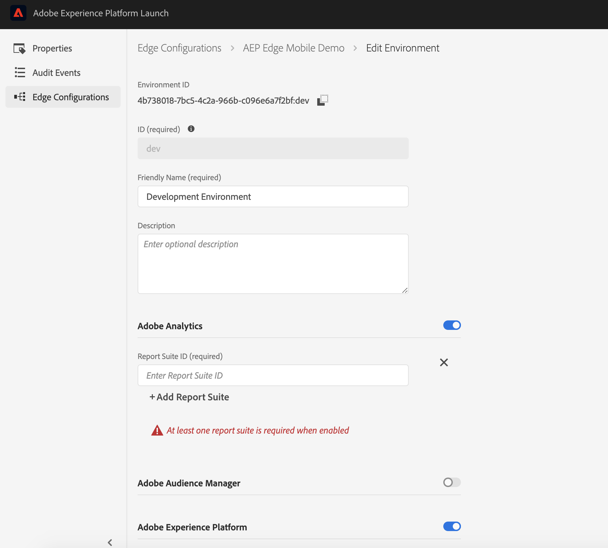

# Using Analytics edge extension 


The Adobe Experience Platform Edge mobile extension is currently in BETA. Use of this extension is by invitation only. Please contact your Adobe Customer Success Manager to learn more and get access to the materials for this tutorial.


## Prerequisites for this tutorial

* Access to Adobe Experience Platform
* Minimal Swift / Android development knowledge 
* Knowledge about the AEP Edge extension
* Completion of [Assignment 1 - AEP Edge extension setup and XDM usage](https://aep-sdks.gitbook.io/docs/beta/experience-platform-extension/tutorials/tutorial-1-edge-extension-setup) (required to have a mobile property in Launch with Edge configuration setup).

### Enable Analytics in Edge configuration

In Adobe Experience Platform Launch, navigate to your mobile property and select Edge Configurations from the left panel, then select the configuration created in Assignment 1

* Select development environment, enable `Adobe Analytics` and add a development report suite. If you don't have one, create a new report suite for this exercise using the Mobile template.




### Download the sample application




#### Java

Clone or download the Android Sample application from [https://github.com/adobe/aepsdk-sample-app-android/tree/beta-assignment-5](https://github.com/adobe/aepsdk-sample-app-android/archive/beta-assignment-5.zip).





#### Swift

Download the iOS Swift Sample application from [https://github.com/adobe/aepsdk-sample-app-ios/tree/beta-assignment-5](https://github.com/adobe/aepsdk-sample-app-ios/archive/beta-assignment-5.zip).




### Install the AnalyticsEdge Extension




#### Java

* Add the following dependency to the `aepsdk-sample-app-android/Sample-App/app/build.gradle`

  ```text
     implementation 'com.adobe.marketing.mobile:analyticsedge:1.+'
  ```

* Follow the installation instructions in [https://github.com/adobe/aepsdk-sample-app-android/tree/beta-assignment-5#installation](https://github.com/adobe/aepsdk-sample-app-android/tree/beta-assignment-5#installation)





#### Swift

* Add the following dependency to the `aepsdk-sample-app-ios/Swift/Podfile`

  ```text
    pod 'AEPAnalyticsEdge', :git => 'https://github.com/adobe/aepsdk-analyticsedge-ios', :branch => 'main'
  ```

* Follow the installation instructions in [https://github.com/adobe/aepsdk-sample-app-ios/tree/beta-assignment-5#swift](https://github.com/adobe/aepsdk-sample-app-ios/tree/beta-assignment-5#swift)




### Set up the required fields

In [Adobe Experience Platform Launch](https://experience.adobe.com/launch), go to the **Environments** tab in the mobile property created in Assignment 1 and click on the Developmenticon. Find the Environment File ID at the top and copy it.

Set the `LAUNCH_ENVIRONMENT_FILE_ID` to the copied Environment File ID in the `MainApp` \(Android\) / `AppDelegate` \(iOS\) class.

### Init Extension




#### Java

* Open `MainApp.java` and add the following `import` statements.

  ```java
  import com.adobe.marketing.mobile.Analytics;
  ```

* In the method `public void onCreate()` , register `Analytics` extension before starting the SDK. 

  ```java
     Analytics.registerExtension();
  ```





#### Swift

* Open `AppDelegate.swift` and add the following `import` statements.

  ```swift
  import AEPAnalyticsEdge
  ```

* In the method `func application(_ application: UIApplication, didFinishLaunchingWithOptions launchOptions: [UIApplication.LaunchOptionsKey: Any]?) -> Bool` , register `Analytics` extension before starting the SDK. 

  ```swift
  // enable the trace log, we need it in the future steps
  MobileCore.setLogLevel(.trace)
  // init SDK
  MobileCore.registerExtensions([Lifecycle.self, Identity.self, Signal.self, Edge.self, Analytics.self], {
      // use the App id assigned to this application via Adobe Launch
      MobileCore.configureWith(appId: self.LAUNCH_ENVIRONMENT_FILE_ID)
  })
  ```




* Now run the app, find the `Track Action` or `Track State` button in the `Core` tab (Swift) or `Analytics` tab (Android) and click on it. You should see in the logs that a corresponding edge request is sent containing the track data. 

* You should see the reports get populated in the configured report suite. Here is a sample real-time Analytics report which captures actions and page views from the sample application. 


* You can follow the steps from [Assignment 1](https://aep-sdks.gitbook.io/docs/beta/experience-platform-extension/tutorials/tutorial-1-edge-extension-setup#using-aep-assurance) to use AEP Assurance (also known as Project Griffon) to examine the events being sent through the AEP Mobile SDK.

* Once connected to Assurance, you should start seeing `AEP Request Event` of type `legacy.analytics` sent to Experience Edge for each track call.

### Next steps

Use this extension to support your existing analytics workflows.
