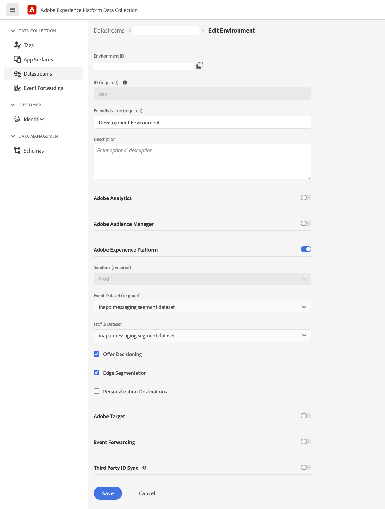

#  Configure Adobe Data Collection and Adobe Experience Platform

### Configure the datastream

* To create the datastream follow the [datastream document](./../../getting-started/configure-datastreams.md)
* In the screenshot below select the `Profile Dataset` to `CJM Push Profile Dataset`

### Setup mobile property in Adobe Data Collection

* To create the property follow [this document](./../../getting-started/create-a-mobile-property.md)
* To configure AEP Edge Extension follow [this document](./../../foundation-extensions/experience-platform-extension)
* To configure AEP Messaging Extension follow [this document](./../../using-mobile-extensions/adobe-journey-optimizer)

#### Now that a mobile property is created, head over to the [instructions](./setup-sdk.md) to install the SDK.
