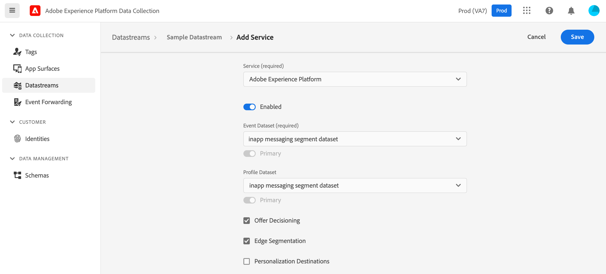

#  Configure Adobe Data Collection and Adobe Experience Platform

### Configure the datastream

* To create the datastream, please follow the [tutorial on creating a datastream](./../../getting-started/configure-datastreams.md).
* From the `Profile Dataset` drop-down, select a profile-enabled dataset based on the XDM ExperienceEvent schema that contains the `pushNotificationTracking` field group

### Setup mobile property in Adobe Data Collection

* To learn how to create the mobile property, please read the tutorial on [creating a mobile property](./../../getting-started/create-a-mobile-property.md)
* To learn how to configure the Edge Network extension, please read the tutorial on [configuring the Edge Network extension](./../../foundation-extensions/experience-platform-extension)
* To learn how to configure the messaging extension, please follow the instructions within the [Adobe Journey Optimizer documentation](./../../using-mobile-extensions/adobe-journey-optimizer)

Now that a mobile property is created, head over to the [instructions](./setup-sdk.md) to install the SDK.

