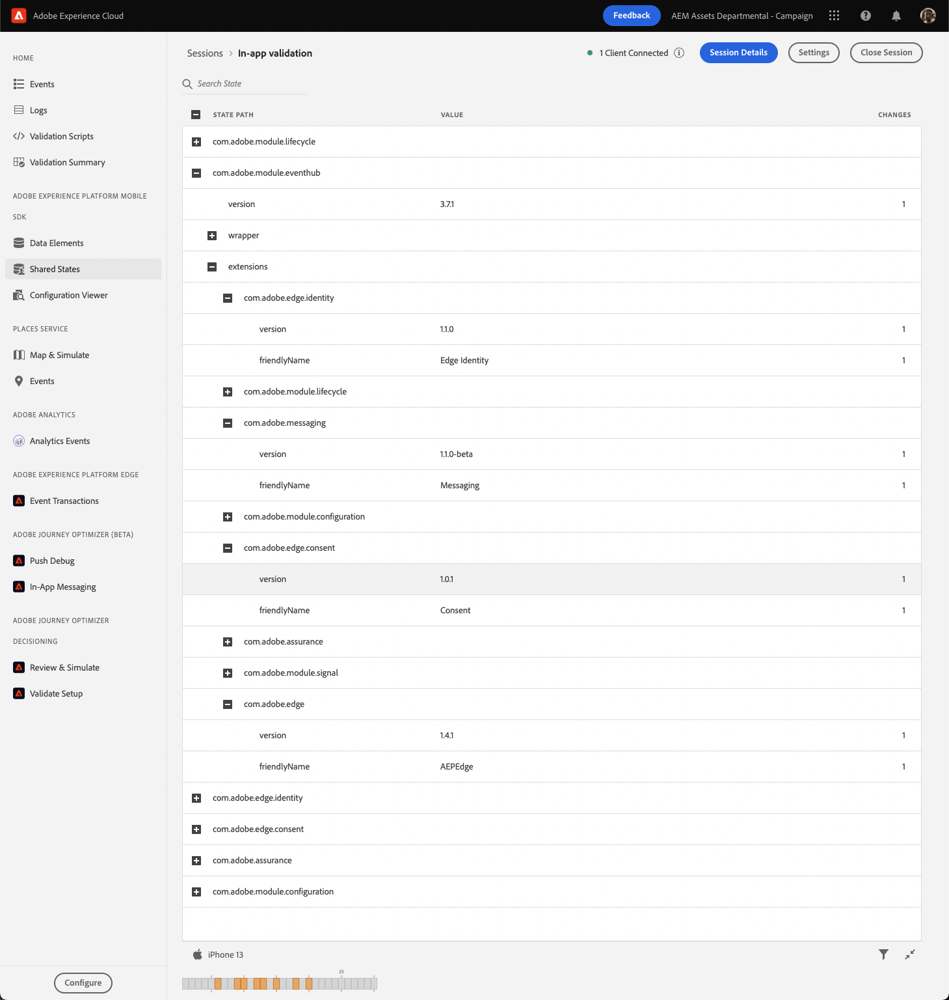
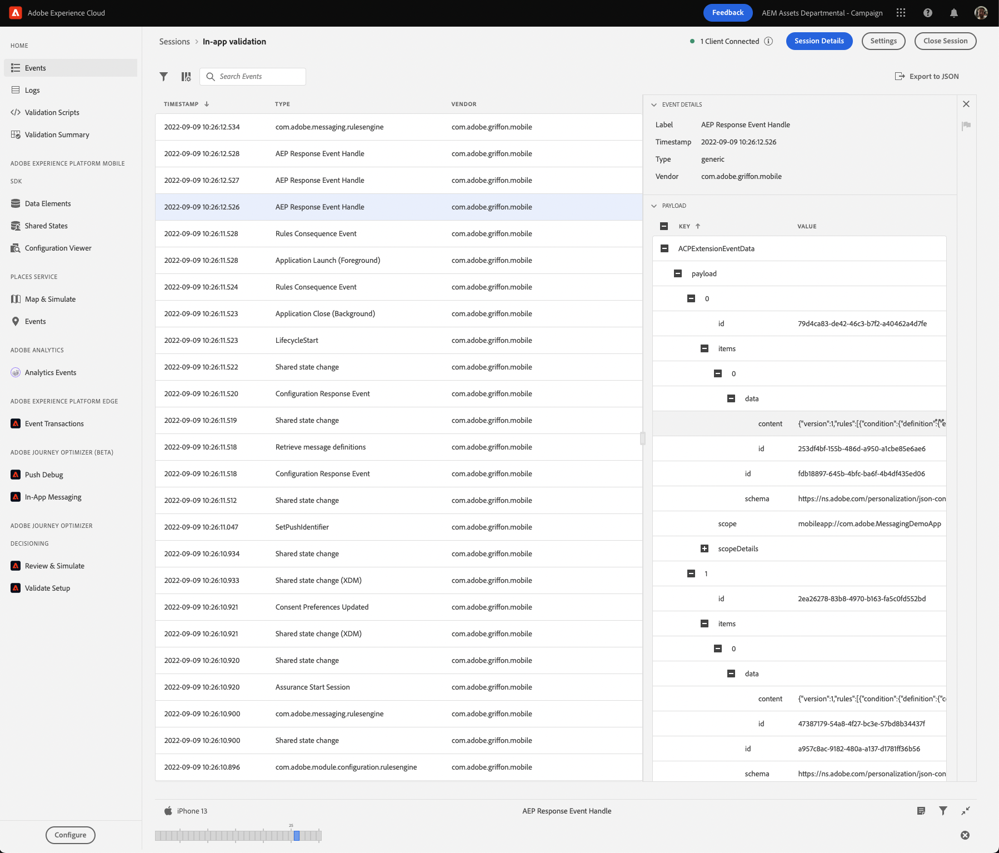

# Validate in-app messaging using AEPAssurance SDK extension and the Assurance UI

This guide will walk you through steps necessary to ensure your app is properly configured for in-app messaging with Adobe Journey Optimizer (AJO).

- [Complete prerequisites for your app](#prerequisites)
- [Validate the correct extensions are registered](#validate-the-correct-extensions-are-registered)
- [Validate the event requesting message definitions](#validate-the-event-requesting-message-definitions)
- [Validate the event containing a message definition response](#validate-the-event-containing-a-message-definition-response)

## Prerequisites

- Your app must have the **AEPMessaging** SDK extension installed. Integrate **AEPMessaging** by following the guide on [setting up AEPMessaging SDK](./../setup-sdk.md).

- This troubleshooting guide uses validation provided by the **AEPAssurance** extension and the **Adobe Assurance UI**. Integrate **AEPAssurance** in your application by following the [Adobe Experience Platform Assurance installation guide](./../../../foundation-extensions/adobe-experience-platform-assurance).

## Validate the correct extensions are registered

Ensure that your app has registered all necessary AEP SDK extensions by doing the following:

1. Launch your application with an **AEPAssurance** session active

1. In the Assurance UI, click on **Shared States** in the left-rail navigation

1. Click the **+** button next to the row with a **State Path** of **com.adobe.module.eventhub**

1. Open the **extensions** object and validate that each of the required extensions exist, ensuring it meets the minimum version requirements. The table below shows the minimum versions required for in-app messaging dependencies:

    | Extension (iOS) | Min. Version (iOS) | Extension (Android) | Min. Version (Android) |
    | --------------- | -----------------: | ------------------- | ---------------------: |
    | AEPCore         | 3.4.2              | core                | 1.11.0                 |
    | AEPEdge         | 1.3.0              | edge                | 1.1.1                  |
    | AEPEdgeConsent  | 1.0.0              | edgeconsent         | 1.0.1                  |
    | AEPEdgeIdentity | 1.0.1              | edgeidentity        | 1.0.0                  |
    | AEPMessaging    | 1.1.0              | messaging           | 1.2.0                  |
    | AEPOptimize     | 1.0.0              | optimize            | 1.0.0                  |

A sample view in the Assurance UI can be seen below:



## Validate the event requesting message definitions

When the AEPMessaging extension has finished registration with the AEP SDK, it will automatically initiate a network request to fetch message definitions from the remote if a valid configuration exists.

Completing the following steps will validate that your app is making the necessary request to retrieve in-app message definitions:

1. Launch your application with an **AEPAssurance** session active

1. In the Assurance UI, click on **Events** in the left-rail navigation

1. In the event list, select the event with type **Edge Optimize Personalization Request**

    

1. Expand the **Payload** section in the right window and ensure the correct **decisionScope** is being used. The **decisionScope** is a base64 representation of a JSON payload that should contain your app's bundle identifier. You can use an [online base64 decoder](https://www.base64decode.org/) to decode the text. Verifying the request is using the correct **decisionScope** is important, since there may be multiple events with the same event type.

The following example demonstrates validating a **decisionScope** for an app with bundle identifier `com.adobe.demosystem.dxdemo`:
- **decisionScope** == `eyJ4ZG06bmFtZSI6ImNvbS5hZG9iZS5kZW1vc3lzdGVtLmR4ZGVtbyJ9`
- Base64 decoded representation of **decisionScope** == `{"xdm:name":"com.adobe.demosystem.dxdemo"}`
- `com.adobe.demosystem.dxdemo` matches the application's bundle identifier

    

## Validate the event containing a message definition response

After the request from the previous step returns, the **AEPEdge** extension will dispatch a response event containing data returned by the remote server.

Complete the following steps to validate a response containing in-app messages:

1. Launch your application with an **AEPAssurance** session active

1. In the Assurance UI, click on **Events** in the left-rail navigation

1. In the event list, select the event with type **AEP Response Event Handle**. There will likely be several events with this type - ensure the one selected has an **AEPExtensionEventSource** of `personalization:decisions`

    

1. Expand the **Payload** section in the right window and continue down the tree until you find the **items** array. The full path to **items** is:

    ```
    ACPExtensionEventData.payload.0.items
    ```

    This array contains an entry for each of this app's published messages. As shown in the screenshot below, the message is fully defined in the **content** property of each item's **data** object:

    

## Use the In-App Messaging Assurance UI plugin

Once all of the above validation sections are complete, you can use the **In-App Messaging** plugin view in the Assurance UI to further debug your app.

#### Install the In-App Messaging plugin


If you have already installed the **In-App Messaging** plugin in your Assurance UI setup, skip this section.


1. In the Assurance UI, click on **Configure** button at the bottom of the left-rail navigation

1. Search for the row named **In-App Messaging** under the **ADOBE JOURNEY OPTIMIZER (BETA)** heading, and click the **+** button on its right

1. Click the **Save** button

    

#### Inspecting a downloaded message

Using the IAM plugin you can do the following for each message downloaded by the client:

- In the **Rules** tab - view the rules defining when the message will be shown to the user
- In the **History** tab - review a history of client events, including a comparison between the event's contents and the message's triggering criteria
- In the **Message Preview** window - see a preview of the message's html
- In the **Message Behavior** window - review message behavior, including its supported gestures and animations
- In the **Message Behavior** window - review message size and positioning properties
- Clicking the **Simulate on Device** button - trigger the currently selected message, causing it to be displayed on the connected client

    

## FAQs

### Q: What do I do when one of the required extensions is missing?

**A:** Ensure that each required extension is linked to your project and registered by `MobileCore`. For more information, please read the [Mobile Core API reference](./../../../foundation-extensions/mobile-core/mobile-core-api-reference.md#registerextensions).

### Q: Why can't I find an event named `Edge Optimize Personalization Request`?

**A:** Ensure that each of the required extensions is at the minimum required version.

### Q: I see an `AEP Error Response` event, is that a problem?

**A:** If you open the EventData and the `detail` key has a value of "The Decisioning Package was not found.", this likely means the Messaging extension was unable to find the messages for your app. Check the below items to try and resolve the issue:

* Make sure that messages have been published in the AJO Campaigns UI for your app surface
* Make sure that the bundle identifier (iOS) or package name (Android) matches the value used for your app surface
* Make sure that the **environment** and **sandbox** being used in AJO matches those being used to configure the app
* Make sure that your Adobe organization is provisioned for Offers on Edge (this may require contacting your account manager)

### Q: Why don't I see any messages in my `AEP Response Event Handle` event?

**A:** In the [Adobe Journey Optimizer UI](https://experience.adobe.com/#/@/journey-optimizer/home), make sure that there are in-app messages with a **Live** status for your application.

### Q: Why aren't there any messages to select in the `In-App Messaging` Assurance UI plugin?

**A:** The `In-App Messaging` plugin view will only be populated when there are messages returned in the `AEP Response Event Handle` event.
