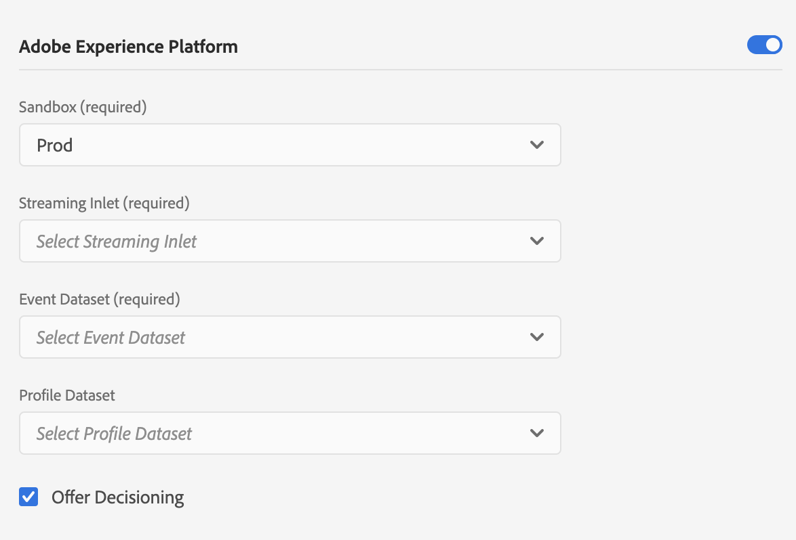

# Adobe Experience Platform Offer Decisioning Extension


The Adobe Experience Platform Offer Decisioning mobile extension is currently in BETA. Use of this extension is by invitation only. Please contact your Adobe Customer Success Manager to learn more and get access to the materials for this tutorial.


Adobe Experience Platform Offer Decisioning mobile extension can deliver personalized offers that are managed in Offer Decisioning. You can create your offers and other related objects using the Offer Decisioning user interface \(UI\) or APIs. To learn more about Offer Decisioning, please refer to [Offer Decisioning product documentation](https://experienceleague.adobe.com/docs/offer-decisioning/using/offer-decisioning-home.html?lang=en).

## Prerequisites

* IMS organization is enabled for edge decisioning
* Offers and Activities are created
* Adobe Experience Platform Core and Edge mobile extensions have been implemented in the app
* Launch UI config is published

## Enable Offer Decisioning in Edge configuration

To enable Offer Decisioning, you need to perform the following steps:

1. In Adobe Experience Platform Launch, navigate to the Edge Configurations from the left panel, then select the configuration that needs to be updated.

   Enable Adobe Experience Platform in your [edge configuration](https://experienceleague.adobe.com/docs/experience-platform/edge/fundamentals/edge-configuration.html?lang=en) and check the `Offer Decisioning` box



1. Add AEP Offer Decisioning extension to the project.



### **Swift**

Use Cocoapods for integrating with AEP Mobile SDK:

```swift
   platform :ios, '10.0'

   use_frameworks!
   target 'YourAppTarget' do
     # Mobile SDK Core Bundle
     pod 'AEPServices', :git => 'git@github.com:adobe/aepsdk-core-ios.git', :branch => 'main'
     pod 'AEPCore', :git => 'git@github.com:adobe/aepsdk-core-ios.git', :branch => 'main'
     pod 'AEPLifecycle', :git => 'git@github.com:adobe/aepsdk-core-ios.git', :branch => 'main'
     pod 'AEPIdentity', :git => 'git@github.com:adobe/aepsdk-core-ios.git', :branch => 'main'
     pod 'AEPSignal', :git => 'git@github.com:adobe/aepsdk-core-ios.git', :branch => 'main'
     pod 'AEPRulesEngine', :git => 'git@github.com:adobe/aepsdk-rulesengine-ios.git', :branch => 'main'   
     pod 'AEPEdge', :git => 'git@github.com:adobe/aepsdk-edge-ios.git', :branch => 'main'

     # AEP Offer Decisioning SDK
     pod 'AEPOfferDecisioning', :git => 'git@github.com:adobe/aepsdk-offer-ios.git', :branch => 'main'

   end
```



### Register the extension



#### Swift

```swift
import UIKit
import AEPCore
import AEPEdge
import AEPIdentity
import AEPLifecycle
import AEPSignal
import AEPOfferDecisioning

@UIApplicationMain
class AppDelegate: UIResponder, UIApplicationDelegate {

    var window: UIWindow?

    func application(_ application: UIApplication, didFinishLaunchingWithOptions launchOptions: [UIApplication.LaunchOptionsKey: Any]?) -> Bool {
        MobileCore.configureWith(appId: YOUR_APP_ID)

        // register Mobile Core and AEP Edge extensions
        MobileCore.registerExtensions([Edge.self, Identity.self, Lifecycle.self, Signal.self, OfferDecisioning.self])

        return true
    }
}
```



## Prefetch and retrieve offers

After you get everything correctly set up, you can now use the AEP Offer Decisioning extension to prefetch and retrieve the offers and then render the content in your app.

### Decision Scope

For Offer Decisioning, Decision Scope is the JSON data structure which contains the activity and placement IDs you want the offer decisioning service to use to propose offers.

_Decision scope JSON:_

```javascript
{
  "activityId":"xcore:offer-activity:11cfb1fa93381aca",
  "placementId":"xcore:offer-placement:1175009612b0100c"
}
```

AEP Offer Decisioning extension provides a convenient class for you to construct the Decision Scope.



#### Swift

```swift
let decisionScope = DecisionScope(activityId: "xcore:offer-activity:11cfb1fa93381aca", placementId: "xcore:offer-placement:1175009612b0100c")
```



### Prefetch offers

AEP Offer Decisioning exension provides separate APIs to prefetch the offers and retrieves the offer contents. This design aims to help apps to build better user experience for their end users. We recommend the app to prefetch the offers in advance, so there is no latency by the time you retrieve the offer contents and render them.



#### TBD



#### Swift

```swift
let decisionScope1 = DecisionScope(activityId: "xcore:offer-activity:11cfb1fa93381aca", placementId: "xcore:offer-placement:1175009612b0100c")
let decisionScope2 = DecisionScope(activityId: "xcore:offer-activity:11cfb1fa93381aca", placementId: "xcore:offer-placement:1175009612b0100d")

OfferDecisioning.prefetchOffers(decisionScopes: [decisionScope1, decisionScope2])
```



### Retrieve offers content

Once the offers have been prefetched, use the `retrievePrefetchedOffers` API to get the contents for the targeted decision scopes.



#### Swift

```swift
let decisionScope = DecisionScope(activityId: "xcore:offer-activity:11cfb1fa93381aca", placementId: "xcore:offer-placement:1175009612b0100c")

OfferDecisioning.retrievePrefetchedOffers(decisionScopes: [decisionScope]) {        offersDict, _ in

  // handle response
  if let offers = offersDict[decisionScope] {
    let offer = offers[0]
    // render the offer with offer.content
  }
}
```



## Listen for offer update

Offer prefetch can not only be triggered by the aforementioned `prefetchOffers` API, calling `Edge.sendEvent()` or using Rules are alternate approaches to prefetch offers. AEP Offer Decisioning extension is listening for all the responses from Offer Decisioning Services, no matter how the requests are triggered.

The app can register a listener for offer update, so it is notified whenever there are new offers being cached or updated.



#### Swift

```swift
OfferDecisioning.onOfferUpdate { offersDict in
      // handle offers
      print("\(propositions as AnyObject)")
}
```



