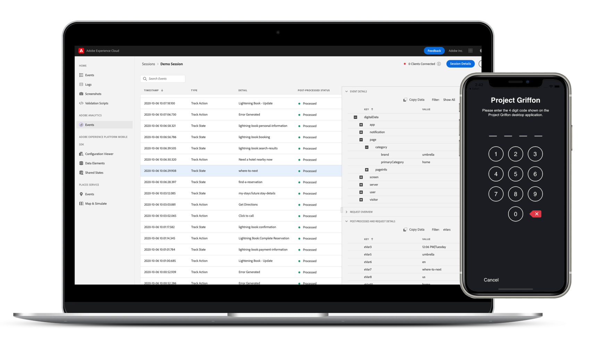
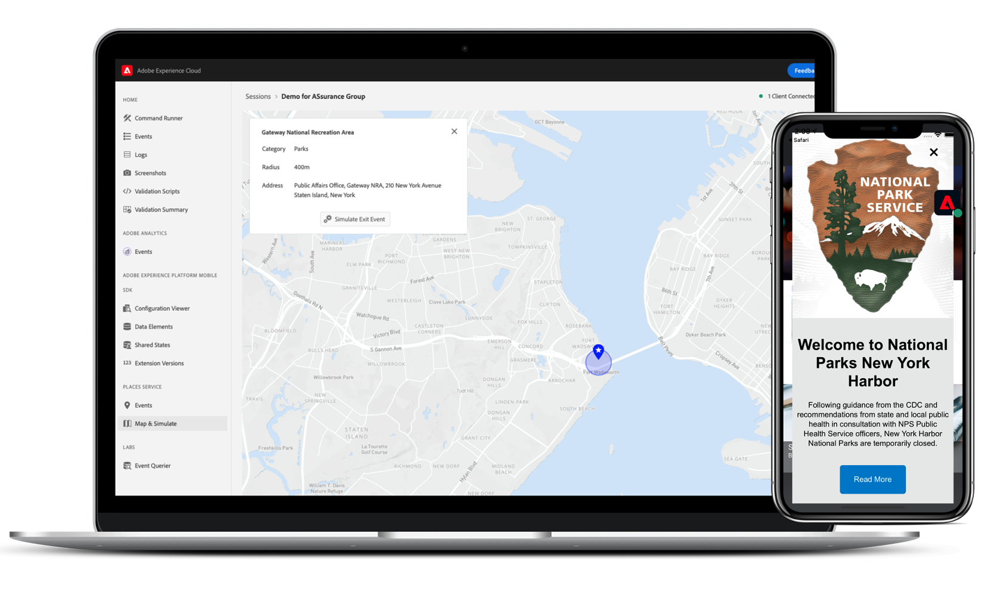
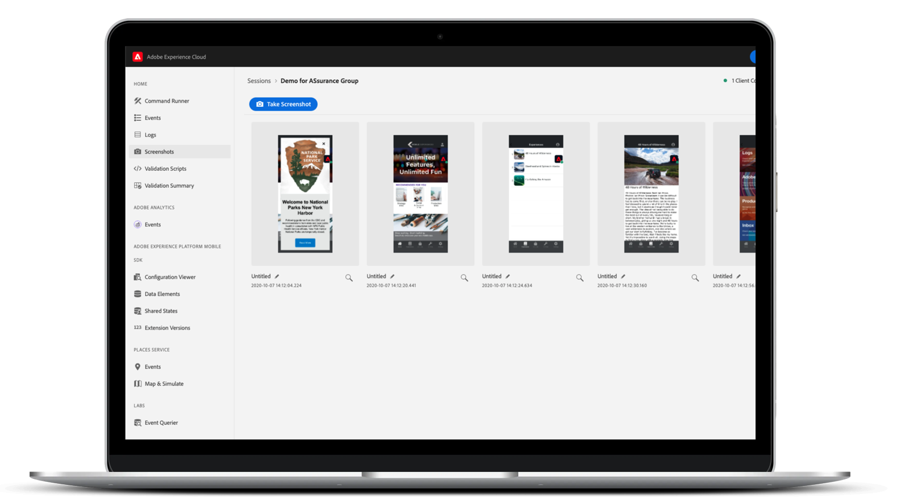

# Project Griffon

Project Griffon is a new, innovative beta product from [Adobe Experience Cloud](https://www.adobe.com/experience-cloud.html) to help you inspect, proof, simulate, and validate how you collect data or serve experiences in your mobile app.

We're building Project Griffon to do the heavy lifting of getting your app implementation right, while you focus on creating engaging experiences.


Project Griffon is a beta product.

To use it, you must accept the terms on [https://experience.adobe.com/griffon](https://experience.adobe.com/griffon).


## What can Project Griffon do for you?

### Quick Setup

Get started in a hurry with few lines of code. For mobile apps, Project Griffon works with the [Adobe Experience Platform Mobile SDK](../../) to help you inspect, simulate, and validate app events, location signals, configuration parameters, SDK logs, device information, and more.

### No-hassle Connection

With Project Griffon, we've made connecting your app with our service simple and reliable. We've saved you the hassle of using network proxies, [MiTM](https://en.wikipedia.org/wiki/Man-in-the-middle_attack) and other network gymnastics - connecting your app to Project Griffon is made as easy as scanning a QR code.

### Real-time inspection, simulation, and validation

After connecting, you can inspect live-streamed app events and activity and filter and search to eliminate noise. Events contain details about validating, debugging, and troubleshooting your mobile app implementation. Project Griffon also lets you screenshot, simulate location signals, and more in real-time.

### Integration with Adobe Experience Cloud

Client-side data and experiences are given context by how users setup reporting rules, activities, and campaigns on our marketer-focused user interfaces. To help you connect the dots between the two, we're integrating with Adobe Experience Cloud solutions such as Adobe Experience Platform, Adobe Analytics, Adobe Target, Places Service, and more.

## Features

### Adobe Experience Platform Mobile SDK Events, logs, and more

Project Griffon helps you inspect raw SDK events generated by the Adobe Experience Platform Mobile SDK. All events collected by the SDK are available for inspection. SDK events are loaded in a list view, sorted by time. Each event has a detailed view that provides further detail. Additional views to browse SDK configuration, Data Elements, Shared States, and SDK extension versions are also provided.

### Adobe Analytics

The Adobe Analytics &gt; Analytics Events view is a focused view that shows events related to your Adobe Analytics mobile implementation. The list view shows the lifecycle or action/state events, Post-Processed “status”, along with requisite event detail in a specially formatted view. Post-Processed status shows you how the event was processed by Adobe Analytics after processing rules have been applied on the event.

### Adobe Analytics for Streaming Media

The Adobe Analytics &gt; Media Analytics Events view shows events for your audio and video analytics implementation. The events detail view shows standard and custom metadata that is tracked for each playback session. In addition, you can view post-processed status and post-processed media analytics data such as media time spent or total buffer duration.

### Places \(Location Services\)

The Location Services view is an on-device view that shows the user location entry and exit events for easy validation. This handy view provides a convenient interface to view location specific data points for inspection on the client for in-context debugging.

## Is Project Griffon Secure?

Project Griffon has the following security measures in place:

* AEP Assurance and Project Griffon web UI have a secure, PIN-based handshake for a connection. The user has to explicitly create a handshake, which prevents "accidental" Project Griffon connections to be created by an end-user.
* Only connections between AEP Assurance and the Project Griffon web UI belonging to the same Adobe Experience Cloud Organization ID are supported.
* Adobe Experience Platform Mobile SDKs events are transported over HTTPs. 
* Project Griffon and Adobe Experience Platform Mobile SDKs use TLS 1.2
* Project Griffon sessions are deleted after 30 days.
* Project Griffon session data is encrypted at rest, following storage best practices.

## Getting Started

To get started with Project Griffon, see the following:

* [Set up Project Griffon](set-up-project-griffon.md)
* [Using Project Griffon](using-project-griffon/)

To access Project Griffon, see instructions on [Set up Project Griffon](set-up-project-griffon.md#how-to-participate-in-the-project-griffon-beta)

