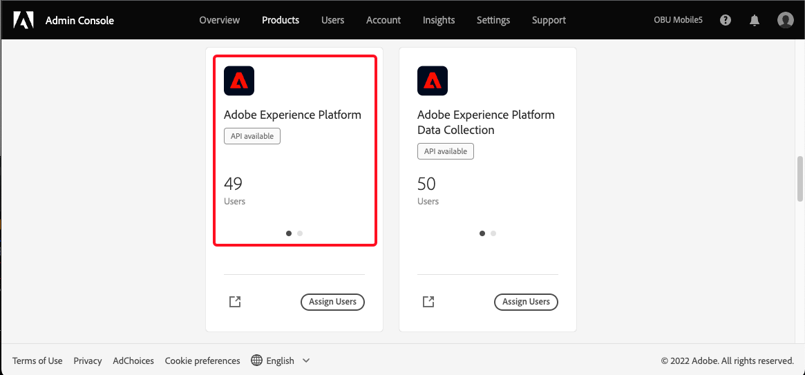
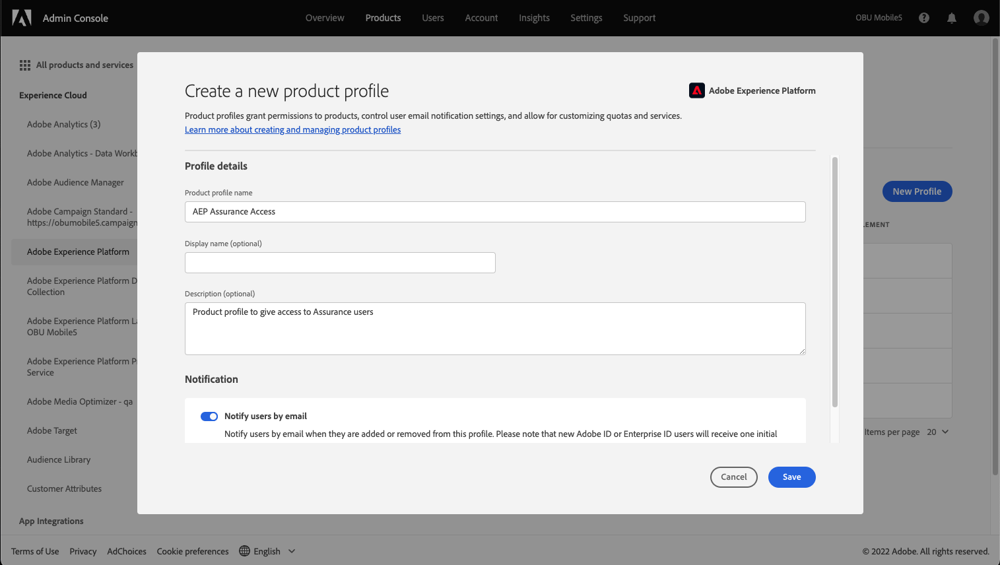
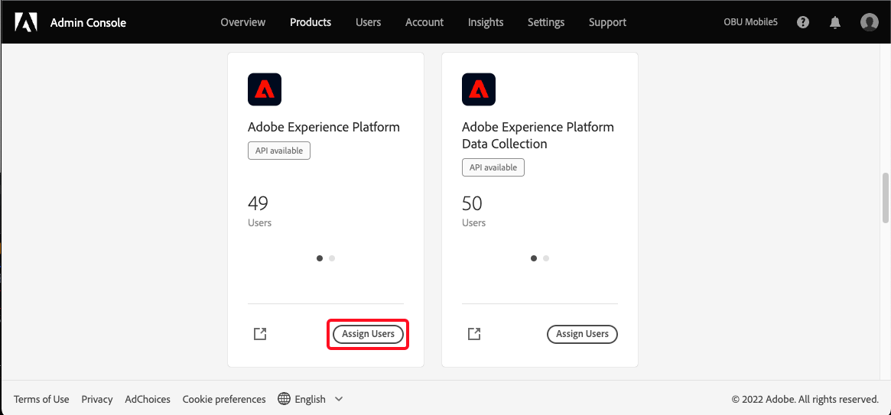
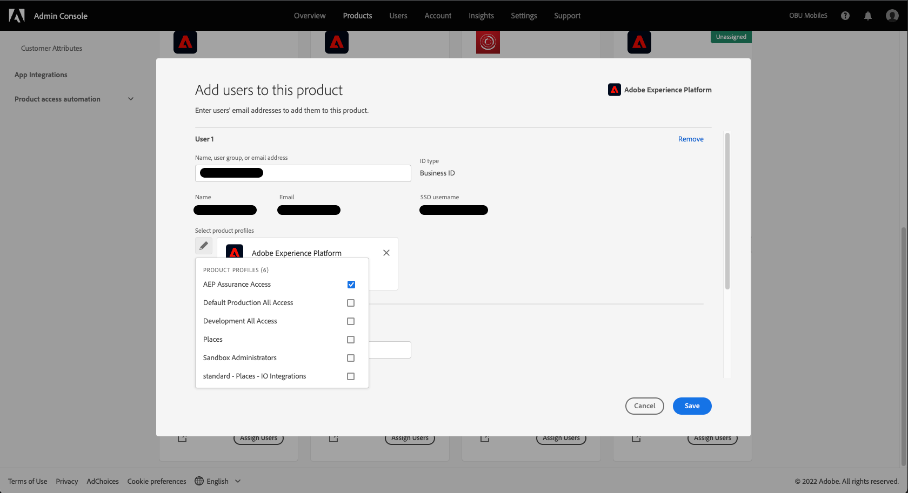

# User Access


## Project Griffon will be Assurance!
We're pleased to annouce that Project Griffon will be generally available to all Adobe Experience Cloud customers as Assurance. To learn more about this transistion see [here]().



## User Access Is Changing
As we make the transition from beta (Project Griffon) to being generally available (as Assurance) to all Adobe Experience Cloud customers - access to Project Griffon / Assurance is changing! Access to Assurance will be managed through the [Admin Console](https://helpx.adobe.com/enterprise/using/admin-console.html)


## Set Up Access


Your company's Adobe Experience Cloud administrator will be able to help and perform the following changes.


To receive or to maintain uninterrupted access to Project Griffon / Assurance, ensure that the following steps are completed in Admin Console:

Step 1 -  Log into the [Admin Console](https://adminconsole.adobe.com/)
   a. Create a new Adobe Experience Platform product profile
   b. Select the "Products" tab, click the Adobe Experience Platform product card - **you may use an existing profile and skip this step.**

Step 2. Provide a name and **save** - The Adobe Experience Platform product profile you intend to use for Assurance access does not need any additional permissions added. The default with no additional selections are sufficient.

   a. Assign users to the Adobe Experience Platform product profile
   b. Select the "Products" tab, click "Assign Users" on the Adobe Experience Platform.
   
   c. Add one or more users to the product profile and save.

