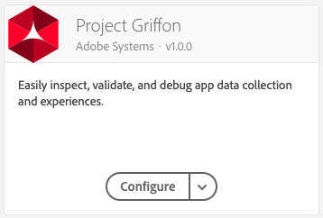

# Set up Project Griffon


The SDK extension for Project Griffon is in beta. Use of this beta product requires acceptance of terms outlined on [https://experience.adobe.com/griffon](https://experience.adobe.com/griffon).


1. In Experience Platform Launch, click the **Extensions** tab.
2. On the **Catalog** tab, locate the **Project Griffon** extension, and click **Install**.
3. Follow the publishing process to update SDK configuration.

### **Install the Project Griffon extension**



No extension settings are required. Save and [publish the extension](https://aep-sdks.gitbook.io/docs/getting-started/create-a-mobile-property#publish-the-configuration).

## Add Project Griffon to your app




**Java**

1. Add the following libraries in your project's `build.gradle` file:

   ```java
   implementation 'com.adobe.marketing.mobile:core:1+'
   implementation 'com.adobe.marketing.mobile:griffon:1+' 
   ```

   Also be sure to use the latest available versions.

2. Import the Project Griffon libraries with the other SDK libraries:

   ```java
   import com.adobe.marketing.mobile.Griffon; 
   import com.adobe.marketing.mobile.MobileCore;
   ```




1. Add the library to your project via your Cocoapods `Podfile` by adding `pod 'ACPGriffon'`
2. Import the Project Griffon libraries along with other SDK libraries:

#### Objective-C

```objectivec
#import "ACPCore.h"
#import "ACPGriffon.h" // <-- import the Project Griffon library
```

#### Swift

```swift
import ACPCore
import ACPGriffon // <-- import the Project Griffon library
```



### Register Griffon with Mobile Core



Registering the extension with Core, sends Experience Platform SDK events to an active Project Griffon session. To start using the extension library, you must first register the extension with the [Mobile Core](https://aep-sdks.gitbook.io/docs/using-mobile-extensions/mobile-core) extension.

#### Java

1. Register the extension wherever you are registering other extensions.

   ```java
     public class TargetApp extends Application {
      @Override
      public void onCreate() {
         super.onCreate();
         MobileCore.setApplication(this);
         MobileCore.ConfigureWithAppId("yourAppId");
         try {
            Griffon.registerExtension();
            MobileCore.start(null);
         } catch (Exception e) {
            // Log the exception
         }
      }
     }
   ```

2. Open the deeplink created on the Griffon UI to start the Griffon session.




Registering the extension with Core sends Experience Platform SDK events to an active Project Griffon session. To start using the extension library, you must first register the extension with the [Mobile Core](https://aep-sdks.gitbook.io/docs/using-mobile-extensions/mobile-core) extension.

#### Objective-C

```objectivec
- (BOOL)application:(UIApplication *)application didFinishLaunchingWithOptions:(NSDictionary *)launchOptions {
    [ACPCore configureWithAppId:@"yourAppId"];
    [ACPGriffon registerExtension]; // <-- register Project Griffon with Core
    [ACPCore start:nil];
    // Override point for customization after application launch.
    return YES;
 }
```

#### Swift

```swift
func application(_ application: UIApplication, didFinishLaunchingWithOptions launchOptions: [UIApplication.LaunchOptionsKey: Any]?) -> Bool {
     ACPCore.configure(withAppId: "yourAppId")   
     ACPGriffon.registerExtension() // <-- register Project Griffon with Core
     ACPCore.start(nil)
     // Override point for customization after application launch. 
     return true;
}
```



### Start a Project Griffon session

After the extension has been registered, start a Project Griffon session by using the following API:




### startSession

This API accepts a deep link to begin a session. After this API is called, to begin a session, the SDK displays a PIN authentication overlay on your app.

#### Java

#### Syntax

```text
public static void startSession(final String url)
```

#### Example

```java
 Griffon.startSession(url);
```



### startSession

This API accepts a deep link to begin a session. After this API is called, to begin a session, the SDK displays a PIN authentication overlay on your app.

#### Objective-C

#### Syntax

```objectivec
+ (void) startSession: (NSURL* _Nonnull) url;
```

#### Example

```objectivec
- (BOOL)application:(UIApplication *)app openURL:(nonnull NSURL *)url options:(nonnull NSDictionary<UIApplicationOpenURLOptionsKey,id> *)options {
    [ACPGriffon startSession:url];
    return false;
}
```

#### Swift

#### Example

```swift
func application(_ app: UIApplication, open url: URL, options: [UIApplication.OpenURLOptionsKey : Any] = [:]) -> Bool {
    do {
        ACPGriffon.startSession(url)
        return false
    }
}
```



### End a Project Griffon session

You can end a session in the app interface by pressing the floating indicator and selecting **Disconnect**. You can also programmatically close an active session by using the following API.



### endSession

This API ends the active session and ensures that no data is sent to a Project Griffon session.

#### Java

```java
Griffon.endSession()
```



### endSession

This API ends the active session and ensures that no data is sent to a Project Griffon session.

#### Objective-C

#### Syntax

```objectivec
+ (void) endSession;
```

#### Example

```objectivec
[ACPGriffon endSession];
```

#### Swift

#### Example

```swift
ACPGriffon.endSession()
```



### Send custom events

You can send custom events from the app to Project Griffon using the following API. Custom events can help you inspect information from the app such as the API and network responses, foreground and background activity, asset and media downloads, performance metrics, timed processes, app startup times, or screen load times.




### sendEvent

This API is for sending custom events.

#### Java

#### Syntax

The follow syntax shows you how to use the sendEvent API:

```java
public static void sendEvent(final GriffonEvent event);
```
The following syntax shows you how to create a Griffon event:

```java
public GriffonEvent(final String vendor, final String type, final Map<String, Object> payload)
```


#### Example

The following example shows you how to send a custom event that measures the download time of an asset’s download activity in the app.

```java
final Map<String, Object> eventPayload = new HashMap<>();
eventPayload.put("time", downloadTime);
eventPayload.put("size", data.length());

// create and send the Griffon event
final GriffonEvent event = new GriffonEvent("com.adobe.myapp", "download info", eventPayload);
Griffon.sendEvent(newEvent);
```



### sendEvent

This API is for sending custom events.

#### Objective-C

#### Syntax

The follow syntax shows you how to use the sendEvent API:

```objectivec
+ (void) sendEvent: (ACPGriffonEvent* _Nonnull) event;
```

The following syntax shows you how to create a ACPGriffonEvent object:

```objectivec
- (instancetype) initWithVendor: (NSString*) vendor type: (NSString*) type payload: (NSDictionary*) payload;
```

#### Example

The following example shows you how to send a custom event that measures the download time of an asset download activity in the app.

```objectivec
CFAbsoluteTime downloadStartTime = CFAbsoluteTimeGetCurrent();

CFAbsoluteTime totalDownloadTime = CFAbsoluteTimeGetCurrent() - downloadStartTime;
        ACPGriffonEvent* griffonDownloadEvent = [[ACPGriffonEvent alloc] initWithVendor:@"com.adobe.myapp"
                                                                                   type:@"download info"
                                                                                payload:@{
                                                                                    @"time" : @(totalDownloadTime),
                                                                                    @"size" : @(data.length)
                                                                                }];
        [ACPGriffon sendEvent: griffonDownloadEvent];
```


#### Swift

#### Example

```swift
var downloadStartTime: CFAbsoluteTime = CFAbsoluteTimeGetCurrent()

var totalDownloadTime: CFAbsoluteTime = CFAbsoluteTimeGetCurrent() - downloadStartTime
var griffonDownloadEvent = ACPGriffonEvent(vendor: "com.adobe.myapp", type: "download info", payload: [
    "time": NSNumber(value: totalDownloadTime),
    "size": NSNumber(value: data.length)
])
ACPGriffon.sendEvent(griffonDownloadEvent)
```


