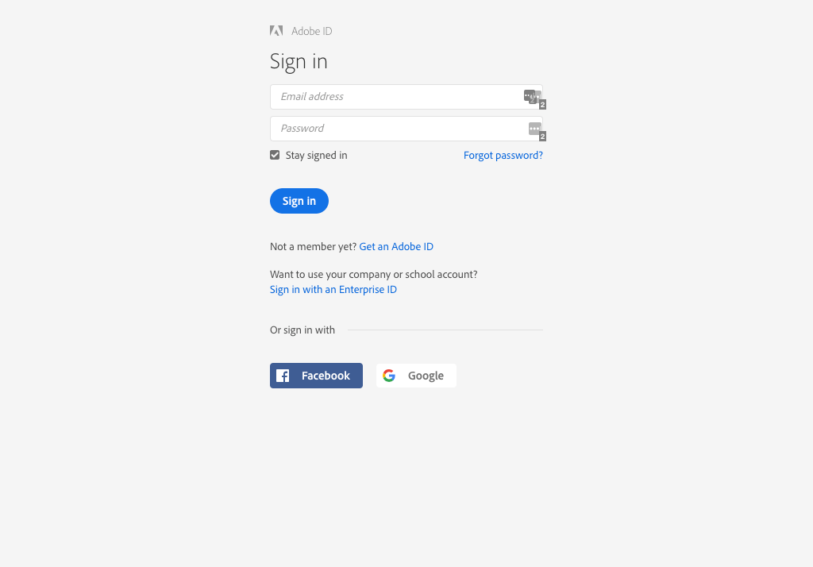
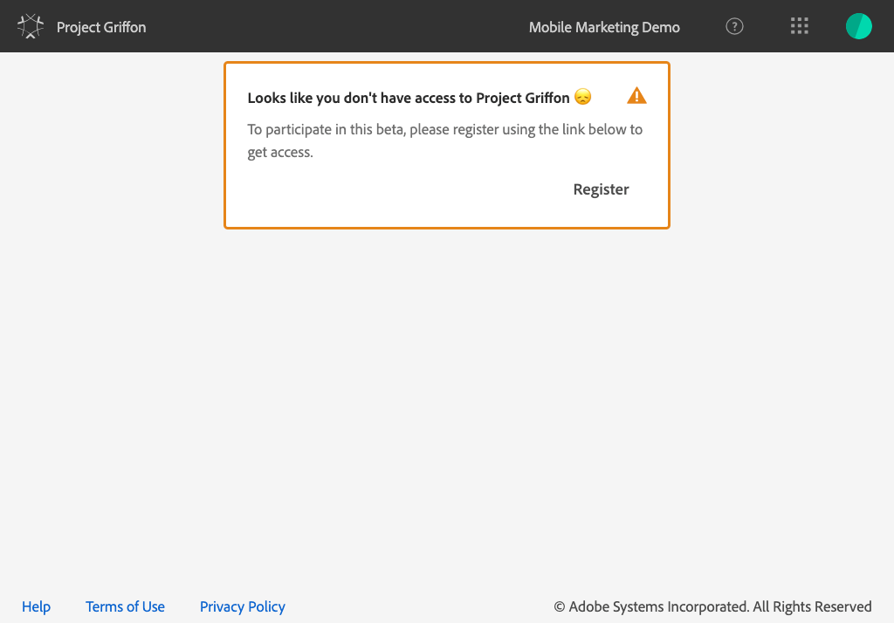
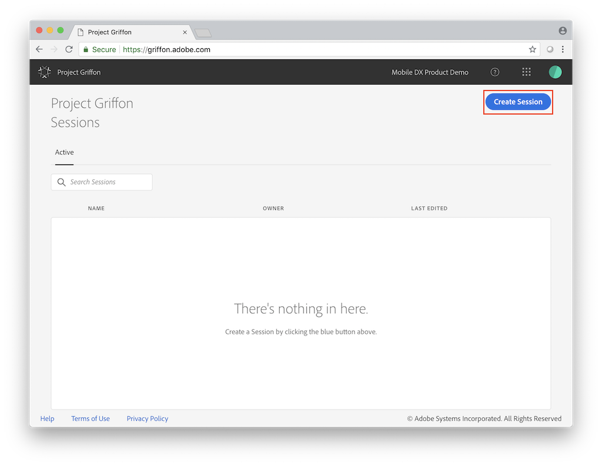
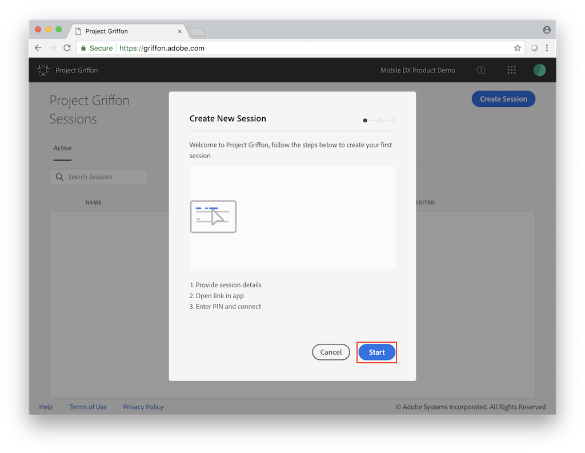
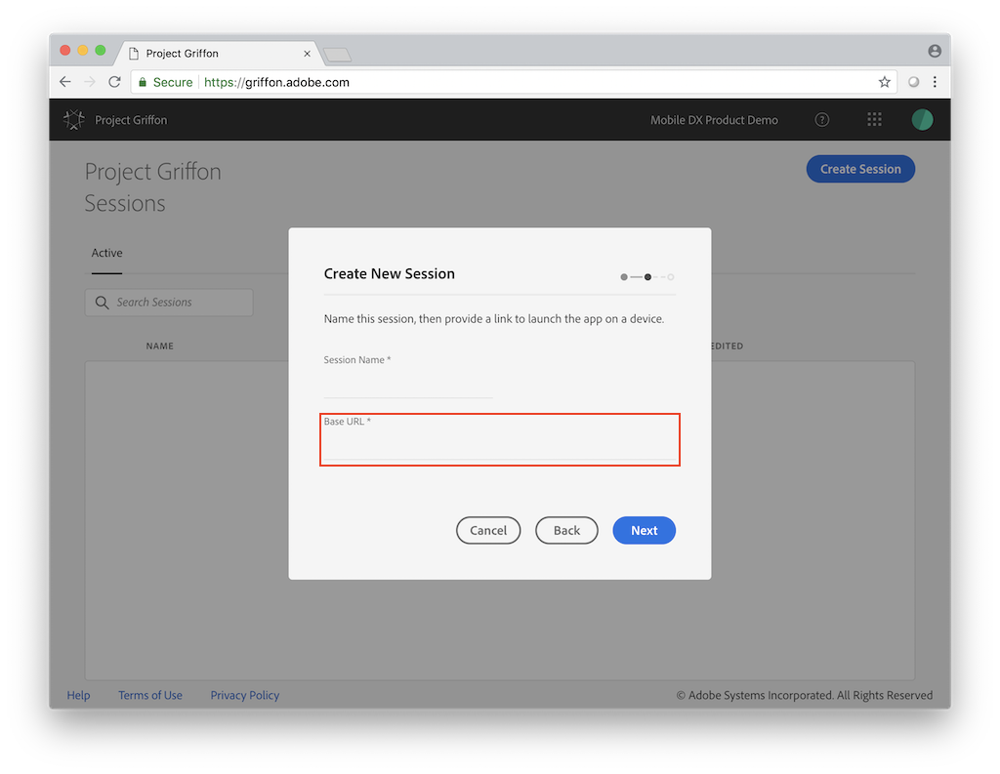
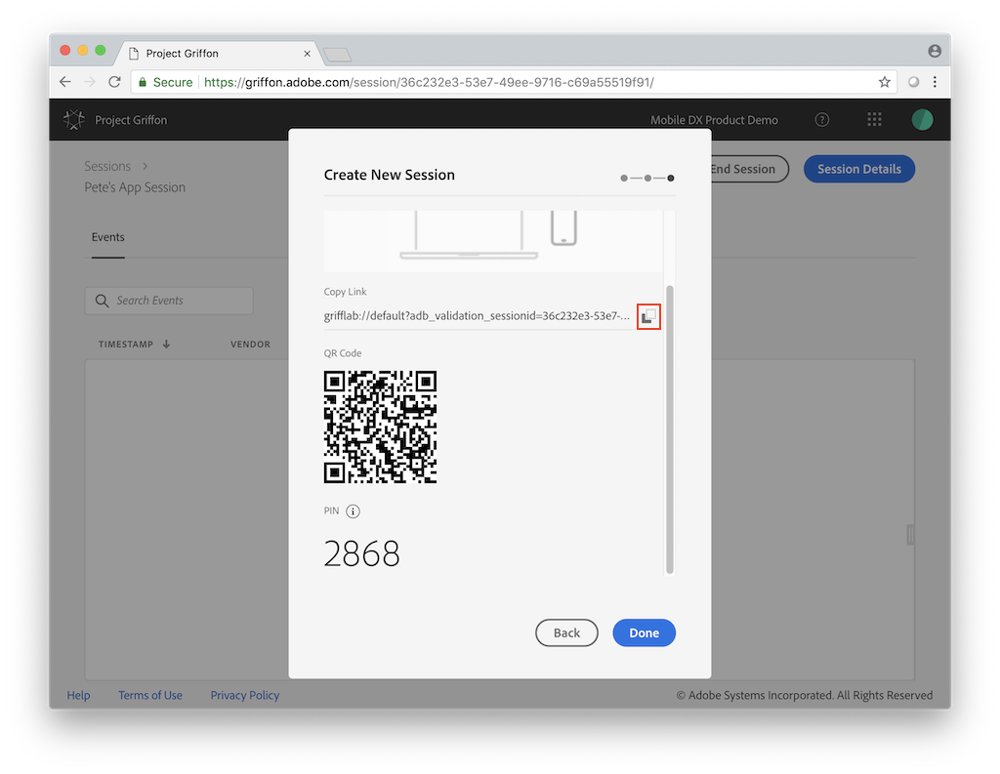
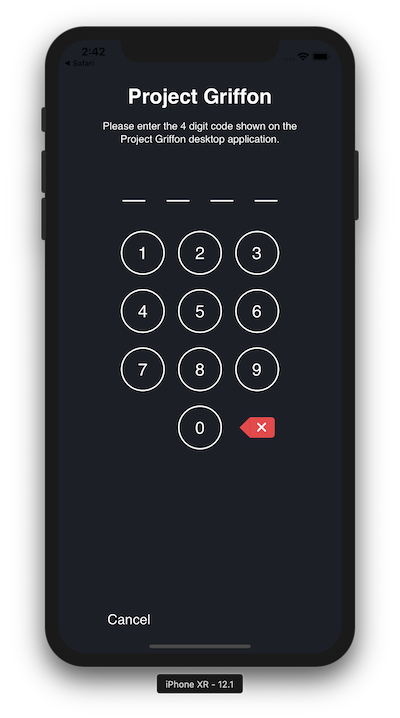
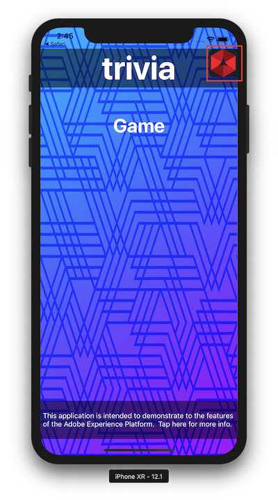
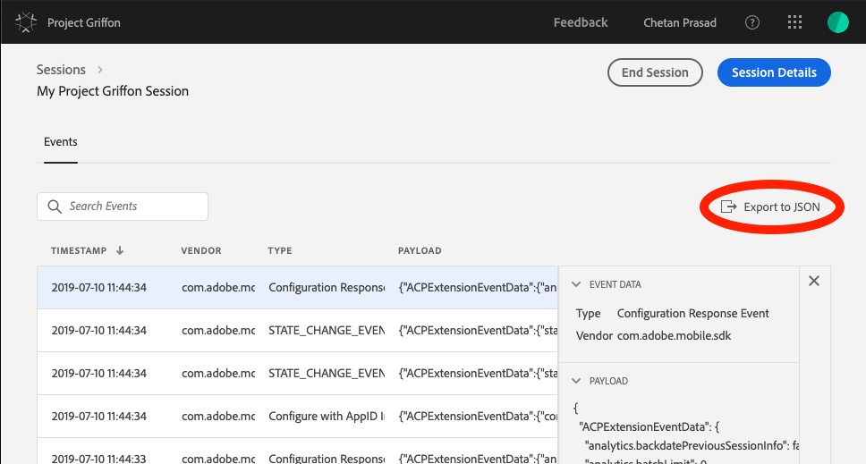

# Using Project Griffon

## Logging in


Project Griffon is in beta. Use of this beta product requires acceptance of terms outlined on [https://griffon.adobe.com](https://griffon.adobe.com).


1. Go to to [https://griffon.adobe.com](https://griffon.adobe.com).
2. Log in using your Adobe ID credentials for the Experience Cloud.


If you do not know your Adobe ID credentials, contact your Adobe administrator or see [how to log in](https://docs.adobe.com/content/help/en/core-services/interface/manage-users-and-products/getting-started-experience-cloud.html).


If you see the following screen, for beta access, click **Register**.

## Begin a Project Griffon session

### Create a session

1. To begin, click the **Create Session** button on the upper right-hand corner of the screen.

1. Click **Start**.

1. In **Session Name**, enter a name to identify the session.  This definition is used to launch your app from a URL and initiate the Project Griffon session. An example value might look like: `grifflab://default`.
2. In the **Base URL** field, type your app's base deep link definition.
3. Click **Next**.

### Connect your device

1. Ensure that you see a screen that shows you a link, a QR code, and a PIN. 
2. Complete one of the following tasks:
   * Use your iOS Camera app to scan the QR code and to open your app.
   * Copy the link and open in your app or the Xcode simulator.

1. When your app launches, you should see the Project Griffon PIN entry screen overlaid. 
2. Type in the PIN from the previous step and press **Connect**.

1. Verify that your app is connected to Project Griffon when the red icon is displayed on your app.

## **Exporting a session**

To export a session, click on the Export to JSON button within a given session, as shown below.


This export feature will honor the search filter and export only the events shown in the event view. For example, if you’ve searched for “track” events and then hit **Export to JSON**, only “track” event results will be exported.


