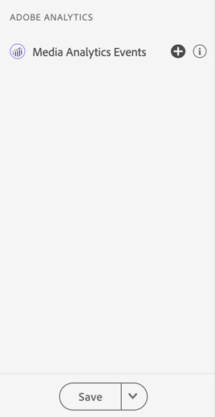
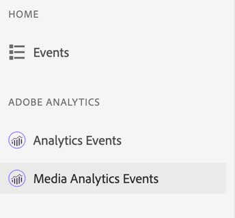
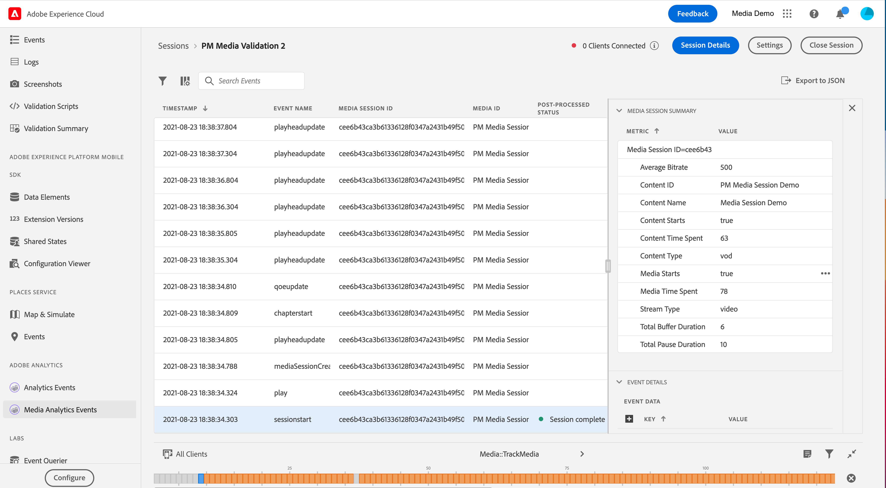

# Adobe Analytics for Streaming Media

## Overview

With the Streaming Media Analytics integration, you can now validate your AEP Mobile SDK - Media Analytics implementation. Views include what is tracked in the media session such as:

* Session start event that contains all content core, standard metadata and custom metadata properties, also session end and complete.
* Ad break Start and Ad start event with all ad properties attached, also skip and complete event for both
* Chapter Start with all properties and chapter skip and complete events
* All playback changes \(play, pause, buffer, errors, bitrate change\)
* All player state tracking changes \(start, end\) 

Once data is processed in Analytics, post-processed status and data, such as media time spent and total pause duration, are also available in the event detail view.

## Using Project Griffon for Adobe Analytics for Streaming Media

After you have connected and [set up](../set-up-project-griffon.md) your app for Adobe Analytics, you are ready to configure it for Streaming Media Analytics. At the bottom of the left panel, click **Configure** to add the Media Analytics Events view and **Save** it.

Once added, select the **Adobe Analytics &gt; Media Analytics Events** view to validate your session tracking.

In the Media Analytics Events view, you may search and filter by Session ID \(VSID\) to view a specific media session. To view additional event details, select a specific event.

For a more succinct view of API calls, you may also hide the playhead update events by selecting the **Hide Playhead Update events** filter.


Viewing post-processed media analytics data requires the use of SDK versions: Android Media 2.1.2 and iOS AEPMedia 3.0.1 \(or above\)


To view post-processed data, find the session start event and validate in the status column that the session was completed. If completed, click on the event to view a media session summary in the event detail view. For further details, scroll down to find the post-processed details.

