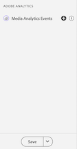
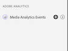

# Adobe Analytics for Streaming Media

## Overview

With the Streaming Media Analytics integration, you can now validate your AEP Mobile SDK - Media Analytics implementation.  With this initial release, views include what is tracked in the media session such as:
* Session start event that contains all content core, standard metadata and custom metadata properties, also session end and complete.
* Ad break Start and Ad start event will all ad properties attached, also skip and complete event for both
* Chapter Start with all properties and chapter skip and complete events
* All playback changes (play, pause, buffer, errors, bitrate change)
* All player state tracking changes (start, end) 

## Using Project Griffon for Adobe Analytics for Streaming Media

After you have connected and [set up](../set-up-project-griffon.md) your app for Adobe Analytics, you are ready to configure it for Streaming Media Analytics.  At the bottom of the left panel, click **Configure** to add the Media Analytics Events view and **Save** it.

Once added, select the **Adobe Analytics > Media Analytics Events** view to validate your session tracking.

In the Media Analytics Events view, you may search and filter by Session ID (VSID) to view a specific media session.  To view additional event details, select a specific event.

For a more succinct view of API calls, you may also hide the playhead update events by selecting the **Hide Playhead Update events** filter.

