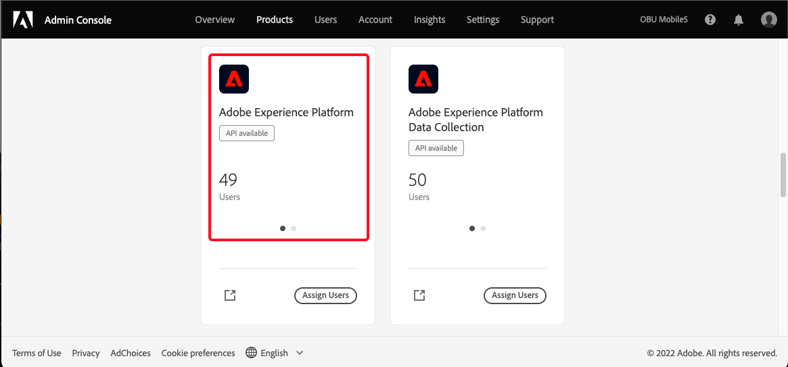
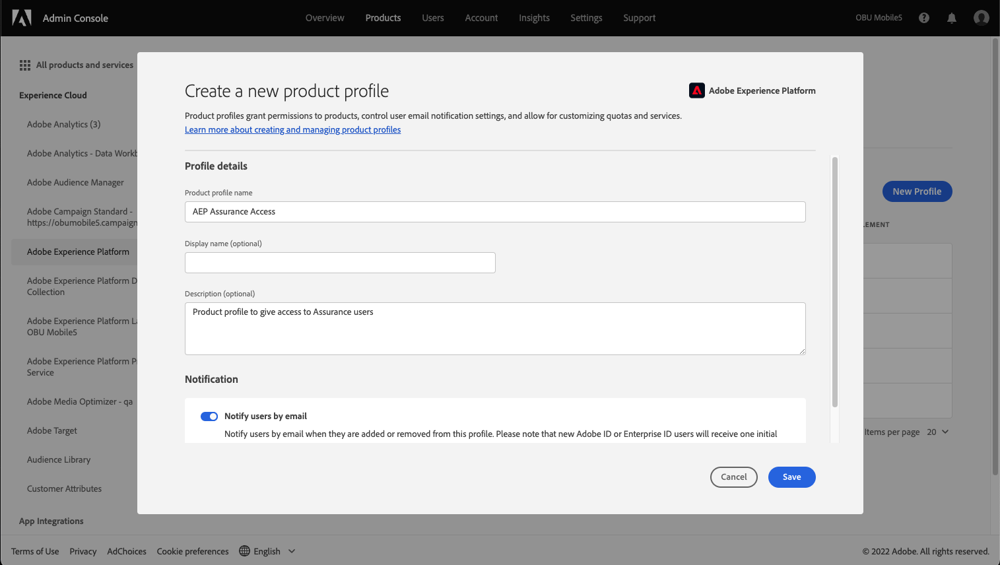
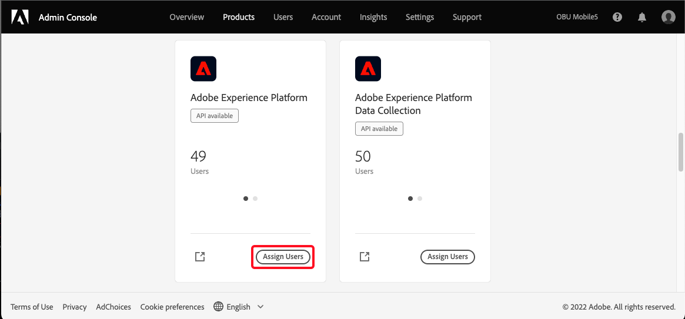

#Assurance User Access


## User Access Is Changing

We're pleased to announce that we are preparing to make Project Griffon generally available to all Adobe Experience Cloud customers during October 2022. After that time, access to Project Griffon will be managed through the Admin Console via Adobe Experience Platform. Information to provide access can be found below.  


## Set Up Access

Ask your org administrator to complete the following actions for each user that needs access to Assurance.

1. Log into the [Admin Console](https://adminconsole.adobe.com/)
1Create a new Adobe Experience Platform product profile  

NOTE: you may use an existing profile and skip this step.


   1. Select the "Products" tab, click the Adobe Experience Platform product card.  

   2. Provide a name and save. 

      
      The Adobe Experience Platform product profile you intend to use for Assurance access does not need any additional permissions added. The default with no additional selections are sufficient.
      
      
1. Assign users to the Adobe Experience Platform product profile
   1. Select the "Products" tab, click "Assign Users" on the Adobe Experience Platform.  

   1. Add one or more users to the product profile and save.  

