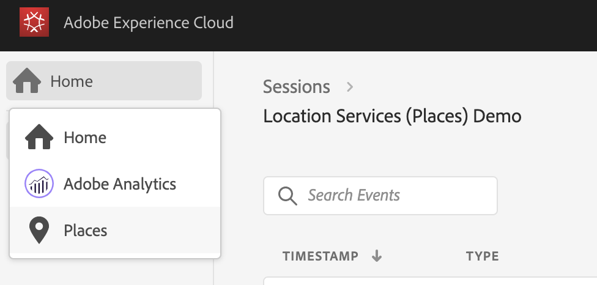

# Places Service and Project Griffon

The Places Service views allow you to inspect location entry and exit events on the Project Griffon web UI and provides an innovative on-device view. These handy views provide a convenient interface to view location specific data points for inspection on the web/client for in-context debugging depending on your business workflows.

We know that using location context with your app experiences can make them more engaging. However, debugging and validating location triggers can be painful. Using these views and reviewing the data that you collect on the device should alleviate that pain. 

## Using Project Griffon for Places Service

To get started, complete the following steps:

1. Ensure you have implemented the latest versions of [Project Griffon](../set-up-project-griffon.md) and [Places Service](location-service-and-project-griffon.md) extensions.
2. Go to https://experience.adobe.com/griffon \(and not griffon.adobe.com\).
3. Connect your app to a Project Griffon session.
4. Select the **Places** view to view your events.

