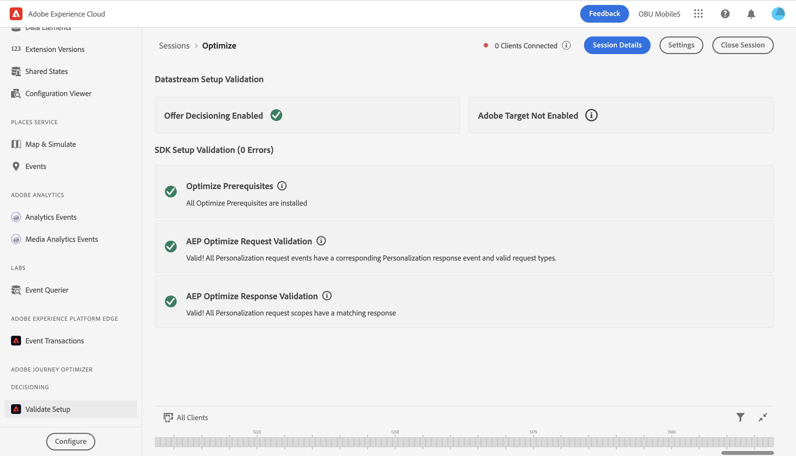
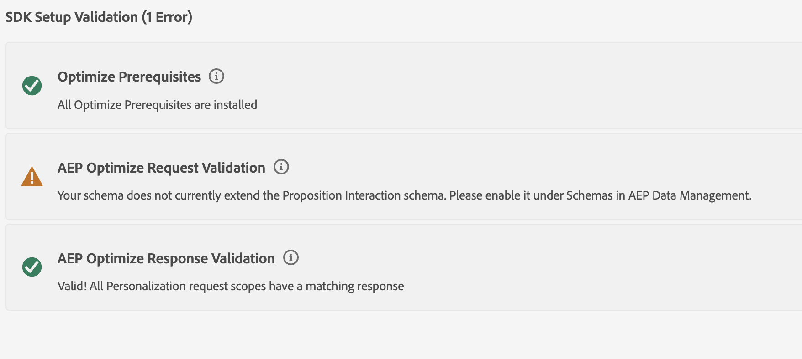

# Optimize Setup Validation View

## Overview

You may use the Optimize Setup Validation view in order to quickly see if your app has been successfully set up to use AEP Optimize. The view validates all pre-requisites have been met, and offers feedback on how to fix your setup in cases where requirements have been missed.

## Getting Started

To use this view, complete the following steps:

1. [Set up Assurance](../set-up-project-griffon.md)
2. [Create](./README.md#creating-sessions) and [connect](./README.md#connecting-to-a-session) to a Assurance session
3. In the **Home** view, select **Validate Setup**

## Datastream Setup Validation

At the top of the Optimize Setup Validation view, Assurance inspects your current app's datastream, and looks to see if Target or Offer Decisioning has been enabled. In order to use optimize, at least one of extensions needs to be enabled inside your datastream.

To enable Target in your datastream, go to the datastream view for your app inside the Data Collection UI, and ensure that Adobe Target has been added and enabled.

To enable Offer Decisioning in your datastream, go to the datastream view for your app inside the Data Collection UI, and then select Edit inside the actions menu for Adobe Experience Platform. Inside, you will see a checkbox that shows whether Offer Decisioning has been enabled.

## SDK Setup Validation

Below the datastream validation section, the SDK Setup Validation section offers feedback on two major issues you could face in your application. First it offers validation that you have installed all the required SDKs Optimize requires in order to work correctly. Second, it validates that request and response events are flowing from your application in the way the platform expects them to. Errors may arise if your schemas have been improperly implemented, or your app may be sending requests that do not receive an appropriate response. In these cases, this section will give feedback about what is going wrong, and identify the events in error so that you can diagnose what went wrong.

