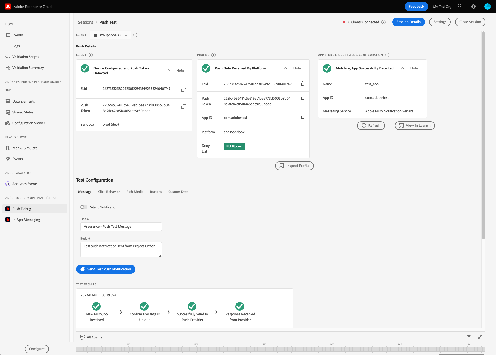
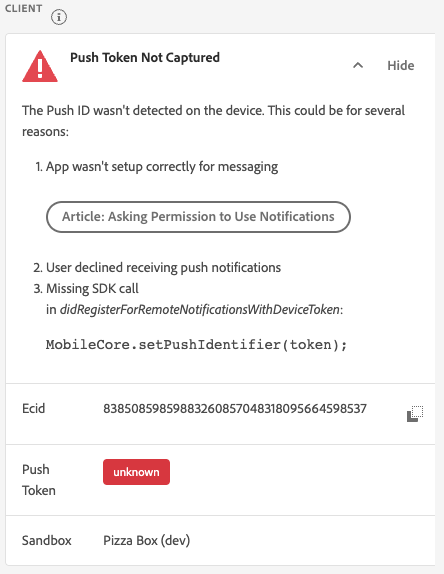
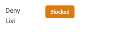
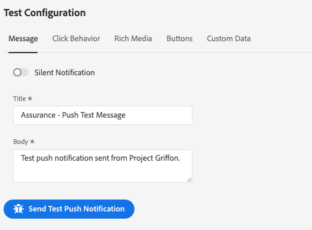
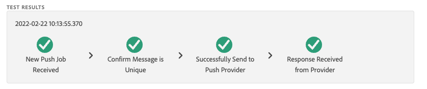
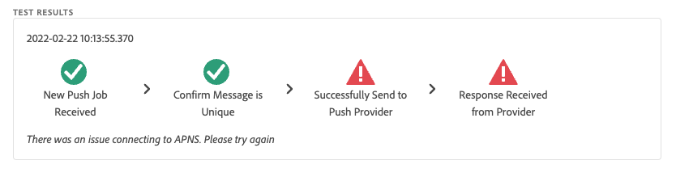
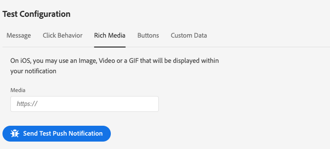

# Push Debug View

## Overview

The Push Debug View provides the ability to validate the Push setup for your app and send a test message to your device. To get started, the following image shows the complete Push Debug View when working as expected:

## Guide

### Clients

The client dropdown has a list of each unique client that has connected to this Griffon session. A client is either a unique device or a unique app install for a device. For example, if an Android device and an iOS device has been connected to the session, those clients would appear in the Clients dropdown.

After reinstalling and reconnecting the app on a device, another client will appear. If a device with that name already existed, the new dropdown will append a #2 to the name.

This view is only enabled for a single client, so selecting a different client will change the details on the screen.

### Push Details

This section will validate and provide additional details about the app's push setup. Each section performs validations against the app and will display a green check mark if the validations all succeed. If there are three green check marks, the app has been correctly configured for push messaging, is writing push tokens to the user profile, and has an associated app surface configured.

If something is not working as expected, there will be an alert with details on how to fix that problem:

#### Client Details

This panel checks to see if the device is configured correctly. This includes configuring the extension in Launch, initializing the extension and its prerequisites in your application, and capturing the push token from the device.

If valid, the Panel will display the Ecid for the device, the Push Token, and the Edge Sandbox name and type.

#### Profile Details

Once your client is set up correctly, this will check to see if the device is writing to profile. It also validates that the Push Token in the profile matches the one on the device.

If valid, the panel will show the Ecid for the device, the push token, the app ID of your application, the messaging platform, and whether the push token has been deny listed. The token can be deny listed for various reasons like the user has uninstalled the app or the user has disabled push messaging for the app.

Finally, at the bottom of the panel is a link that will open this specific profile in a new tab.

#### App Store Credentials & Configuration

This validates that the app ID and the messaging platform that was saved in the profile has a matching app surface created. This is the screen where push credentials for the application are uploaded.

If valid, the profile will display the name of the app surface, the app ID, and the name of the messaging service.

Finally, at the bottom of the panel is a link that will open this specific app surface in a new tab.

### Testing

Once the app is setup correctly and validated, the testing section can be used to  send a test message to your device. There are a couple use cases for this:

#### Use Case: Validate Setup

TO validate that the app is set up correctly and that it's push credentials are valid, enter a title and a body for a message and send it:

A new entry will appear in the test results section, showing the message passed through the Adobe Messaging Services and onto the platform's messaging service. If successful, the message should popup on the device:

If the test failed, the test results section will show an error providing more information:

#### Use Case: Developing/Testing Advanced Message Features

Several of the advanced message features, such as click behaviors and rich media, will require additional setup steps from the app developers. The additional tabs in the Testing section can help the developer develope and test these features.

