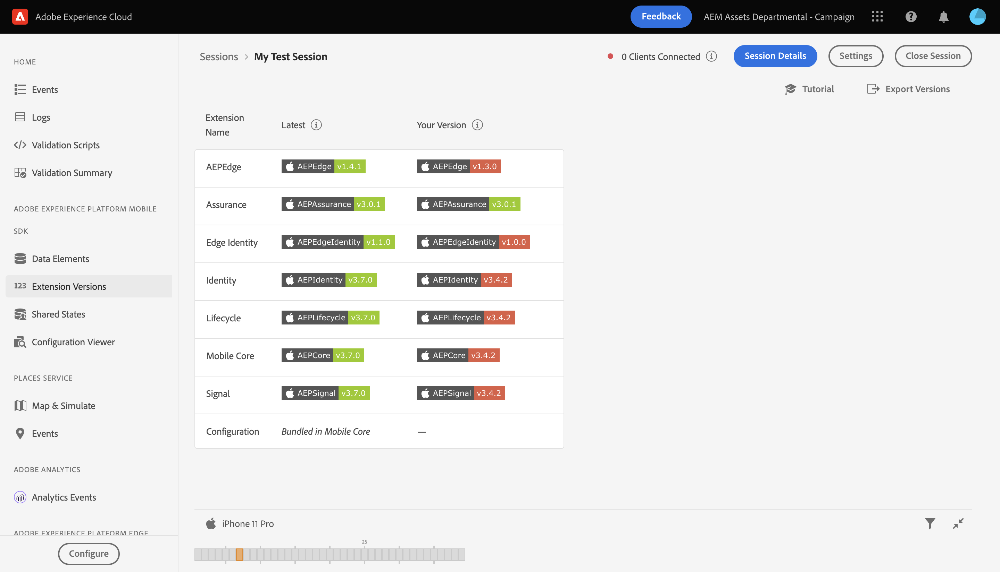
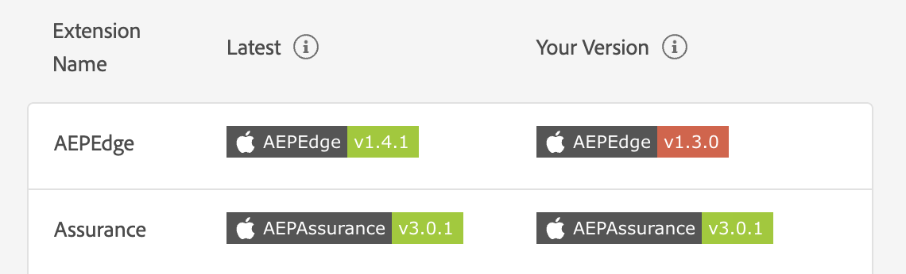
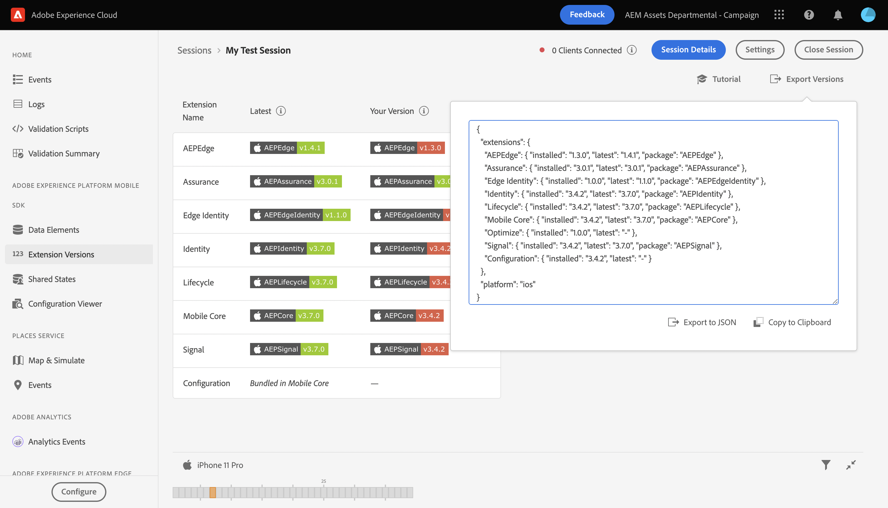

# Versions Assurance View

## Overview

You may use the Extensions Version view in order to quickly and easily view which Platform extensions you have installed and if they are up to date in a client connected to an Assurance (also known as Project Griffon) session. 

## Getting Started

To use this view, complete the following steps:

1. [Set up Assurance](../set-up-project-griffon.md)
2. [Create](./README.md#creating-sessions) and [connect](./README.md#connecting-to-a-session) to a Assurance session
3. In the **Home** view, select **Extension Versions**

## Checking if your version is up to date

Inside this view, a table displays both the latest version of each AEP SDK, as well as the current version you have installed, if applicable. When a version is in sync with the latest version, the installed version will display a green badge. Otherwise, the badge will be displayed in red.

## Exporting versions

On the top right of the view, you can select **Export Versions** which will give you a JSON payload with all the extensions information, as well as the platform of the client. You may choose to export this data to a JSON file, or copy it to your clipboard.

