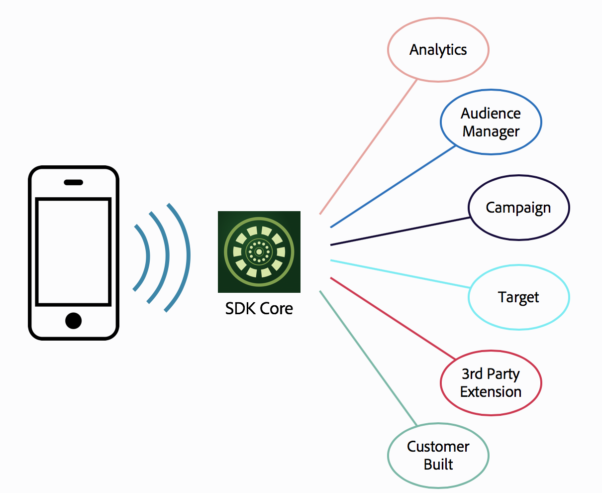

# Overview

## Overview on building SDK extensions

The Adobe Experience Platform SDK is architected to be both modular and extensible. Adobe solutions, customers, and partners may choose to create extensions that when enabled, can augment an application's functionality. Managing solution integrations as SDK extensions brings a number of benefits to the customer, such as the ability to use a single tag for SDK events, rather than having to tag each event multiple times for each solution that data needs to be sent to. 

To support customer-specific features, and allow for the greatest flexibility, the goal is to provide an interface for customers to integrate with the Adobe Experience Platform SDKs at a much lower level. This interface allows customers to define extensions, which are similar in capabilities to the extensions that Adobe Launch has written for our internal services. We are going to follow an open model, so that these extensions will have access to all of the events and data to which the Adobe Experience Platform SDK code also has access.

Extensions allow customers to extend the Adobe Experience Platform SDKs with their own code. This includes listening for and dispatching any event, reading the shared state of any registered extension, and sharing the state of the current extension. The application can use the extension to monitor for information that Adobe does not expose by default. It can also use the extension to modify Adobe Experience Platform SDK internal operations, for example by adding additional data to messages that are sent or by sending data to other systems.



## Composition of an SDK extension {#namespace-conventions}


There are two primary parts to a mobile extension - The Launch extension configuration view and the client-side native code package. This page will primarily discuss the process for building the client-side extension package. To learn more about the process for creating the Launch Extension UI, see the [Launch Developer Getting Started Guide](%20%20https://developer.adobelaunch.com/guides/extensions/getting-started/).

## Namespace Conventions

Components or data that is provided by Adobe must be clearly distinguished from the components or data that are provided by external parties. Inconsistent naming conventions impact module naming, event type, source names, and event data keys.

Here are the naming rules for extensions:

* The ADOBE\_PREFIX is com.adobe.
* The THIRDPARTY\_PREFIX is com. and com.adobe.\* is reserved for Adobe.
* Third parties must prefix their extension name and any custom event types or sources they create with the THIRDPARTY\_PREFIX followed by their company name.
* By convention, Adobe will not prefix shared state keys or event data keys. These names will be in the global namespace. example: “mid”.
* Adobe internal module names will follow the pattern ADOBE\_PREFIX.module.{moduleName}.
* Adobe event types will follow the pattern .eventType.{eventType}.
* Adobe event source will follow the pattern ADOBE\_PREFIX.eventSource.{eventSource}.
* Shared state names \(not keys\) must equal the module name.
* All constants will be named using lowerCamelCase, and cases will be normalized internally to make comparisons case-insensitive. For example, if you use **Com.Adobe.moDule.AnAlytiCS** it will be internally converted to **com.adobe.module.analytics.** An exception to this rule is that shared state names that are used in rules are compared in a **case-sensitive** manner. This means that when registering an extension, the actual case is retained internally, so that rule comparison can succeed.


We strongly recommend that you use ASCII characters even if your company name contains non-ASCII characters.


## Prerequisites to Building an Extension {#prerequisites-to-building-an-extension}

Before you build an extension, complete the following tasks:

* Ensure that you can accomplish your goals only by using an extension.

  To determine your goals, think about the following questions:

  * Do you need access to data that is not already exposed via the Adobe Experience Platform SDKs?
  * Do you need to be notified when messages will be sent, or data is being collected by the Adobe Experience Platform SDKs?
  * Do you need to add data to or modify data for outgoing messages?
  * Do you need to expose data to other extensions or to rules processing?

  **If your answers to any of these questions is yes, build the extension.**

* Ensure that you are using Objective-C on iOS or Java on Android.

  _Extensions for iOS can currently only be built using Objective-C, and extensions on Android can currently only be built using Java._

* Ensure that you have already included the Adobe Experience Platform SDKs in your project.

## Creating an SDK extension {#implementing-an-adobe-cloud-platform-sdk-extension}

To create a simple extension, follow these steps:

### **Create an Extension Class** {#a-create-an-extension-class}



The `Extension` class is the base class that any SDK extensions must derive from. The base `constructor` \(Android\) of your extension class is where you will have the opportunity to extend the SDK functionality by registering event listeners, or by setting a default shared state that other modules can access.

The `Extension` class has the following method that you must override:

* `getName`, which returns the name of the extension.

  Extension developers must prefix their extension names with the company name \(for example, _com.myCompany.myExtension_\). For more information about the naming constraints, see Namespace Conventions. The name that you use to register cannot conflict with other registered extensions or Adobe internal modules.

**Tip**: All Adobe module names are prefixed with _com.adobe.module_ and are considered reserved.

* `onUnregistered`, which allows your extension to complete the cleanup that is required when the Adobe Cloud Platform SDK unregisters your extension. Unregistration typically happens at app shutdown but can also occur when an extension is behaving badly. Examples of the extension behaving badly include taking too long to handle a callback or by throwing an exception.

The `Extension` class has the following methods that you can optionally override and a member that provides access to the Event Hub:

* `getVersion`, which returns a version string for your extension. The version string is only used for logging and is currently not validated for formatting.
* `onUnexpectedError`, which allows you log additional information when the Adobe Experience Cloud Platform SDK encounters an error that could not be returned immediately from a call into the Adobe Cloud Platform SDK. An example is an exception that is thrown on a worker thread. The exceptions are rare after your extension has been correctly implemented, but the exceptions might occur during development.
* `getApi` , allows the extension developer to interact with the Event Hub to register event listeners, manage shared state, and so on.

  This method can be used at any after the extension registration is complete. It may also be used by your listeners by using the extension member.

**Tip**: The `Extension` class provides access to the `ExtensionApi` interface through the `getApi` member.

#### **Android code example** {#android-code-example}

```java
import com.adobe.marketing.mobile.*;
class MyExtension extends Extension {

    public MyExtension(final ExtensionApi extensionApi) {
        super(extensionApi);
    }

    @Override
    public String getName() {
        return "my.company.com";
    }

    @Override
    public void onUnregistered() {
        // this method will be called when the extension is unregistered from the 
        // Event Hub in order for you to perform the necessary cleanup
    }
}
```



The `ACPExtension`class is the base class that any iOS SDK extensions must derive from. The `init` method of your extension class is where you will have the opportunity to extend the SDK's functionality by registering event listeners, or by setting a default shared state that other modules can access.

The `ACPExtension` class has the following method that you must override:

* `name`, which returns the name of the extension. Extension developers must prefix their extension names with the company name \(for example, _com.myCompany.myExtension_\). For more information about the naming constraints, see [Namespace Conventions](https://docs.adobelaunch.com/extension-reference/mobile/build-your-own-extension#namespace-conventions). The name that you use to register cannot conflict with other registered extensions or Adobe internal modules.

  **Tip**: All Adobe module names are prefixed with com.adobe.module and are considered reserved.

The `ACPExtension` class has the following methods that you can optionally override and a member that provides access to the Event Hub:

* `version`, which returns a version string for your extension. The version string is only used for logging and is currently not validated for formatting.
* `onUnregister`, which allows your extension to complete the cleanup that is required when the Adobe Cloud Platform SDK unregisters your extension. Unregistration typically happens at app shutdown but can also occur when an extension is behaving badly. Examples of the extension behaving badly include taking too long to handle a callback or by throwing an exception.
* `unexpectedError`, which allows you log additional information when the Adobe Cloud Platform SDKs encounter an error that could not be returned immediately from a call into the SDK. An example is an exception that is thrown on a worker thread. The exceptions are rare after your extension has been correctly implemented, but the exceptions might occur during development.
* `api` , allows the extension developer to interact with the Event Hub to register event listeners, manage shared state, and so on. This method can be used at any time during or after init has been called on your extension. It may also be used by your listeners by using the extension member. **Tip**: The ACPExtension class provides access to the `ACPExtensionApi` interface through the API member.

#### **iOS code example** {#ios-code-example}

1. In Xcode, create a new file from the `Cocoa Touch Class` template and save it in your project.
2. Name this class `MyExtension` and ensure that this class is a member of `ACPExtension`.

**Tip**: In the example below, the methods that are available for overriding are displayed.

**MyExtension.h**

```objectivec
import "ACPExtension.h"
@interface MyExtension: ACPExtension {}
   (void) unexpectedError: (nonnull NSError*) error;
   (void) onUnregister;
@end
```

1. At a minimum, you must provide an implementation for the `init` and `name` methods.

   **MyExtension.m**

   ```objectivec
   #import "MyExtension.h"
    @implementation MyExtension
     - (nullable NSString*) name {
        return @"com.myCompany.myExtension";
      }
     - (instancetype) init {
       if (self= [super init]) {
       // your extension code goes here
       }
        return self;
      }
    @end
   ```

2. The default implementation of onUnregister must be called if you decide to override the `init` method.

   ```objectivec
   - (void) onUnregister
        [super onUnregister];
        // your extension code goes here
        }
   ```

3. The default implementation of `unexpectedError` will log an error message using `NSLog`.

   ```objectivec
   - (void) unexpectedError {
    [super unexpectedError];
    //your detailed logging code goes here
    }
   ```



### **Registering your extension** {#b-registering-your-extension}

After creating your extension class, you can register it by using the `ACPCore` method `registerExtension`. Some registration errors, such as undefined names, name conflicts, or type checking issues, occur immediately. Other errors might occur asynchronously and are reported through the `unexpectedError` callback before the extension is unregistered.

**Tip**: Registration can be completed any time after the app is launched.

During registration, the extension class that you passed will be used by the Adobe Cloud Platform SDKs to instantiate an instance that will be retained until the extension is unregistered.



A convenient place to register your extension on iOS is in the `AppDelegate didFinishLaunchingWithOptions` method.

```objectivec
#import "ACPMobileMarketing.h"
#import "MyExtension.h"
@implementation AppDelegate
-(BOOL)application:(UIApplication *)application didFinishLaunchingWithOptions:(NSDictionary *)launchOptions {
NSError* error = nil;
if ([ACPMarketingMobileCore registerExtension: [MyExtension class] error: &error]) {
    NSLog(@"MyExtension was registered");
  }
  else {
    NSLog(@"Error registering MyExtension: %@ %d", [error domain], (int)[error code]);
  }
}
@end
```



A convenient place to register your extension on Android is in the `onCreate` method of your activity.

```java
import com.adobe.marketing.mobile.MobileCore;
import com.adobe.marketing.mobile.ExtensionError;
import com.adobe.marketing.mobile.ExtensionErrorCallback;
...
@Override
public void onCreate() {
    super.onCreate();
    MobileCore.setApplication(this);

    ExtensionErrorCallback<ExtensionError> errorCallback = new ExtensionErrorCallback<ExtensionError>() {
        @Override
        public void error(final ExtensionError extensionError) {
            Log.e("Extensions", String.format("An error occurred while registering the MyCustomExtension %d %s", extensionError.getErrorCode(), extensionError.getErrorName()));
            }
        };
    if (!MobileCore.registerExtension(MyCustomExtension.class, errorCallback)) {
        Log.e("Extensions", "Failed to register the MyCustomExtension extension");
    }
}
```



### **Unregister your extension** {#c-unregistering-your-extension}

If your extension does not need to be active at all times, you can unregister your extension by using `unregisterExtension` in the `ACPExtensionApi`. This process allows you to have more granular resource control, but the listeners that you registered will be unregistered. If you overrode `onUnregister`, you should see a call into your implementation that allows you to clean up resources before the instance is released.


If you retained a reference to the extension instance \(for example by storing `self` or `this` in a static variable\), this is where you should clean it up.


## Extension Architecture {#extension-architecture}

### Error Handling {#error-handling}

When using an extension, you might get asynchronous or synchronous errors.

#### Synchronous Errors {#synchronous-errors}

Synchronous errors are caught outside the Adobe Cloud Platform SDK and might occur for the following reasons:

* When registering a class with the incorrect parent class.
* When passing empty strings to certain parameters. Examples include an extension name, an event type, a shared state name, and so on.
* When passing malformed JSON data.Synchronous errors will be returned immediately on the same thread. **Important**: In iOS, a `@false` value is returned to indicate an error and filling in an optional `NSError` out parameter.

#### Asynchronous Errors {#asynchronous-errors}

Asynchronous errors caught in the SDK are rare. When they occur, the error is handled with a callback function, which might be called back on a different thread.

Asynchronous errors might occur for the following reasons:

* When registering an extension with a name that duplicates an internal module or a previously registered extension.
* When using a deprecated shared state name.
* When registration is attempted during extension shutdown.
* When an event is being dispatched while the extension is being shut down.
* When a callback from the Adobe Experience Platform SDKs to the external code throws an exception.
* When an internal error occurs, or an unexpected exception is thrown.
* When a timeout has been exceeded.


In iOS, asynchronous errors are handled by using the `unexpectedError` method that is defined in the `ADBExtension` class.


