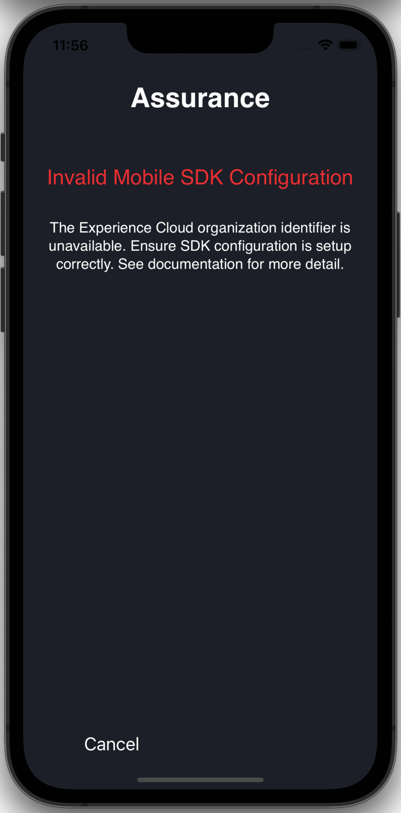
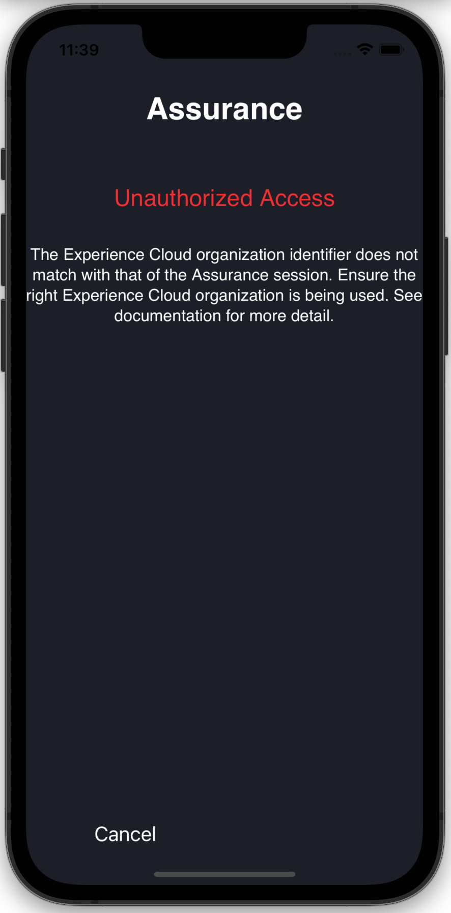

# Resolving Common Issues

## Unable to open app with QR code or generated link

If scanning the QR code or opening the deep link in Project Griffon does not open your app, deep linking may not be correctly configured in your mobile application.

Please follow OS developer documentation to learn more on setting up deep linking.



Follow the [Android documention](https://developer.android.com/training/app-links/deep-linking%20) on information about how to setup a deeplink.



Follow [Apple developer](https://developer.apple.com/documentation/uikit/inter-process_communication/allowing_apps_and_websites_to_link_to_your_content/defining_a_custom_url_scheme_for_your_app) documentation to set custom URL scheme for your application.



## P**IN** screen does not appear

When the generated link or QR code from Project Griffon is opened on device, it should launch your app and show a PIN screen to establish a Project Griffon session \(as shown below\). If this screen does not appear, ensure the following:


### Register Assurance SDK extension with Mobile Core



#### Java

```java
public class MobileApp extends Application {
   @Override
   public void onCreate() {
      super.onCreate();
      MobileCore.setApplication(this);
      MobileCore.configureWithAppId("yourAppId");
      try {
         Assurance.registerExtension();
         MobileCore.start(null);
      } catch (Exception e) {
         // Log the exception
      }
   }
  }
```



**Swift**

```swift
func application(_ application: UIApplication, didFinishLaunchingWithOptions launchOptions: [UIApplication.LaunchOptionsKey: Any]?) -> Bool {
     ACPCore.configure(withAppId: "yourAppId")   
     AEPAssurance.registerExtension() // <-- register AEPAssurance with Core
     ACPCore.start(nil)
     // Override point for customization after application launch. 
     return true;
}
```



### Copy link or open QR code from Project Griffon

The PIN screen may not show if the link or QR code is incorrect \(or doesn't contain the query parameter `adb_validation_sessionid`\). You may detect this error by seeing console logs with the following strings:



```text
W/AdobeExperienceSDK: Assurance - Not a valid Assurance deeplink, Ignorning start session API call. URL :  <deeplink URL>
```



```text
[AdobeExperienceSDK DEBUG <AEPAssurance>]: Not a valid Assurance deeplink, Ignorning start session API call. URL : <deeplink URL>
```



This issue may be resolved by scanning the right QR code or correctly copying the link generated in Project Griffon.

## Connection error

After you enter the PIN, if you see the following Connection Error:


You may resolve it by double-checking the PIN is entered correctly from the session associated link or QR code:


Or ensuring internet connectivity on the device/simulator.

## Invalid Launch & SDK configuration

If you see a Invalid Launch & SDK Configuration error \(see screenshot below\), verify the following:

1. Mobile Core is [configured](https://aep-sdks.gitbook.io/docs/using-mobile-extensions/mobile-core/configuration/configuration-api-reference)
2. Configuration in Experience Platform Launch is [published](https://aep-sdks.gitbook.io/docs/getting-started/create-a-mobile-property#publish-the-configuration)
3. Ensure the device/simulator has internet connectivity



#### Sample logs



```text
W/AdobeExperienceSDK: Assurance - Assurance connection closed. Reason: Invalid Launch & SDK Configuration, Description: The Experience Cloud Org identifier is unavailable from SDK configuration. Please ensure the Launch mobile property is properly configured.
```



```text
[AdobeExperienceSDK ERROR <AEPAssurance>]: Assurance connection closed. Reason: Invalid Launch & SDK Configuration, Description: The Experience Cloud Org identifier is unavailable from SDK configuration. Please ensure the Launch mobile property is properly configured.
```



## Unauthorized access

This error may happen when you have access to multiple organizations in your Adobe Experience Cloud interface. To resolve, ensure the organization which houses the Experience Platform Launch mobile property is the same one as that where you are using Project Griffon.



#### Sample logs



```text
W/AdobeExperienceSDK: Assurance - Assurance connection closed. Reason: Unauthorized Access, Description: AEP Assurance sessions and Launch mobile properties must be created in the same organization.
```



```text
[AdobeExperienceSDK ERROR <AEPAssurance>]: Assurance connection closed. Reason: Unauthorized Access, Description: AEP Assurance sessions and Launch mobile properties must be created in the same organization.
```



## Timeout

This SDK log message is not an error and is displayed during the routine course of SDK initialization. This message is expected if the app was not launched with a Project Griffon deep link. You may ignore this message if Project Griffon works as expected.

#### Sample log messages



```text
D/AdobeExperienceSDK: Assurance - Timeout - Assurance did not receive deeplink to start Assurance session within 5 seconds. Shutting down Assurance extension
```



```text
[AdobeExperienceSDK DEBUG <AEPAssurance>]: Timeout - Griffon didnot receive deeplink to start griffon session. Shutting down griffon extension
```



## Failed to show fullscreen takeover

This log message is not an error and will appear with routine usage on Android devices & simulators. You may ignore this log if Project Griffon works as expected.

#### Sample log

```text
W/AdobeExperienceSDK: Assurance - Failed to show fullscreen takeover, could not get fullScreenTakeover object.
```

