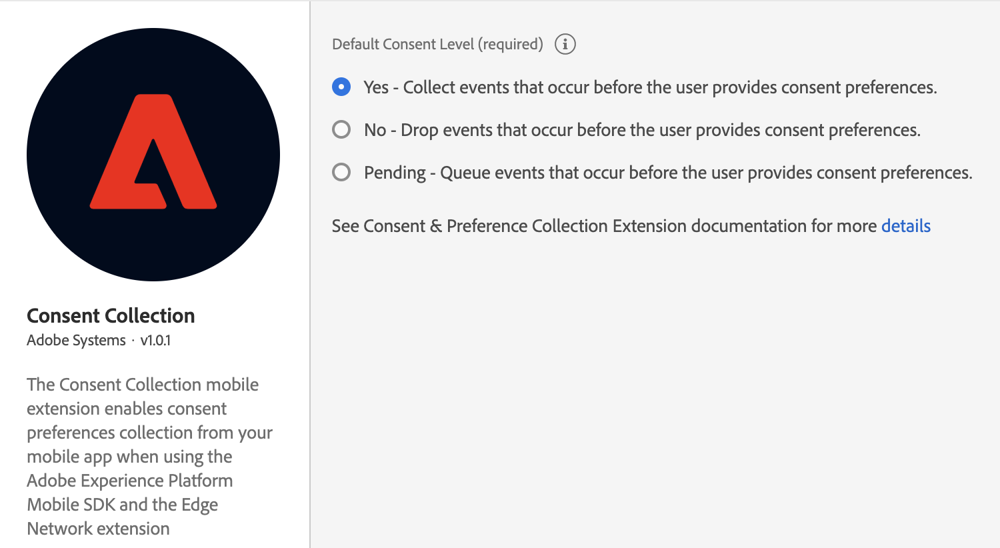

# Consent for Edge Network

The Adobe Experience Platform Consent mobile extension enables consent preferences collection from your mobile app when using the [Adobe Experience Platform Mobile SDK](../mobile-core) and the [Edge Network extension](../experience-platform-extension).

## Configure the Adobe Experience Platform Consent extension in Data Collection UI

1. In Data Collection UI, in your mobile property, select the **Extensions** tab.
2. On the **Catalog** tab, locate or search for the **Consent** extension, and select **Install**.
3. Set your desired default consent level.
4. Select **Save**.
5. Follow the publishing process to update SDK configuration.



## Add the AEP Consent extension to your app

### Download and import the Consent extension



### Java

1. Add the Mobile Core and Edge extensions to your project using the app's Gradle file.

   ```java
   implementation 'com.adobe.marketing.mobile:core:1.+'
   implementation 'com.adobe.marketing.mobile:edge:1.+'
   implementation 'com.adobe.marketing.mobile:edgeidentity:1.+'
   implementation 'com.adobe.marketing.mobile:edgeconsent:1.+'
   ```

2. Import the Mobile Core and Edge extensions in your Application class.

   ```java
    import com.adobe.marketing.mobile.MobileCore;
    import com.adobe.marketing.mobile.Edge;
    import com.adobe.marketing.mobile.edge.identity.Identity;
    import com.adobe.marketing.mobile.edge.consent.Consent;
   ```
   


1. Add the Mobile Core and Edge extensions to your project using Cocoapods. Add following pods in your `Podfile`:

   ```swift
   use_frameworks!
   target 'YourTargetApp' do
       pod 'AEPCore'
       pod 'AEPEdge'
       pod 'AEPEdgeIdentity'
       pod 'AEPEdgeConsent'
   end
   ```

2. Import the Mobile Core and Edge libraries:

### Swift

```swift
// AppDelegate.swift
import AEPCore
import AEPEdge
import AEPEdgeIdentity
import AEPEdgeConsent
```

### Objective-C

```objectivec
// AppDelegate.h
@import AEPCore;
@import AEPEdge;
@import AEPEdgeIdentity;
@import AEPEdgeConsent;
```




This extension is built on the AEPCore (3.x) and it is not compatible with ACPCore (2.x). Please follow [the guide for migrating to the Swift AEPCore](https://aep-sdks.gitbook.io/docs/resources/migrate-to-swift).





### Register Edge extensions with Mobile Core



### Java

```java
public class MobileApp extends Application {

    @Override
    public void onCreate() {
      super.onCreate();
      MobileCore.setApplication(this);
      try {
        Edge.registerExtension();
        Consent.registerExtension(); // register Consent
        Identity.registerExtension();
        // register other extensions
        MobileCore.start(new AdobeCallback() {
          @Override
          public void call(final Object o) {
            MobileCore.configureWithAppID("yourAppId");
          }});
      } catch (Exception e) {
        //Log the exception
      }
    }
}
```



### Swift

```swift
// AppDelegate.swift
func application(_ application: UIApplication, didFinishLaunchingWithOptions launchOptions: [UIApplication.LaunchOptionsKey: Any]?) -> Bool {
    MobileCore.registerExtensions([Identity.self, Edge.self, Consent.self], {
        MobileCore.configureWith(appId: "yourLaunchEnvironmentID")
    })
  ...
}
```

### Objective-C

```objectivec
// AppDelegate.m
- (BOOL)application:(UIApplication *)application didFinishLaunchingWithOptions:(NSDictionary *)launchOptions {
    [AEPMobileCore registerExtensions:@[AEPMobileEdgeIdentity.class, AEPMobileEdge.class, AEPMobileEdgeConsent.class] completion:^{
    [AEPMobileCore configureWithAppId: @"yourLaunchEnvironmentID"];
  }];
  ...
}
```



## Configuration keys

To update the SDK configuration programmatically, use the following information to change the Edge Consent configuration values.

| Key | Required | Description | Data Type |
| :--- | :--- | :--- | :--- |
| consent.default | No | Consents in XDM format. For more details, see [Privacy/Personalization/Marketing Preferences \(Consents\) Schema](https://github.com/adobe/xdm/blob/master/docs/reference/mixins/profile/profile-consents.schema.md). | Map |

