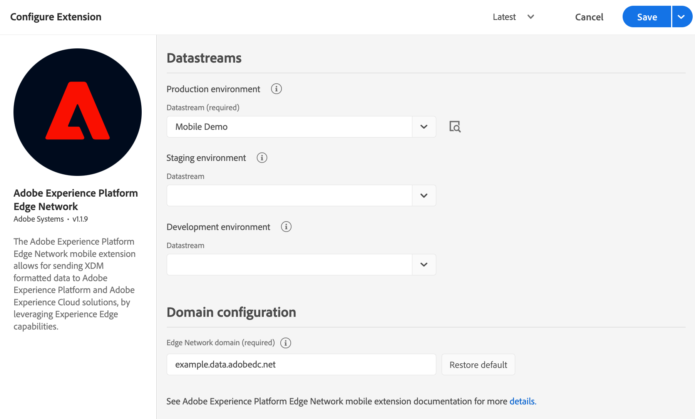

# Adobe Experience Platform Edge Network

## Before starting

### Install Identity for Edge Network

The Adobe Experience Platform Edge Network extension requires the Identity for Edge Network extension in order to operate. As a first step install and configure the [Identity for Edge Network](../identity-for-edge-network) extension, then continue with the steps below.

## Configure the Edge Network extension in Data Collection UI <a id="configure-edge-network-extension"></a>

1. In the Data Collection UI, in your mobile property, select the **Extensions** tab.
2. On the **Catalog** tab, locate or search for the **Adobe Experience Platform Edge Network** extension, and select **Install**.
3. Select the **Datastream** you would like to use per environment. Read more about [datastreams](./#datastreams) below.
4. Set up the **Domain configuration** by either using the automatically populated domain, or a first party domain mapped to an Adobe-provisioned Edge network domain. For more information, see [domain configuration](./#domain-configuration) below.
4. Select **Save**.
5. Follow the [publishing process](../../getting-started/create-a-mobile-property.md#publish-the-configuration) to update SDK configuration.



### Datastreams

If no datastream was previously created, see [Configure datastreams](../../getting-started/configure-datastreams.md) before moving to the next step.

You may configure only the required datastream for the production environment, and by default the staging and development environments will use the same datastream. Alternatively, if you want to use different datastreams per each environment, select the desired ones from the corresponding drop-down lists.


If your organization uses multiple sandboxes, select the **Sandbox** first, then select the **Datastream** for each environment.


The datastream used by the client-side implementation is one of the followings:

* the `Production environment` configuration when the Launch library is published to production \(in the Published column in the Launch publishing flow\).
* the `Staging environment` configuration when the Launch library is published to staging \(in the Submitted column in the Launch publishing flow\).
* the `Development environment` configuration when the Launch library is in development.

### Domain configuration

The value under the **Edge Network domain** field is used for requests to Adobe Experience Platform Edge Network and it usually follows the format `<company>.data.adobedc.net`, where `<company>` is the unique namespace associated to your Adobe organization.

If you have a first-party domain mapped to the Adobe-provisioned Edge Network domain, you can enter it here. For more details about how to configure or maintain a first-party domain, see [Adobe-Managed Certificate Program](https://experienceleague.adobe.com/docs/core-services/interface/administration/ec-cookies/cookies-first-party.html?lang=en#adobe-managed-certificate-program).

**Note:** The domain name is expected to be just the domain without any protocol or trailing slashes. If no domain is provided, by default the `edge.adobedc.net` domain is used.

## Add the Edge Network extension to your app

### Download and import the Edge extension



### Java

1. Add the Mobile Core and Edge extensions to your project using the app's Gradle file.

   ```java
   implementation 'com.adobe.marketing.mobile:core:1.+'
   implementation 'com.adobe.marketing.mobile:edge:1.+'
   implementation 'com.adobe.marketing.mobile:edgeidentity:1.+'
   ```

2. Import the Mobile Core and Edge extensions in your application class.

   ```java
    import com.adobe.marketing.mobile.MobileCore;
    import com.adobe.marketing.mobile.Edge;
   ```





1. Add the Mobile Core and Edge extensions to your project using CocoaPods. Add following pods in your `Podfile`:

   ```swift
   use_frameworks!
   target 'YourTargetApp' do
   	pod 'AEPCore'
   	pod 'AEPEdge'
   	pod 'AEPEdgeIdentity'
   end
   ```
   
2. Import the Mobile Core and Edge libraries:

### Swift

```swift
// AppDelegate.swift
import AEPCore
import AEPEdge
import AEPEdgeIdentity
```

### Objective-C

```objectivec
// AppDelegate.h
@import AEPCore;
@import AEPEdge;
@import AEPEdgeIdentity;
```




This extension is built on the AEPCore (3.x) and it is not compatible with ACPCore (2.x). Please follow [the guide for migrating to the Swift AEPCore](../../resources/migrate-to-swift.md).





### Register Edge with Mobile Core




### Java

```java
public class MobileApp extends Application {

    @Override
    public void onCreate() {
      super.onCreate();
      MobileCore.setApplication(this);

      try {
        Edge.registerExtension();
        com.adobe.marketing.mobile.edge.identity.Identity.registerExtension();
        // register other extensions
        MobileCore.start(new AdobeCallback() {
          @Override
          public void call(final Object o) {
            MobileCore.configureWithAppID("yourAppId");
          }});
      } catch (Exception e) {
        //Log the exception
      }
    }
}
```



### Swift

```swift
// AppDelegate.swift
func application(_ application: UIApplication, didFinishLaunchingWithOptions launchOptions: [UIApplication.LaunchOptionsKey: Any]?) -> Bool {
    MobileCore.registerExtensions([Edge.self, AEPEdgeIdentity.Identity.self], {
    MobileCore.configureWith(appId: "yourAppId")
  })
  ...
}
```

### Objective-C

```objective-c
// AppDelegate.m
- (BOOL)application:(UIApplication *)application didFinishLaunchingWithOptions:(NSDictionary *)launchOptions {
    [AEPMobileCore registerExtensions:@[AEPMobileEdge.class, AEPMobileEdgeIdentity.class] completion:^{
    ...
  }];
  [AEPMobileCore configureWithAppId: @"yourAppId"];
  ...
}
```




## Next steps

Install other extensions based on your use-case:

1. If your application requires user consent preferences collection and enforcement, install and configure the [Consent for Edge Network](../consent-for-edge-network) extension.
2. Lifecycle extension now supports application lifecycle metrics collection for Edge Network. If you would like to start collecting this type of data, follow the installation instruction for [Lifecycle for Edge Network](../lifecycle-for-edge-network).
3. If your application uses push notifications, see also the [Adobe Journey Optimizer](../../using-mobile-extensions/adobe-journey-optimizer) extension.

## Configuration keys

To update the SDK configuration programmatically, use the following information to change the Edge configuration values.

| Key | Required | Description | Data Type |
| :--- | :--- | :--- | :--- |
| edge.configId | Yes | See [datastreams](./#datastreams). | String |
| edge.domain   | No  | A custom first-party domain mapped to the Adobe provisioned Edge Network domain. | String |

