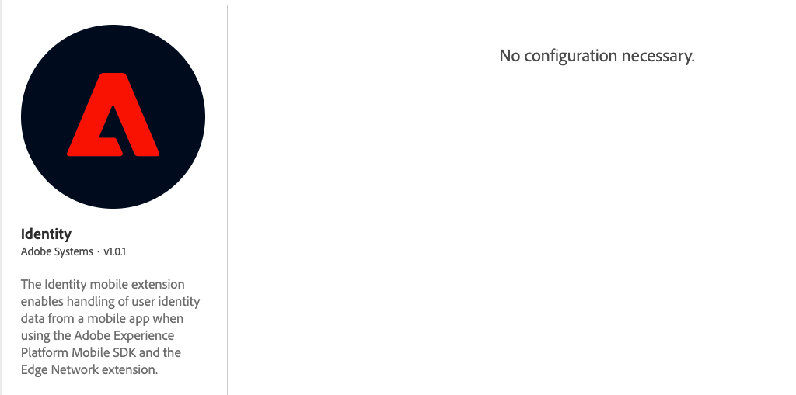

# Identity for Edge Network

The Adobe Experience Platform Identity mobile extension enables identity management from your mobile app when using the Adobe Experience Platform Mobile SDK and the [Edge Network extension](../experience-platform-extension/).

## Configure the Adobe Experience Platform Identity extension in the Data Collection UI

1. In Data Collection UI, in your mobile property, select the **Extensions** tab.
2. On the **Catalog** tab, locate or search for the **Identity** extension, and select **Install**.
3. There are no configuration settings for **Identity**.
4. Select **Save**.
5. Follow the publishing process to update SDK configuration.



## Add the AEP Identity extension to your app

### Download and import the Identity extension


The following instructions are for configuring an application using Adobe Experience Platform Edge mobile extensions. If an application will include both Edge Network and Adobe Solution extensions, both the Identity for Edge Network and Identity for Experience Cloud ID Service extensions are required. Find more details in the [frequently asked questions](identity-faq.md).




### Java

1. Add the Mobile Core and Edge extensions to your project using the app's Gradle file.

   ```java
   implementation 'com.adobe.marketing.mobile:core:1.+'
   implementation 'com.adobe.marketing.mobile:edge:1.+'
   implementation 'com.adobe.marketing.mobile:edgeidentity:1.+'
   ```

2. Import the Mobile Core and Edge extensions in your Application class.

   ```java
    import com.adobe.marketing.mobile.MobileCore;
    import com.adobe.marketing.mobile.Edge;
    import com.adobe.marketing.mobile.edge.identity.Identity;
   ```





1. Add the Mobile Core and Edge extensions to your project using CocoaPods. Add following pods in your `Podfile`:

   ```swift
   use_frameworks!
   target 'YourTargetApp' do
       pod 'AEPCore'
       pod 'AEPEdge'
       pod 'AEPEdgeIdentity'
   end
   ```

2. Import the Mobile Core and Edge libraries:

### Swift

```swift
// AppDelegate.swift
import AEPCore
import AEPEdge
import AEPEdgeIdentity
```

### Objective-C

```objectivec
// AppDelegate.h
@import AEPCore;
@import AEPEdge;
@import AEPEdgeIdentity;
```




This extension is built on the AEPCore (3.x) and it is not compatible with ACPCore (2.x). Please follow [the guide for migrating to the Swift AEPCore](../../resources/migrate-to-swift.md).





### Register the Identity extension with Mobile Core



### Java

```java
public class MobileApp extends Application {

    @Override
    public void onCreate() {
      super.onCreate();
      MobileCore.setApplication(this);
      try {
        Edge.registerExtension();
        Identity.registerExtension();
        // register other extensions
        MobileCore.start(new AdobeCallback () {
            @Override
            public void call(Object o) {
                MobileCore.configureWithAppID("yourAppId");
            }
        });      

      } catch (Exception e) {
        ...
      }


    }
}
```



### Swift

```swift
// AppDelegate.swift
func application(_ application: UIApplication, didFinishLaunchingWithOptions launchOptions: [UIApplication.LaunchOptionsKey: Any]?) -> Bool {
    MobileCore.registerExtensions([Identity.self, Edge.self], {
    MobileCore.configureWith(appId: "yourLaunchEnvironmentID")
  })
  ...
}
```

### Objective-C

```objectivec
// AppDelegate.m
- (BOOL)application:(UIApplication *)application didFinishLaunchingWithOptions:(NSDictionary *)launchOptions {
    [AEPMobileCore registerExtensions:@[AEPMobileEdgeIdentity.class, AEPMobileEdge.class] completion:^{
    ...
  }];
  [AEPMobileCore configureWithAppId: @"yourLaunchEnvironmentID"];
  ...
}
```


