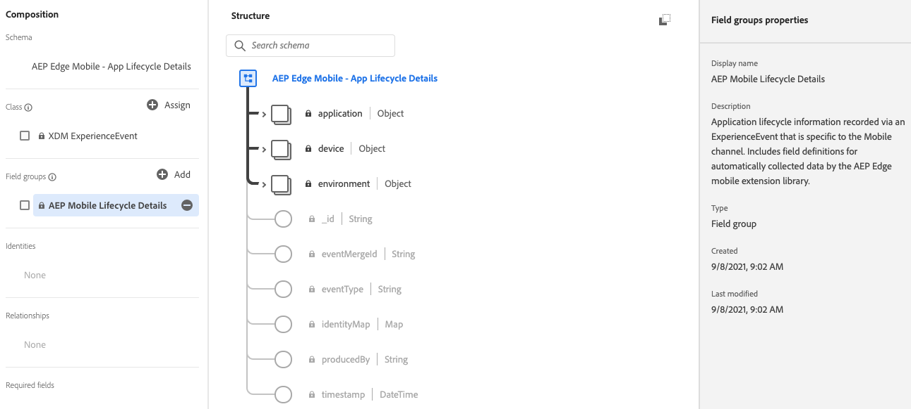
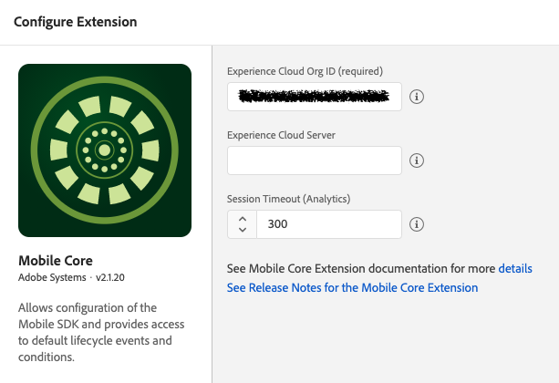
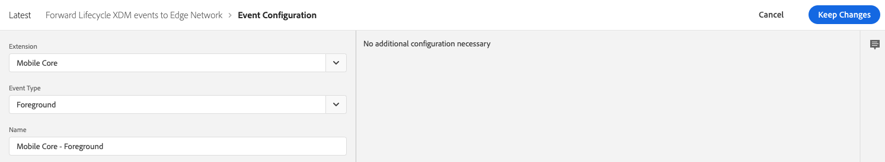
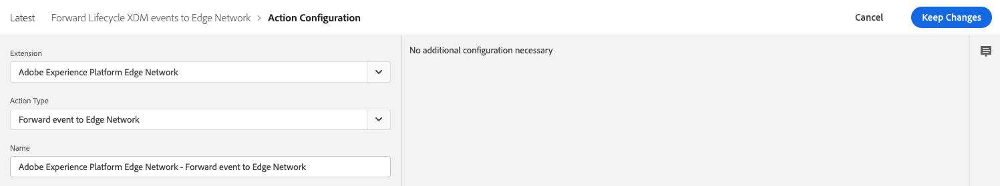
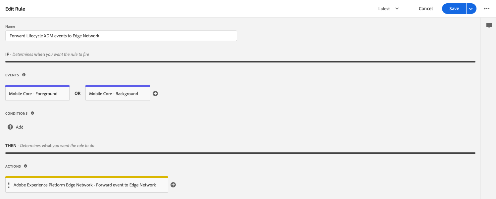

# Lifecycle for Edge Network

The Adobe Experience Platform Mobile SDK Lifecycle extension enables application lifecycle data collection from your mobile app when using the Adobe Experience Platform Mobile SDK and the [Edge Network extension](../experience-platform-extension/). The following steps will setup an application to forward Lifecycle extension metrics to the Adobe Experience Platform.

## Add AEP Mobile Lifecycle Details field group to your XDM Schema in Adobe Experience Platform

Include the AEP Mobile Lifecycle Details field group to the schema defined in your Edge configuration data stream. The AEP Mobile Lifecycle field group defines all the metrics auto-collected by the Lifecycle for Edge Network extension. 

1. In Adobe Experience Platform, log into your organization.
2. Under **Schemas** section, select the **Browse** tab and search for the schema used in the application's Edge configuration.
3. In the **Field groups** section, select **Add**
4. Search for **AEP Mobile Lifecycle Details**, select it then click **Add field groups**
5. Click **Save**

## Configure the Adobe Experience Platform Lifecycle extension in Experience Platform Launch


The Lifecycle for Edge Network extension is part of the Mobile Core extension. There is no separate card for the Lifecycle for Edge Network extension in the Launch Extensions Catalog.



The configuration setting "Session Timeout" in the Mobile Core extension configuration is used when collecting Lifecycle session data for Analytics and is not used for the Lifecycle for Edge Network extension.


1. In Experience Platform Launch, in your mobile property, click the **Extensions** tab.
2. On the **Catalog** tab, locate or search for the **Mobile Core** extension, and click **Install**.
3. There are no configuration settings for **Lifecycle for Edge Network**.
4. Click **Save**.
5. Follow the publishing process to update SDK configuration.

In addition, use the following steps to [Configure the AEP Edge Network extension in Launch](https://aep-sdks.gitbook.io/docs/foundation-extensions/experience-platform-extension#configure-the-edge-network-extension-in-launch).

## Configure a Rule in Launch to forward Lifecycle metrics to Platform
The Lifecycle for Edge Network extension dispatches application foreground and background events to the Mobile SDK. Create a rule to forward these events to the Adobe Experience Platform Edge Network.

### Create a rule

1. On the **Rules** tab, click **Create New Rule**.
2. Give your rule an easily recognizable name in your list of rules.

   In this example, the rule is named "Forward Lifecycle XDM events to Edge Network".


If you do not have existing rules for this property, the **Create New Rule** button will be in the middle of the screen. If your property has rules, the button will be in the top right of the screen.


### Select an event

1. Under the **Events** section, click **Add**.
2. From the **Extension** dropdown list, select **Mobile Core**.
3. From the **Event Type** dropdown list, select **Foreground**.
4. Click **Keep Changes**.
5. Under the **Events** section again, click the plus icon to add another Event
6. From the **Extension** dropdown list, select **Mobile Core**.
7. From the **Event Type** dropdown list, select **Background**.
8. Click **Keep Changes**.

### Define the action

1. Under the **Actions** section, click **Add**.
2. From the **Extension** dropdown list, select **Adobe Experience Platform Edge Network**.
3. From the **Action Type** dropdown list, select **Forward event to Edge Network**.
4. Click **Keep Changes**.

### Save the rule and rebuild your property

After you complete your configuration, verify that your rule looks like the following:

1. Click **Save**
2. Rebuild your Experience Platform Launch property and deploy it to the correct Environment.

## Add the AEP Lifecycle extension to your app

For implementation details, please reference:
1. [Add Lifecycle to your app](https://aep-sdks.gitbook.io/docs/foundation-extensions/mobile-core/lifecycle#add-lifecycle-to-your-app)
2. [Register Lifecycle with Mobile Core and add appropriate Start/Pause calls](https://aep-sdks.gitbook.io/docs/foundation-extensions/mobile-core/lifecycle#register-lifecycle-with-mobile-core-and-add-appropriate-start-pause-calls)

In addition, use the following steps to [add the AEP Edge extension to your app](https://aep-sdks.gitbook.io/docs/foundation-extensions/experience-platform-extension#add-the-aep-edge-extension-to-your-app).

