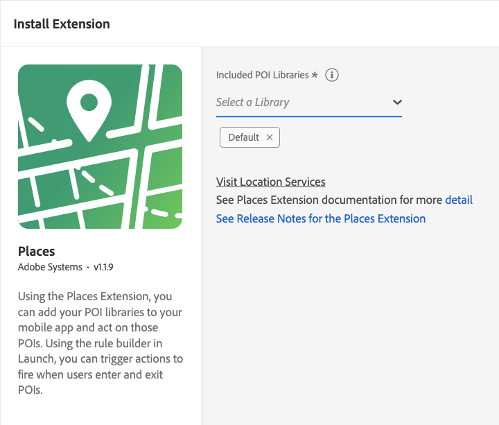

# Adobe Experience Platform Location Service

Adobe Experience Platform Location Service provides an SDK extension which allows you to act based on the location of your users. This extension is the interface to the [Location Service Web Services APIs](https://experienceleague.adobe.com/docs/places/using/web-service-api/places-web-services.html?lang=en).

The SDK extension listens for events that contain GPS coordinates and geofence region events, and dispatches new events that are processed by the Rules Engine. The SDK extension also retrieves and delivers a list of the nearest POI for the app data that retrieves from the APIs. The regions returned by the APIs are stored in cache and persistence, which allows limited offline processing.

`Places` is the mobile SDK supporting the Location Service.

## Configure the Places extension in Data Collection UI

1. In the Data Collection UI, from your mobile property, select the **Extensions** tab.
1. On the **Catalog** tab, locate or search for the **Places** extension, and select **Install**.
1. Select the **POI Library (or libraries)** you wish to use in the app.
1. Select **Save**.
1. Follow the publishing process to update SDK configuration.



## Add the AEP Places extension to your app

### Download and import the Places extension



### Java

1. Add the Mobile Core and Places extensions to your project using the app's Gradle file.

```java
implementation 'com.adobe.marketing.mobile:core:1.+'
implementation 'com.adobe.marketing.mobile:places:1.+'
```

2. Import the Mobile Core and Places extensions in your Application class.

```java
import com.adobe.marketing.mobile.MobileCore;
import com.adobe.marketing.mobile.Places;
```





1. Add the Mobile Core and Places extensions to your project using CocoaPods. Add the following pods in your `Podfile`:

```swift
use_frameworks!
target 'YourTargetApp' do
   pod 'AEPCore'
   pod 'AEPPlaces'       
end
```

2. Import the Mobile Core and Places modules:

### Swift

```swift
// AppDelegate.swift
import AEPCore
import AEPPlaces
```

### Objective-C

```objectivec
// AppDelegate.h
@import AEPCore;
@import AEPPlaces;
```




1. Add the Mobile Core and Places extensions to your project using CocoaPods. Add the following pods in your `Podfile`:

```swift
use_frameworks!
target 'YourTargetApp' do
   pod 'ACPCore', '~> 2.0'
   pod 'ACPPlaces', '~> 1.0'
end
```

2. Import the Mobile Core and Places modules:

### Swift

```swift
// AppDelegate.swift
import ACPCore
import ACPPlaces
```

### Objective-C

```objectivec
// AppDelegate.h
#import "ACPCore.h"
#import "ACPPlaces.h"
```





### Register the Places extension with Mobile Core



### Java

```java
public class MobileApp extends Application {

    @Override
    public void onCreate() {
        super.onCreate();
        MobileCore.setApplication(this);
        try {            
            Places.registerExtension();
            // register other extensions
            MobileCore.start(new AdobeCallback () {
                @Override
                public void call(Object o) {
                    MobileCore.configureWithAppID("yourAppId");
                }
            });    
        } catch (Exception e) {
            //Log the exception
         }
    }
}
```



### Swift

```swift
// AppDelegate.swift
func application(_ application: UIApplication, didFinishLaunchingWithOptions launchOptions: [UIApplication.LaunchOptionsKey: Any]?) -> Bool {
    MobileCore.registerExtensions([Places.self], {
        MobileCore.configureWith(appId: "yourLaunchEnvironmentID")
    })
    ...
}
```

### Objective-C

```objectivec
// AppDelegate.m
- (BOOL)application:(UIApplication *)application didFinishLaunchingWithOptions:(NSDictionary *)launchOptions {
    [AEPMobileCore registerExtensions:@[AEPMobilePlaces.class] completion:^{
        ...
    }];
    [AEPMobileCore configureWithAppId: @"yourLaunchEnvironmentID"];
    ...
}
```



### Swift

```swift
// AppDelegate.swift
func application(_ application: UIApplication, didFinishLaunchingWithOptions launchOptions: [UIApplication.LaunchOptionsKey: Any]?) -> Bool {
    ACPPlaces.registerExtension()
    ACPCore.configure(withAppId: "yourLaunchEnvironmentID")
    ACPCore.start()
  })
  ...
}
```

### Objective-C

```objectivec
// AppDelegate.m
- (BOOL)application:(UIApplication *)application didFinishLaunchingWithOptions:(NSDictionary *)launchOptions {
    [ACPPlaces registerExtension];
    [ACPCore configureWithAppId:@"yourLaunchEnvironmentID"];    
    [ACPCore start];  
    ...
}
```



