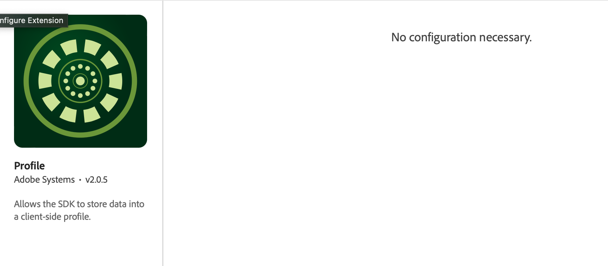

# Profile

You can use the Profile extension to store attributes about your user on the client. This information can be used later to target and personalize messages during online or offline scenarios, without having to connect to a server for optimal performance. The Profile extension manages the Client-Side Operation Profile \(CSOP\) and provides a way to react to APIs, updates user profile attributes, and shares the user profile attributes with the rest of the system as a generated event.

The Profile data is used by other extensions to perform profile-related actions. An example is the Rules Engine extension that consumes the profile data and runs rules based on the profile data.

**Important**: The Profile extension does not require any configuration.

To get started with the Profile extension:

1. Configure the Profile Extension in Launch.
2. Add the Profile extension to your app.
3. Implement Profile APIs to:
   * Update user attributes.
   * Remove user attributes.

## Install the Profile extension in the Data Collection UI

1. In the Data Collection UI, in your mobile property, select the **Extensions** tab.
2. On the **Catalog** tab, locate or search for the **Profile** extension, and select **Install**.
3. There are no configuration settings for **Profile**.
4. Select **Save**.
5. Follow the publishing process to update SDK configuration.





## Add the Profile extension to your app

To add the Profile extension to your app:



### Java

1. Add the `UserProfile` library to your project using the app's gradle file.
2. Import the `UserProfile` library and any other SDK library in your application's main activity.

   ```java
   import com.adobe.marketing.mobile.*;
   ```



1. Add the Mobile Core and Profile extensions to your project using Cocoapods. Add following pods in your `Podfile`:
```ruby
use_frameworks!
target 'YourTargetApp' do
    pod 'AEPCore', '~> 3.0'
    pod 'AEPUserProfile', '~> 3.0'
end
```
2. Import the UserProfile library.  

### Swift

```swift
   import AEPCore
   import AEPUserProfile
```

### Objective-C

```objectivec
   @import AEPCore;
   @import AEPUserProfile;
```





### Objective-C

1. Add the Mobile Core and Profile extensions to your project using Cocoapods. Add following pods in your `Podfile`:
```ruby
use_frameworks!
target 'YourTargetApp' do
    pod 'ACPCore'
    pod 'ACPUserProfile'
end
```
2. Import the UserProfile library.   

### Swift

```swift
   import ACPCore
   import ACPUserProfile
```

### Objective-C

```objectivec
   #import "ACPCore.h"
   #import "ACPUserProfile.h"
```




### Cordova

After creating your Cordova app and adding the Android and iOS platforms, the UserProfile extension for Cordova can be added with this command:

```bash
cordova plugin add https://github.com/adobe/cordova-acpuserprofile.git
```



### C\#

After importing the [ACPUserProfile.unitypackage](https://github.com/adobe/unity-acpuserprofile/blob/master/bin/ACPUserProfile-0.0.1-Unity.zip), the UserProfile extension for Unity can be added with following code in the MainScript

```csharp
using com.adobe.marketing.mobile;
```



### C\#

After adding the iOS ACPUserProfile NuGet package or the Android ACPUserProfile NuGet package, the UserProfile extension can be added by this import statement

```csharp
using Com.Adobe.Marketing.Mobile;
```




## Register the extension



### Java

**Required:** The `setApplication()` method must be called once in the `onCreate()` method of your main activity.

1. The `UserProfile` extension must be registered with Mobile Core before calling an `UserProfile` API.

   This can be done after calling `setApplication()` in the `onCreate()` method. Here is a code sample, which calls these set up methods:

```java
   public class MobileApp extends Application {

       @Override
       public void onCreate() {
           super.onCreate();
           MobileCore.setApplication(this);
           try {
               // register other extensions
               UserProfile.registerExtension();
               MobileCore.start(new AdobeCallback () {
                   @Override
                   public void call(Object o) {
                       MobileCore.configureWithAppID("yourAppId");
                   }
               });    
           } catch (Exception e) {
               //Log the exception
            }
       }
   }
```




### Swift

```swift
// AppDelegate.swift
func application(_ application: UIApplication, didFinishLaunchingWithOptions launchOptions: [UIApplication.LaunchOptionsKey: Any]?) -> Bool {
    MobileCore.registerExtensions([UserProfile.self], {
  })
  ...
}
```

### Objective-C

```objectivec
- (BOOL)application:(UIApplication *)application didFinishLaunchingWithOptions:(NSDictionary *)launchOptions {
    [AEPMobileCore registerExtensions:@AEPMobileUserProfile.class] completion:^{
    ...
  }];
  ...
  // Override point for customization after application launch.
  return YES;
}
```





### Swift

```swift
func application(_ application: UIApplication, didFinishLaunchingWithOptions launchOptions: [UIApplication.LaunchOptionsKey: Any]?) -> Bool {
     ACPCore.configure(withAppId: "yourAppId")   
     ACPUserProfile.registerExtension() 
     ACPCore.start(nil)
     // Override point for customization after application launch. 
     return true;
}
```

### Objective-C

```objectivec
- (BOOL)application:(UIApplication *)application didFinishLaunchingWithOptions:(NSDictionary *)launchOptions {
  [ACPUserProfile registerExtension];
  // Override point for customization after application launch.
  return YES;
}
```



### JavaScript

When using React Native, register Profile with Mobile Core in native code as shown on the Android and iOS tabs.



### Cordova

When using Cordova, register Profile with Mobile Core in native code as shown on the Android and iOS tabs.



### Flutter

When using Flutter, register Profile with Mobile Core in native code as shown on the Android and iOS tabs.




### C\#

Register the extension in the `start()` function:

```csharp
using com.adobe.marketing.mobile;
using using AOT;

public class MainScript : MonoBehaviour
{
    [MonoPInvokeCallback(typeof(AdobeStartCallback))]
    public static void HandleStartAdobeCallback()
    {   
        ACPCore.ConfigureWithAppID("yourAppId"); 
    }

    // Start is called before the first frame update
    void Start()
    {   
        ACPUserProfile.registerExtension();
        ACPCore.Start(HandleStartAdobeCallback);
    }
}
```




### C\#

**iOS**

Register the User Profile extension in your app's `FinishedLaunching()` function:

```csharp
public override bool FinishedLaunching(UIApplication app, NSDictionary options)
{
  global::Xamarin.Forms.Forms.Init();
  LoadApplication(new App());
  ACPUserProfile.RegisterExtension();
  // start core
  ACPCore.Start(startCallback);
  return base.FinishedLaunching(app, options);
}

private void startCallback()
{
  // set launch config
  ACPCore.ConfigureWithAppID("yourAppId");
}
```

**Android**

Register the User Profile extension in your app's `OnCreate()` function:

```csharp
protected override void OnCreate(Bundle savedInstanceState)
{
  base.OnCreate(savedInstanceState);
  global::Xamarin.Forms.Forms.Init(this, savedInstanceState);
  LoadApplication(new App());
  ACPUserProfile.RegisterExtension();

  // start core
  ACPCore.Start(new CoreStartCompletionCallback());
}

class CoreStartCompletionCallback : Java.Lang.Object, IAdobeCallback
{
  public void Call(Java.Lang.Object callback)
  {
    // set launch config
    ACPCore.ConfigureWithAppID("yourAppId");
  }
}
```



