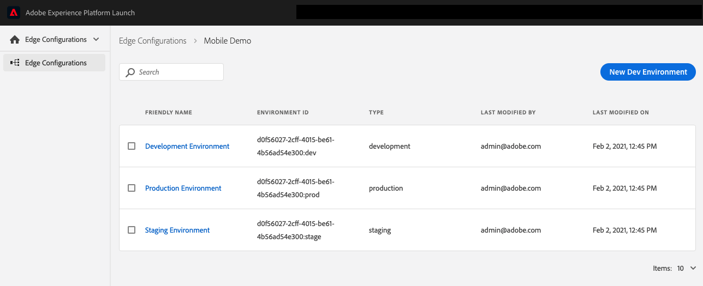

# Configure datastreams

After you've created a schema and its associated dataset, you may now configure datastreams (also referred to as Edge configurations or Edge Network configurations).


To create a datastream, your organization must be provisioned for this feature in Adobe Experience Platform Launch. Please contact your Adobe Customer Success Manager (CSM) to be added to the _allow list_.



The Datastreams tool is available to customers on the _allow list_ regardless whether they use Experience Platform Launch for web tag management or to manage mobile app configuration.

Users will require _Develop_ permissions in Experience Platform Launch. See the [user permissions](https://docs.adobe.com/content/help/en/launch/using/reference/admin/user-permissions.html) article in the Experience Platform Launch documentation for more details.


### What is a datastream?

A datastream is a configured instance of the Edge Network that contains settings for your Adobe solutions and services. This configuration ensures that incoming data to the Edge Network is routed to Adobe Experience Platform and Adobe Experience Cloud solutions & services appropriately.

The following steps illustrate how to create a sample datastream for a mobile implementation:

1. In the browser, navigate to [Adobe Experience Platform Launch](https://experience.adobe.com/launch) and login with your credentials.
2. From the left panel, choose **Datastreams** from the dropdown (instead of **Client Side**).
3. Click **New Datastream** (located on top right)
4. Set a name for the configuration and click **Save**.

1. In the next screen, toggle on **Adobe Experience Platform** and:
   1. Select the appropriate **Sandbox** from the dropdown
   2. Choose the appropriate **Event Dataset** as previously created
2. Once you have made your selections click `Save`.

In the resulting summary screen, you will see that three environments have been created for your datastream. If needed, each environment can be edited individually with different configuration parameters.

For additional information on datastreams in Experience Platform Launch, see the [configuring a datastream guide](https://experienceleague.adobe.com/docs/experience-platform/edge/fundamentals/datastreams.html).

