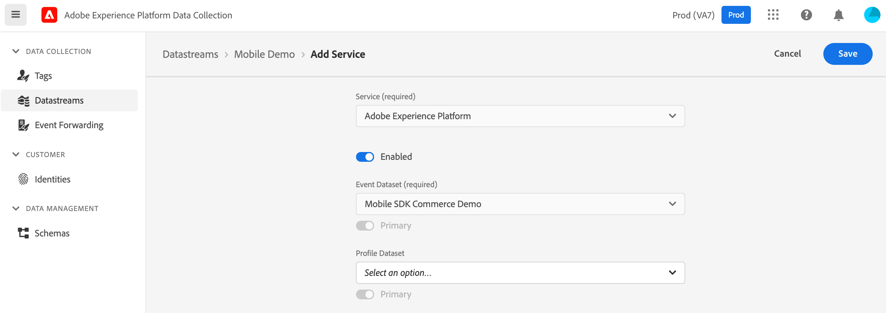

# Configure datastreams

After you've created a schema and its associated dataset, you may now configure datastreams \(also referred to as Edge configurations or Edge Network configurations\).


To create a datastream, your organization must be provisioned for this feature in Adobe Experience Platform Data Collection UI. Please contact your Adobe Customer Success Manager \(CSM\) to be added to the _allow list_.



The Datastreams tool is available to customers on the _allow list_ regardless whether they use Experience Platform Data Collection UI for web tag management or to manage mobile app configuration.

Users will require _Develop_ permissions for Experience Platform Data Collection. See the [user permissions](https://experienceleague.adobe.com/docs/experience-platform/tags/admin/user-permissions.html) article for more details.


## What is a datastream?

A datastream is a configured instance of the Edge Network that contains settings for your Adobe solutions and services. This configuration ensures that incoming data to the Edge Network is routed to Adobe Experience Platform and Adobe Experience Cloud solutions & services appropriately.

The following steps illustrate how to create a sample datastream for a mobile implementation:

1. In the browser, navigate to [Adobe Experience Platform Data Collection UI](https://experience.adobe.com/#/data-collection) and login with your credentials.
2. If your organization is enabled for multiple sandboxes, first select the sandbox from the top right corner. For more details about sandboxes, please read the [sandboxes overview](https://experienceleague.adobe.com/docs/experience-platform/sandbox/home.html).
2. From the left panel, select **Datastreams**.
3. Select **New Datastream** \(located on top right\).
4. Set a name for the datastream and select **Save**.

6. In the next screen, select **Add Service**.

7. From the Service drop-down, select **Adobe Experience Platform** and:

   * Make sure the service toggle is **Enabled**.

   * Choose the appropriate **Event Dataset** as previously created, then select **Save**.

Your datastream is ready to be used now. If different settings are required per environment, create new datastreams with the respective configuration settings.

For additional information on datastreams in Experience Platform Data Collection UI, see the [configuring a datastream guide](https://experienceleague.adobe.com/docs/platform-learn/implement-mobile-sdk/initial-configuration/create-datastream.html).

