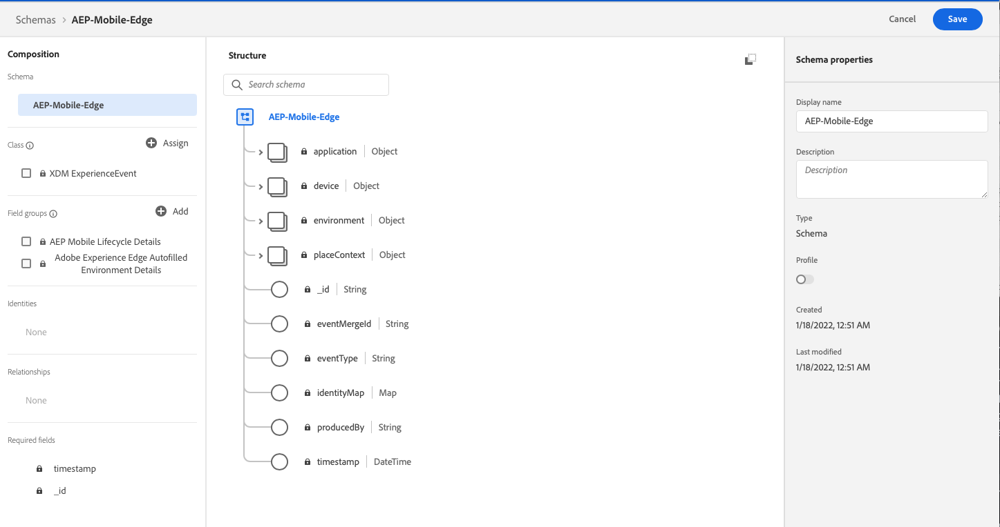

# Configure Schema and Dataset

To standardize data collection and interoperability, Adobe has created the open and publicly documented Experience Data Model standard, or [XDM](https://experienceleague.adobe.com/docs/experience-platform/xdm/home.html). XDM is the foundational framework that allows [Platform](https://experienceleague.adobe.com/docs/experience-platform/landing/home.html) services and Adobe Experience Cloud solutions, to deliver the right experiences to the right person, on the right channel and at the right time.

To begin sending XDM data from your mobile application to Adobe Experience Platform you must first create an XDM schema and a dataset.

## Configuring a XDM Schema

Customers and organizations can configure XDM data schemas to organize and describe data that will be ingested into the Adobe Experience Platform. 


To learn more about XDM schema creation see [Basics of schema composition](https://experienceleague.adobe.com/docs/experience-platform/xdm/schema/composition.html).


To create a basic XDM schema for mobile data collection, follow the steps below to get started:

1. In the browser, navigate to [Adobe Experience Platform](https://experience.adobe.com/platform) and login with your credentials.
2. Create an XDM Schema as follows:
   * From the left panel, select Schemas
   * Click **Create schema**
   * Select **XDM Experience event**
   * Under **Mixins**, select **Add**; search and add the `Environment Details`,`Application Details`, and other custom mixins as needed.
   * Set a **Display Name** for this schema and click `Save`.

## Configuring a Dataset

All data ingested into the Adobe Experience Platform is stored in Datasets that conform to a defined XDM schema. To learn more about datasets in Adobe Experience Platform [see this document](https://experienceleague.adobe.com/docs/experience-platform/catalog/datasets/overview.html?lang=en#datasets).

To create a dataset container for mobile data collection, follow the steps below to get started: 1. In the browser, navigate to [Adobe Experience Platform](https://experience.adobe.com/platform) and login with your credentials. 2. Create a new dataset as follows:

* From the left panel, select Datasets
* Click `Create dataset from schema`
* Select the XDM schema previously created and click `Next`.
* Set a name for this dataset and click `Finish`.

