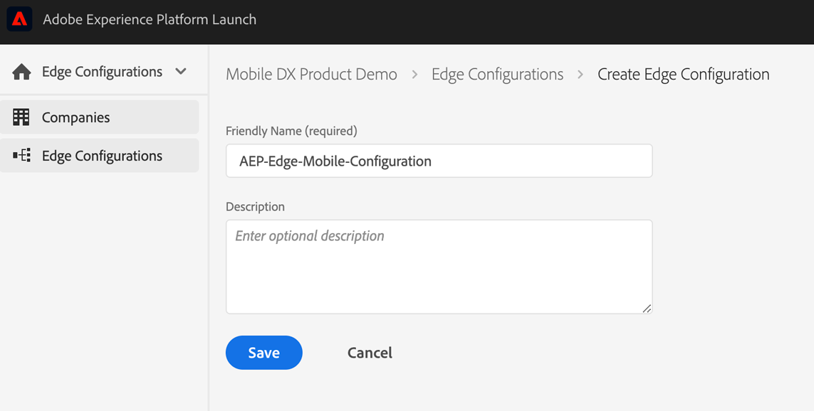
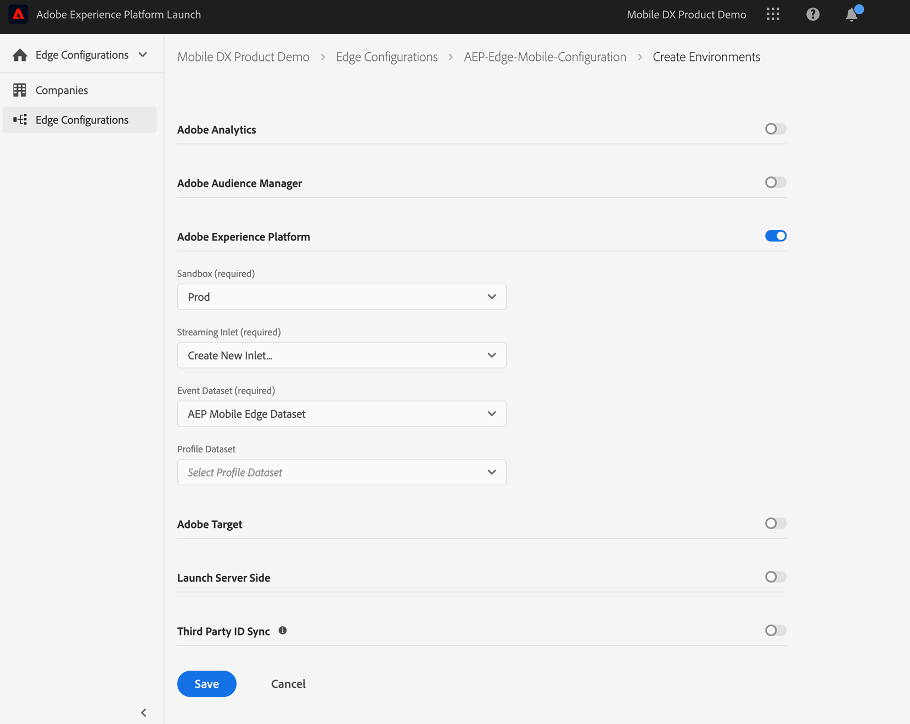

# Create a new Edge Configuration

The [Adobe Experience Platform Edge Network](https://www.adobe.com/experience-platform/experience-platform-edge-network.html) is a solution-agnostic data network that can be used to streamline multiple data transfers to and from Adobe Experience Cloud solutions, Adobe Experience Platform services and external 3rd parties when used with [Experience Platform Launch Server Side](https://experienceleague.adobe.com/docs/launch/using/server-side-info/server-side-overview.html?lang=en#server-side-info). 

Customers looking to send mobile data through the Adobe Experience Platform Edge Network must first create an Edge Configuration in Adobe Experience Platform Launch. 

It is recommended that prior to creating a new Edge Configuration, that customers first create a XDM Schema and corresponding dataset in Adobe Experience Platform. See [Configure Schema and Dataset]() for more information.

To create a new Edge Configuration follow the steps below:

1. In the browser, navigate to [Adobe Experience Platform Launch](https://experience.adobe.com/launch) and login with your credentials.
2. From the left panel, change from Client Side configurations to `Edge Configurations`
3. Click `New Edge Configuration` on the right side
4. Set a name for the configuration and click `Save`.

5. In the next screen switch on `Adobe Experience Platform`
  * For Streaming Inlet select `Create New Inlet`
  * For Event Dataset select the dataset you previously created
6. Once you have made your selections click `Save`.

In the summary screen you will see that three environments have been created for your Edge Configuration. If desired, each environment can be edited individually with different configuration parameters. Make note of the Environment ID, as this value will be used to connect your mobile application to your Edge Configuration.

For additional information on Edge Configurations in Experience Platform Launch [see this document](https://experienceleague.adobe.com/docs/experience-platform/edge/fundamentals/edge-configuration.html?lang=en#creating-an-edge-configuration).

