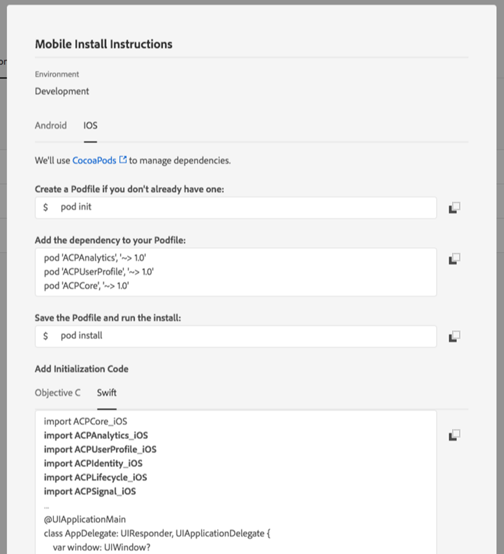
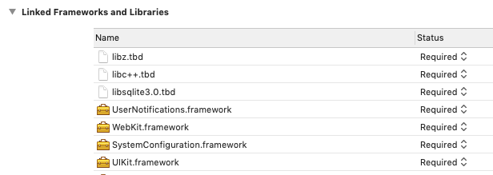

# Get the Experience Platform SDK

The Experience Platform SDK is available for iOS via [Cocoapods](https://cocoapods.org/), Android via [Gradle](https://gradle.org), and for React Native projects via [Node Package Manager](https://nodejs.org). Follow the directions below to learn how to incorporate the Experience Platform SDK into your application.


For iOS and Android projects, the recommended approach to integrating the SDK is to use Cocoapods or Gradle. SDK libraries are also available on [Github](https://github.com/Adobe-Marketing-Cloud/acp-sdks/).




### Android


The Experience Platform SDK for Android supports Android 4.0 \(API 14\) or later.


1. Open the **Mobile** property in Experience Platform Launch, and click on the **Environments** tab, and then click on the install package icon. 
2. On the **Mobile Install Instructions** dialog box, select **Android**.
3. Follow the instructions for using Gradle with Android.

The necessary dependencies and initialization code can be copied from the dialog box to your app project.

You should see a dialog box similar to the following:





### iOS - Objective C


**Important:** Adobe Experience Platform SDKs for iOS supports **iOS 10 or later.**


1. Open the **Mobile** property in Launch, and click on the **Environments** tab, and then click on the install package icon   
2. On the **Mobile Install Instructions** dialog box, select **iOS**.
3. Follow the instructions for using CocoaPods with iOS.
4. Under the initialization code, choose Objective C.

The necessary dependencies and initialization code can be copied from the dialog box to your app project.

You should see a pop-up similar to the following:





### iOS - Swift


**Important:** Adobe Experience Platform SDKs for iOS supports **iOS 10 or later.**


1. Open the **Mobile** property in Launch, and click on the **Environments** tab, and then click on the install package icon   
2. On the **Mobile Install Instructions** dialog box, select **iOS**.
3. Follow the instructions for using CocoaPods with iOS.
4. Under the initialization code, choose Swift.

The necessary dependencies and initialization code can be copied from the dialog box to your app project.

You should see a pop-up similar to the following:





### React Native


For React Native, it is recommended to first install [Node.js](https://nodejs.org) to download packages from [npm](https://npmjs.com). 

See this [tutorial](https://facebook.github.io/react-native/docs/getting-started) for additional instructions on getting started with React Native applications 


`@adobe/react-native-acpcore` is a wrapper around the iOS and Android Adobe Experience Platform Mobile SDK to allow for integration with React Native applications. Functionality to enable the Core extension is provided entirely through JavaScript documented below.

First create the React Native project \(if one does not already exist\)

```jsx
react-native init MyReactApp
```

Install and link kthe `@adobe/react-native-acpcore` package:

```jsx
npm install @adobe/react-native-acpcore
react-native link @adobe/react-native-acpcore
```

#### Configure native projects

**Android project**

Navigate to `MainApplication.java` under `app/src/main/java/com/<project-name>/` and add a call to `MobileCore.setApplication(this)` inside of `onCreate()`.

```jsx
import com.adobe.marketing.mobile.MobileCore; // import MobileCore

@Override
public void onCreate() {
	super.onCreate();
	//...
	MobileCore.setApplication(this); // add this line
}
```

**iOS project**

Inside your Xcode project click on the project file and under the **General** tab click the + button under the Lined Frameworks and Libraries section. Add the following frameworks and libraries:

* `UIKit.framework`
* `SystemConfiguration.framework`
* `WebKit.framework`
* `UserNotifications.framework`
* `libsqlite3.0.tbd`
* `libc++.tbd`
* `libz.tbd`




Note: If you plan to use the AEP SDK in your native iOS code you will need to import the appropriate headers with the following format: `#import <RCTACPCore/ACPCore.h>`




## Watch the Video



## Additional Information

* [How to use Gradle for Android](https://docs.gradle.org/current/userguide/userguide.html)
* [How to use CocoaPods for iOS ](https://guides.cocoapods.org/using/using-cocoapods)
* Obtaining Current SDKs

