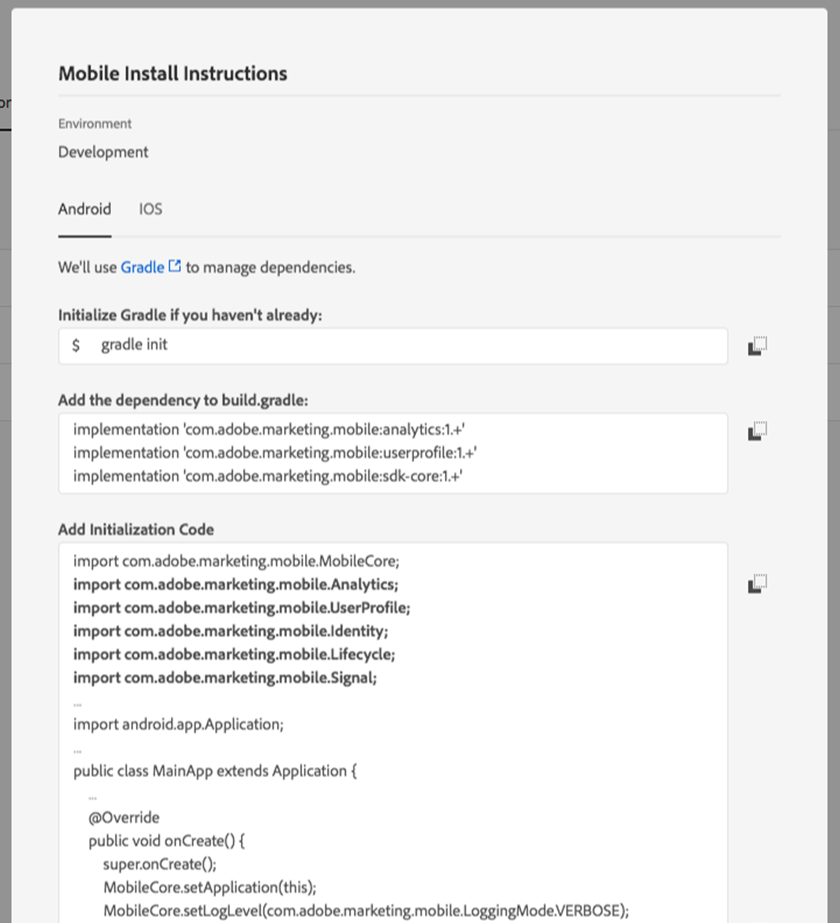
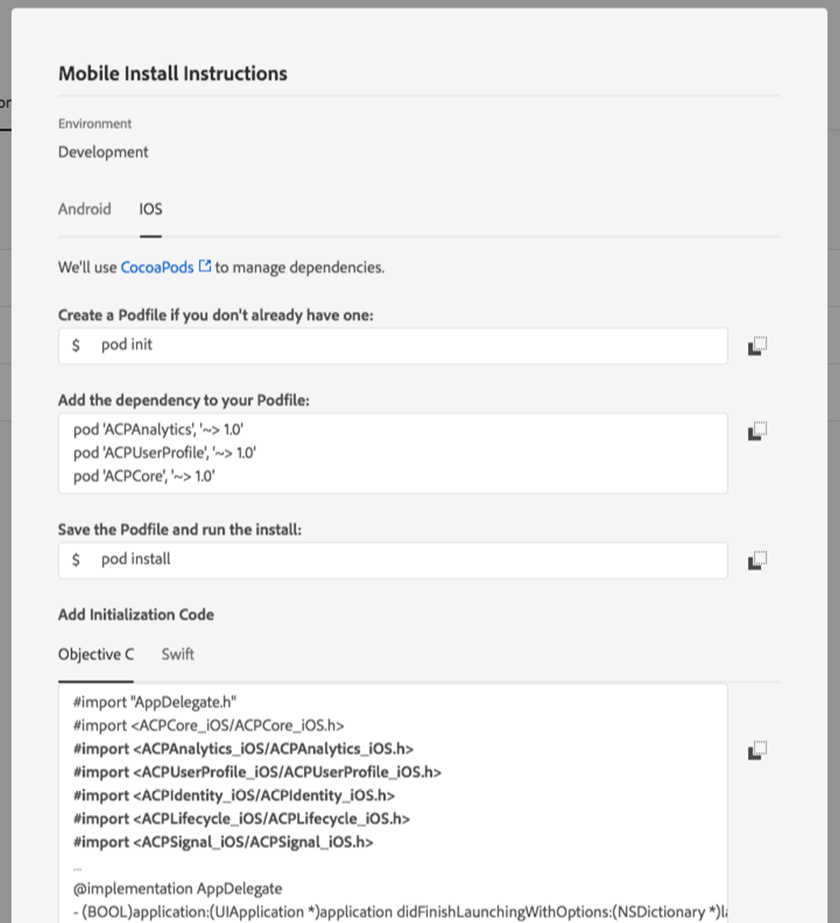

# Get the Experience Platform SDK

The Adobe Experience Platform SDK is available for Apple iOS \(includes iOS, iPadOS, and tvOS\) via [Cocoapods](https://cocoapods.org/), for Google Android via [Gradle](https://gradle.org), and for various cross-platform platforms such as Cordova, Flutter, React Native, Unity, and Xamarin.

Follow the directions below to include the SDK into your mobile application.


For iOS and Android projects, the recommended approach for integrating the SDK is to use supported dependency and package managers as listed for each platform such as Maven and Cocoapods. SDKs are also available for download on [GitHub](https://github.com/Adobe-Marketing-Cloud/acp-sdks/).




### Java / Kotlin


Adobe Experience Platform SDKs for Android supports Android 4.0 \(API 14\) or later.


1. Open the mobile property you created earlier in Experience Platform Launch.
2. On your mobile property's details page, click on the **Environments** tab.

   The **Environments** tab lists the different environments where you can publish.

3. In the row for the **Development** environment, click on the install package icon \(\).

   You should see a dialog box similar to the following:

   

4. On the **Mobile Install Instructions** dialog box, make sure you are on the **Android** tab.
5. Follow the instructions for using Gradle with Android.

   The necessary dependencies and initialization code can be copied from the dialog box to your mobile application project.




Adobe Experience Platform SDKs for iOS support **iOS 10 or later**; ****requires **Swift 5.1 or newer;** and **Xcode 11.0 or newer**.



### Apple M1 compatibility

In order to support the new Apple M1 architecture while maintaining support for existing Intel architecture, the Adobe Experience Platform SDKs are now distributed using XCFrameworks.

Please see the [release notes](../release-notes/#december-18-2020) and the document on [current SDK versions](../resources/upgrading-to-aep/current-sdk-versions.md) for more information on the latest extension versions.


### iOS \(Swift\) version 3.x

Add the dependencies to your `Podfile` for each extension. For a complete list of available SDK extension libraries, please read the documentation on [current SDK Versions](../resources/upgrading-to-aep/current-sdk-versions.md).

```swift
use_frameworks!
target 'YourTargetApp' do
    // Mobile Core and dependents
    pod 'AEPCore'
    pod 'AEPSignal'
    pod 'AEPLifecycle'

    // Client-side user profile
    pod 'AEPUserProfile'

    // Edge Network and dependents
    pod 'AEPEdge'
    pod 'AEPEdgeIdentity'
    pod 'AEPEdgeConsent'

    // Adobe Analytics and dependents
    pod 'AEPIdentity'
    pod 'AEPAnalytics'
end
```

### iOS version 2.x and before

1. Open a previously created and configured **Mobile** property in Launch, and click on the **Environments** tab, and then click on the install package icon \(\).
2. On the **Mobile Install Instructions** dialog box, select **iOS**.
3. Follow the instructions for using CocoaPods with iOS.
4. Under the initialization code, choose Objective C or Swift.

The necessary dependencies and initialization code can be copied from the dialog box to your app project.

You should see a pop-up similar to the following image:





### React Native

Adobe Experience Platform Mobile SDK plugin for React Native supports React Native **versions 0.44.0 or later**. For the latest installation instructions, see the `README` file in the [`react-native-acpcore`](https://github.com/adobe/react-native-acpcore) repository.


For React Native, you should install [Node.js](https://nodejs.org) to download packages from [npm](https://npmjs.com). For additional instructions, see this [tutorial on getting started with React Native applications](https://facebook.github.io/react-native/docs/getting-started).




### Flutter

Adobe Experience Platform Mobile SDK plugin for Flutter supports Flutter **versions 1.10.0 or later**.

For the latest Flutter installation instructions, see the package [install tab](https://pub.dev/packages/flutter_acpcore#-installing-tab-).



### Cordova

Adobe Experience Platform Mobile SDK plugins for Cordova supports Cordova **versions 9.0.0 or later**. For the latest Cordova installation instructions, see the `README` file in the [`cordova-acpcore`](https://github.com/adobe/cordova-acpcore) repository.


For Cordova, you should install [Node.js](https://nodejs.org/en/) to download packages from npm. For additional instructions, see this [guide to get started with Cordova applications](https://netbeans.apache.org/kb/docs/webclient/cordova-gettingstarted.html).


With Node.js installed, you can install the Cordova framework from terminal using the following statement:

```text
sudo npm install -g cordova
```

To start using the Adobe Experience Platform Mobile SDK plugin for Cordova, navigate to the directory of your Cordova app and install the plugins using the following statement:

```text
cordova plugin add https://github.com/adobe/cordova-acpcore.git
```



### Unity


Adobe Experience Platform SDKs plugins for Unity supports **Unity versions 2019.3.10f1 or later**



For the latest Unity installation instructions, see the README file in the [unity-acpcore](https://github.com/adobe/unity-acpcore) repository.


To start using the Adobe Experience Platform Mobile SDK for Unity, open your application and import the requisite Unity packages.

For instance, to add the Mobile Core extension, you should:

* Download [ACPCore-0.0.1-Unity.zip](https://github.com/adobe/unity-acpcore/blob/master/bin/ACPCore-0.0.1-Unity.zip)
* Unzip `ACPCore-0.0.1-Unity.zip`
* Import `ACPCore.unitypackage` via Assets-Import Package



### Xamarin

Adobe Experience Platform Mobile SDK plugins for Xamarin require **MonoAndroid 9.0+ and Xamarin.iOS 1.0+**. For the latest Xamarin installation instructions, see the `README` file in the [`xamarin-acpcore`](https://github.com/adobe/xamarin-acpcore) repository.


The Adobe Experience Platform Mobile SDK plugins for Xamarin are packages distributed via [nuget](https://www.nuget.org/packages). NuGet packages can be added to projects within a [Visual Studio](https://visualstudio.microsoft.com/downloads/) solution. The NuGet packages can also be generated locally via the included Makefile located in each of the Xamarin repositories.




## Installation instructions

If you cannot access the **Mobile Install Instructions** dialog box in Experience Platform Launch, complete the following sections to get the Adobe Experience Platform SDK. If you already completed the steps in the Mobile Install Instructions dialog box, no need to complete these steps.

### 1. Add dependencies to your project

Each extension needs to be added as a dependency to the mobile application project. The following examples will add the Mobile Core and Profile extensions.



**Android**

Add the dependencies to `build.gradle` for each extension.

```java
implementation 'com.adobe.marketing.mobile:userprofile:1.+'
implementation 'com.adobe.marketing.mobile:sdk-core:1.+'
```



### iOS version 3.x

Create a `Podfile` if you do not already have one:

```text
pod init
```

Add the dependencies to your `Podfile` for each extension.

```swift
use_frameworks!
pod 'AEPCore', '~> 1.0'
pod 'AEPUserProfile', '~> 1.0'
```

If Cocoapods cannot not find the dependencies, you may need to run this command:

```text
pod repo update
```

Save the `Podfile` and run install:

```text
pod install
```

### iOS version 2.x and before

Create a `Podfile` if you do not already have one:

```text
pod init
```

Add the dependencies to your `Podfile` for each extension.

```objectivec
use_frameworks!
pod 'ACPCore', '~> 2.0'
pod 'ACPUserProfile', '~> 2.0'
```

If Cocoapods cannot not find the dependencies, you may need to run this command:

```text
pod repo update
```

Save the `Podfile` and run install:

```text
pod install
```



### 2. Add initialization code

Next you'll need to import SDK libraries into your project and register them for initialization. Extensions are registered with Mobile Core so that they can dispatch and listen for events.


Extension registration is **mandatory**. Attempting to make extension-specific API calls without registering the extension will lead to undefined behavior.


The following code snippets demonstrate how you can import and register the Mobile Core and Profile extensions. You can also see, for reference, how Identity, Lifecycle, Signal, Profile, and other extensions are imported and registered.



After you register the extensions, call the `start` API in Mobile Core to initialize the SDK as shown below. This step is required to boot up the SDK for event processing. The following code snippet is provided as a sample reference.

### Java

```java
import com.adobe.marketing.mobile.AdobeCallback;
import com.adobe.marketing.mobile.Identity;
import com.adobe.marketing.mobile.InvalidInitException;
import com.adobe.marketing.mobile.Lifecycle;
import com.adobe.marketing.mobile.LoggingMode;
import com.adobe.marketing.mobile.MobileCore;
import com.adobe.marketing.mobile.Signal;
import com.adobe.marketing.mobile.UserProfile;
...
import android.app.Application;
...
public class MainApp extends Application {
  ...
  @Override
  public void on Create(){
    super.onCreate();
    MobileCore.setApplication(this);
        MobileCore.setLogLevel(LoggingMode.DEBUG);
    ...
    try {
      UserProfile.registerExtension();
            Identity.registerExtension();
            Lifecycle.registerExtension();
            Signal.registerExtension();
            MobileCore.start(new AdobeCallback () {
            @Override
            public void call(Object o) {
            MobileCore.configureWithAppID("<your_environment_id_from_Launch>");
    }
});
    } catch (InvalidInitException e) {
      ...
    }
  }
}
```



### iOS version 3.x


For iOS Swift libraries, registration is changed to a single API call \(as shown in the snippets below\). Calling the`MobileCore.start` API is no longer required.


**Swift**

```swift
// AppDelegate.swift
func application(_ application: UIApplication, didFinishLaunchingWithOptions launchOptions: [UIApplication.LaunchOptionsKey: Any]?) -> Bool {
    MobileCore.registerExtensions([Signal.self, Lifecycle.self, UserProfile.self, Edge.self, AEPEdgeIdentity.Identity.self, Consent.self, AEPIdentity.Identity.self, Analytics.self], {
        MobileCore.configureWith(appId: "yourLaunchEnvironmentID")
    })
  ...
}
```

**Objective-C**

```text
// AppDelegate.m
- (BOOL)application:(UIApplication *)application didFinishLaunchingWithOptions:(NSDictionary *)launchOptions {
    [AEPMobileCore registerExtensions:@[AEPMobileSignal.class, AEPMobileLifecycle.class, AEPMobileUserProfile.class, AEPMobileEdge.class, AEPMobileEdgeIdentity.class, AEPMobileEdgeConsent.class, AEPMobileIdentity.class, AEPMobileAnalytics.class] completion:^{
    [AEPMobileCore configureWithAppId: @"yourLaunchEnvironmentID"];
  }];
  ...
}
```

### iOS version 2.x and before

The following snippet shows an example of how to add the initialization code. Note that this may need to be adjusted, depending on how your application is structured.

**Objective-C**

```objectivec
#import "AppDelegate.h"
#import "ACPCore.h"
#import "ACPUserProfile.h"
#import "ACPIdentity.h"
#import "ACPLifecycle.h"
#import "ACPSignal.h"
...
@implementation AppDelegate
-(BOOL)application:(UIApplication *)application didFinishLaunchingWithOptions:(NSDictionary *)launchOptions {
  [ACPCore setLogLevel:ACPMobileLogLevelDebug];
  [ACPCore configureWithAppId:@"<your_environment_id_from_Launch>"];
    ...
  [ACPUserProfile registerExtension];
    [ACPIdentity registerExtension];
    [ACPLifecycle registerExtension];
    [ACPSignal registerExtension];
    const UIApplicationState appState = application.applicationState;
    [ACPCore start:^{
      // only start lifecycle if the application is not in the background
      if (appState != UIApplicationStateBackground) {
        [ACPCore lifecycleStart:nil];
      }
    }];
    ...
  return YES;
}

@end
```

**Swift**

```swift
import ACPCore
import ACPUserProfile
...
@UIApplicationMain
class AppDelegate: UIResponder, UIApplicationDelegate {
  var window: UIWindow?
  func application(_application: UIApplication, didFinishLaunchingWithOptions launchOptions: [UIApplication.LaunchOptionsKey: Any]?) -> Bool{
    ACPCore.setLogLevel(.debug)
        ACPCore.configure(withAppId: "<your_environment_id_from_Launch>")
    ...
    ACPUserProfile.registerExtension()
        ACPIdentity.registerExtension()
        ACPLifecycle.registerExtension()
        ACPSignal.registerExtension()
        ACPCore.start {
        ACPCore.lifecycleStart(nil)
        }
    ...
    return true
  }
}
```



### Javascript

For React Native apps, initialize the SDK using native code in your `AppDelegate` and `MainApplication` in iOS and Android, respectively.

The initialization code is located in the [React Native ACPCore Github README](https://github.com/adobe/react-native-acpcore).



### Dart

For Flutter apps, initialize the SDK using native code in your `AppDelegate` and `MainApplication` in iOS and Android, respectively.

The initialization code is located in the [Flutter ACPCore Github README](https://github.com/adobe/flutter_acpcore).



For Cordova apps, initialize the SDK using native code in your `AppDelegate` and `MainApplication` in iOS and Android, respectively.

**iOS**

```text
// Import the SDK
#import "ACPCore.h"
#import "ACPLifecycle.h"
#import "ACPIdentity.h"
#import "ACPSignal.h"
- (BOOL)application:(UIApplication *)application didFinishLaunchingWithOptions:(NSDictionary *)launchOptions {  
  // make sure to set the wrapper type at the beginning of initialization
  [ACPCore setWrapperType:ACPMobileWrapperTypeCordova];

  //...
  [ACPCore configureWithAppId:@"yourAppId"];
  [ACPIdentity registerExtension];
  [ACPLifecycle registerExtension];
  [ACPSignal registerExtension];
  // Register any additional extensions

  [ACPCore start:nil];
}
```

**Android**

```java
// Import the SDK
import com.adobe.marketing.mobile.MobileCore;
import com.adobe.marketing.mobile.Identity;
import com.adobe.marketing.mobile.Lifecycle;
import com.adobe.marketing.mobile.Signal;
import com.adobe.marketing.mobile.WrapperType;

@Override
public void onCreate() {
  //...
  MobileCore.setApplication(this);
  MobileCore.configureWithAppID("yourAppId");

  // make sure to set the wrapper type at the beginning of initialization
  MobileCore.setWrapperType(WrapperType.CORDOVA);

  try {
    Identity.registerExtension();
    Lifecycle.registerExtension();
    Signal.registerExtension();

    // Register any additional extensions
  } catch (Exception e) {
    // handle exception
  }

  MobileCore.start(null);
}
```



### C\#

For Unity apps, initialize the SDK using the following code in the start function of the `MainScript`.

```csharp
using com.adobe.marketing.mobile;
using using AOT;

public class MainScript : MonoBehaviour
{
    [MonoPInvokeCallback(typeof(AdobeStartCallback))]
    public static void HandleStartAdobeCallback()
    {   
        ACPCore.ConfigureWithAppID("1423ae38-8385-8963-8693-28375403491d");
    }

    // Start is called before the first frame update
    void Start()
    {   
        if (Application.platform == RuntimePlatform.Android) {
            ACPCore.SetApplication();
        }

        ACPCore.SetLogLevel(ACPCore.ACPMobileLogLevel.VERBOSE);
        ACPCore.SetWrapperType();
        ACPIdentity.registerExtension();
        ACPLifecycle.registerExtension();
        ACPSignal.registerExtension();
        ACPCore.Start(HandleStartAdobeCallback);
    }
}
```



### C\#

For Xamarin Forms applications, the SDK initialization differs, depending on the platform being targeted.

**iOS**

```csharp
using Com.Adobe.Marketing.Mobile;

[Register("AppDelegate")]
public partial class AppDelegate : global::Xamarin.Forms.Platform.iOS.FormsApplicationDelegate
{
  //
  // This method is invoked when the application has loaded and is ready to run. In this
  // method you should instantiate the window, load the UI into it and then make the window
  // visible.
  //
  // You have 17 seconds to return from this method, or iOS will terminate your application.
  //
  public override bool FinishedLaunching(UIApplication app, NSDictionary options)
  {
    global::Xamarin.Forms.Forms.Init();
    LoadApplication(new App());

    // set the wrapper type
    ACPCore.SetWrapperType(ACPMobileWrapperType.Xamarin);

    // set launch config
    ACPCore.ConfigureWithAppID("your-app-id");

    // register SDK extensions
    ACPIdentity.RegisterExtension();
    ACPLifecycle.RegisterExtension();
    ACPSignal.RegisterExtension();

    // start core
    ACPCore.Start(null);
  }
```

**Android**

```csharp
using Com.Adobe.Marketing.Mobile;

[Activity(Label = "TestApp", Icon = "@mipmap/icon", Theme = "@style/MainTheme", MainLauncher = true, ConfigurationChanges = ConfigChanges.ScreenSize | ConfigChanges.Orientation)]
public class MainActivity : global::Xamarin.Forms.Platform.Android.FormsAppCompatActivity
{
  protected override void OnCreate(Bundle savedInstanceState)
  {
    base.OnCreate(savedInstanceState);

    global::Xamarin.Forms.Forms.Init(this, savedInstanceState);
    LoadApplication(new App());

    // set the wrapper type
    ACPCore.SetWrapperType(WrapperType.Xamarin);

    // register SDK extensions
    ACPCore.Application = this.Application;
    ACPIdentity.RegisterExtension();
    ACPLifecycle.RegisterExtension();
    ACPSignal.RegisterExtension();

    // start core
    ACPCore.Start(null);
}
```



### 3. Ensure app permissions \(Android only\)

For Android, the SDK requires standard [network connection](https://developer.android.com/training/basics/network-ops/connecting) permissions in your manifest to send data, collect cellular provider, and record offline tracking calls.

To enable these permissions, add the following lines to your `AndroidManifest.xml` file, located in your app's application project directory:

```markup
<uses-permission android:name="android.permission.INTERNET" />
<uses-permission android:name="android.permission.ACCESS_NETWORK_STATE" />
```

## Watch the Video



## Additional information

* [How to use Gradle for Android](https://docs.gradle.org/current/userguide/userguide.html)
* [How to use CocoaPods for iOS ](https://guides.cocoapods.org/using/using-cocoapods)
* [Current SDK Versions](../resources/upgrading-to-aep/current-sdk-versions.md)

## Get help

* Visit the SDK [community forum](https://forums.adobe.com/community/experience-cloud/platform/launch/sdk) to ask questions
* Contact [Adobe Experience Cloud customer care](https://helpx.adobe.com/contact/enterprise-support.ec.html) for immediate assistance

