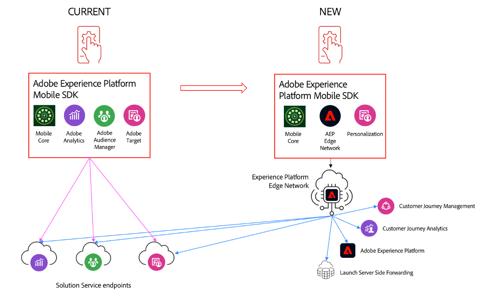

# Introduction

Adobe Experience Cloud implementations for mobile apps leverage [Adobe Experience Platform Mobile SDKs](http://sdkdocs.com) for data collection and experience delivery. With the introduction of Adobe Experience Platform Edge Network data collection, client-side implementations will provide unified, purpose-based APIs to provide customers with a more modern and efficient data collection paradigm.
 
By utilizing the latest Adobe Experience Platform Mobile SDK along with the [Adobe Experience Platform Edge Network extension](using-mobile-extensions/adobe-edge/README.md), customers can adopt XDM ([Experience Data Model](https://experienceleague.adobe.com/docs/experience-platform/xdm/home.html)) workflows for data collection. XDM data collection represents a shift from solution specific APIs to simple key / value pairs, that can be sent from both Mobile and Web properties.

Mobile XDM events take the place of solution APIs such as trackAction and trackState calls to send analytics events. Customers that are not yet ready to fully adopt an XDM only data workflow may opt to keep solution specific API calls, and then create separate XDM calls for important events. 

XDM data collected is sent to the [Adobe Experience Platform Edge Network](https://www.adobe.com/experience-platform/experience-platform-edge-network.html) where it can be transformed or distributed to different Adobe solutions including Adobe Experience Platform, Adobe Customer Journey Analytics, Adobe Customer Journey Management, Adobe Audience Manager, Adobe Target and others. In addition to Adobe solutions, XDM data delivered to the Edge Network can take advantage of [Adobe Experience Platform Launch Server Side](https://experienceleague.adobe.com/docs/launch/using/server-side-info/server-side-overview.html?lang=en#server-side-info), where rules can be configured to forward data to 3rd party solutions.

## Key Benefits

  * Performance - Reduced number of network calls from your web/mobile applications to improve customer experience
  * Smaller footprint – Decrease in the number of extensions and dependencies to manage for mobile implementations
  * Simplified data collection – Standardize data collection with XDM, reducing developer complexity and maintenance
  * Privacy - Improved privacy controls and consent management
  * Server Side Forward – Take advantage of Launch Server Side rules and extensions to deliver data to 3rd parties

## Is the Edge Network right for my organization?

Generally speaking, the determination for adopting the Adobe Experience Platform Edge Network, depends on if you are looking to start sending data to the Adobe Experience Platform, or if you are looking at adopting additional platform-based solutions such as Customer Journey Management or Customer Journey Analytics. 

The new Experience Platform Edge Network extension requires the usage of the latest Adobe Experience Platform SDKs, which for iOS is a new Swift-based SDK. This new Swift SDK for iOS is incompatible with existing Adobe solution extensions such as Adobe Campaign Standard, Adobe Campaign Classic, and Adobe Mobile Services. While updates to these solution extensions are in progress, organizations requiring multiple Adobe solutions should first check to ensure that a swift-compatible or Edge version of the extension exists. 

Customers looking to take advantage of Adobe Experience Platform Launch Server Side for data rules and forwarding to 3rd parties should consider adopting the Experience Platform Edge Network extension. 
