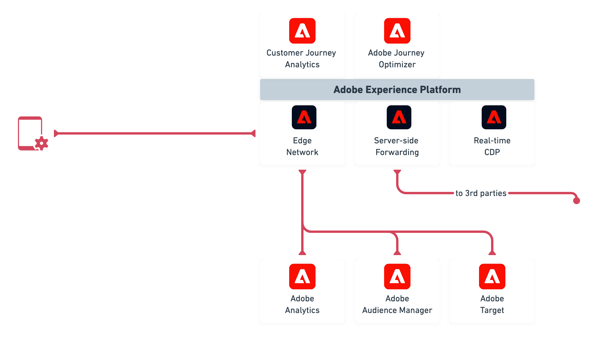
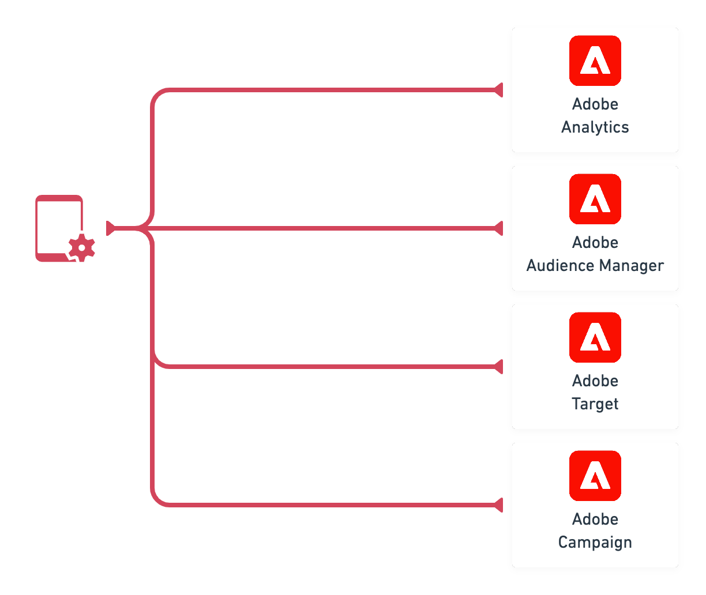

# Overview

The Adobe Experience Platform Mobile SDKs support interaction with Adobe Experience Cloud solutions and services via one or both of the following methods:

1. [Adobe Experience Platform Edge Network](overview.md#integration-via-experience-platform-edge-network)
2. [Leveraging Experience Cloud solution / service-specific network infrastructure](overview.md#integration-via-solutions-specific-network-infrastructure)

The following information outlines the steps you'll need to follow to get started to leverage integrations via one or both methods.

## Integration via Experience Platform Edge Network

### Steps to Getting Started

1. [Setup Schemas & Datasets](setup-schemas-and-datasets.md)
2. [Configure Datastreams](configure-datastreams.md)
3. [Setup Mobile Property](create-a-mobile-property.md)
4. [Get the Experience Platform Mobile SDK](get-the-sdk.md)
5. [Debugging and implementing basic events](enable-debug-logging.md)
6. [Validation](validate.md)

## Integration via solutions-specific network endpoints

### Steps to Getting Started

1. Configure solutions
2. [Setup Mobile Property](create-a-mobile-property.md)
3. [Get the Experience Platform Mobile SDK](get-the-sdk.md)
4. [Debugging and implementing basic events](enable-debug-logging.md)
5. [Validation](validate.md)

## Reference

* [Adobe Experience Platform Edge Network](https://experienceleague.adobe.com/docs/web-sdk-learn/tutorials/introduction-to-web-sdk-and-edge-network.html?lang=en)
* [What is XDM](https://experienceleague.adobe.com/docs/experience-platform/xdm/home.html?lang=en)
* [How to build a schema?](https://experienceleague.adobe.com/docs/experience-platform/xdm/schema/composition.html?lang=en#schema)

