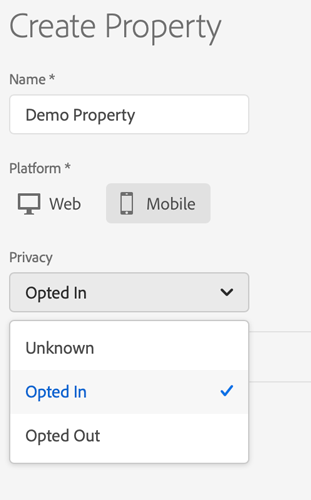

# Set up a mobile property

A property is a container that you fill with extensions, rules, data elements, and libraries. To use these resources, you need to create and configure a mobile property in [Experience Platform Launch](https://launch.adobe.com). You will typically create a mobile property for each mobile application you want to manage.

## Before you start

Before you can set up your mobile property, complete the following prerequisites:

### Set up groups and users

Launch is fully integrated with your Adobe ID. User permissions are managed through the Admin Console with other Adobe products and solutions from the Creative Cloud, Document Cloud, and Experience Cloud.

For detailed instructions on how to create groups and add users for Launch, see [User permissions](https://experienceleague.adobe.com/docs/launch/using/admin/user-permissions.html).

### Log in to Experience Platform Launch

After Experience Platform Launch rights have been added to your Adobe ID, log in to Launch. You can do this by going to [https://launch.adobe.com](https://launch.adobe.com) or by logging in to the Experience Cloud \([https://experiencecloud.adobe.com](https://experiencecloud.adobe.com)\), navigating to Launch, and clicking on Go to Launch.

## Create a mobile property

1. Log in to Experience Platform Launch.
2. On the main page, review the list of existing client side properties.
3. Click **New Property**.
4. Type a name for the property and select **Mobile** as the platform.

   If necessary, you can change the [**Privacy** ](../resources/privacy-and-gdpr.md#setting-privacy-status) setting later.

5. Click **Save** to create the mobile property.
6. Search for the property you just created and click to open it.


The default privacy status is set to _opted in_ and might impact data collection. For more information, see [Privacy and GDPR](../resources/privacy-and-gdpr.md).


## Install your extensions

An extension is an integration built by Adobe or an Adobe partner that adds new options you can use in your apps. By default, all new mobile properties come with the Mobile Core extension installed. The Mobile Core extension provides a robust default set of functionality.

## Set up your extensions

1. In Experience Platform Launch, on the details page for your mobile property, click **Extensions** in the sidebar under the **Authoring** section.

   The **Mobile Core** extension is installed by default.

2. On the **Mobile Core** card, click **Configure** to open the extensions detail page.

   

3. Check your Experience Cloud Org ID.

   By default, this value is auto-populated using the currently signed-in Organization ID. This is a required identifier for your Experience Cloud Organization and is typically a 24-character, alphanumeric string followed by _@AdobeOrg_. If you need help finding it, contact your Adobe CSM or Customer Care.

4. \(Optional\) Provide your Experience Cloud Server.

   This is an optional server value that is used to send Experience Cloud ID \(ECID\) Service network requests to a custom endpoint. If this property is not set, the visitor identifiers sync requests are sent to _dpm.demdex.net_ when the `Identity` extension is registered. The visitor identifiers are not translated to XDM IdentityMap and they are not synched with the Adobe Edge Network.

5. \(Optional\) Change the **Session Timeout** value.

   A default value of 300 seconds is already set. This timeout value indicates the number of seconds that must pass after a user backgrounds the app before a launch is considered to be a new Lifecycle session.

6. Click **Save** to confirm your settings for **Mobile Core**.

## Publish the configuration

Before the mobile application can access the configuration, it needs published to an environment. For now, we need to publish the Mobile Core extension configuration.

To deploy your configuration to a development environment for testing:

1. In Experience Platform Launch, on your mobile property's details page, click **Publishing Flow** in the sidebar under the **Publishing** section.
2. Under the **Development** portion of the publishing workflow, click **Add New Library**.
3. Specify any name for the library **Name**.
4. From the **Environment** drop-down list, select **Development** as the environment.
5. Click **Add a Resource** in the **Resource Changes** section at the bottom.
6. Click on **Extensions**, then **Mobile Core**, then **Revision 1**. Then, click the **Select Revision** button.
7. Click the **Save & Build for Development** button at the top.

   The library builds and is displayed under the **Development** section of the publishing workflow.

8. On the library card, click _**...**_ to see a drop-down list.
9. Select **Submit for Approval** from the drop-down and then **Submit**.

The library of changes are then published to the Development environment and the library is displayed under the **Submitted** section of the publishing workflow.


Testing can be done using the configuration in the Development environment. The library can later be deployed to the **Staging** and **Production** environments by using the rest of the publishing workflow. For more information, see [Publishing](https://experienceleague.adobe.com/docs/launch/using/publish/overview.html).


Now that you published your configuration, get the Adobe Experience Platform SDK for your application. For more information, see [Get the Experience Platform SDKs](https://github.com/Adobe-Marketing-Cloud/aep-sdks-documentation/tree/dc9846c2383008aa0bc38f48ce26c43874b1c58b/getting-started/get-the-sdk.md).

## Additional information

* To learn more about getting access to Launch, see [User Permissions](https://experienceleague.adobe.com/docs/launch/using/admin/user-permissions.html).
* To learn more about Experience Platform Launch's publishing workflows, watch this [video](https://www.youtube.com/embed/Pe-YSn26_xI).

## Get help

* To ask questions, visit the SDK [community forum](https://experienceleaguecommunities.adobe.com/t5/adobe-experience-platform-sdks/ct-p/platform-sdk).
* For immediate assistance, contact [Adobe Experience Cloud customer care](https://helpx.adobe.com/contact/enterprise-support.ec.html).

