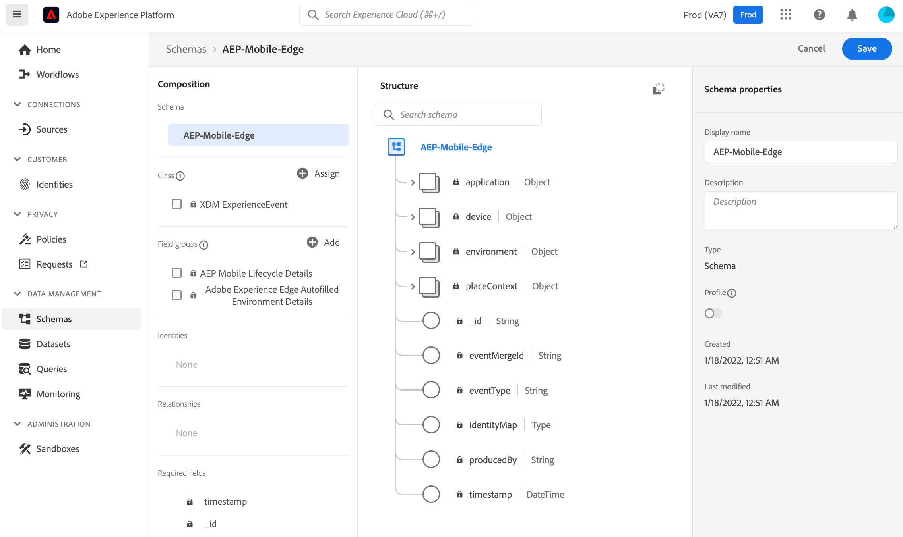
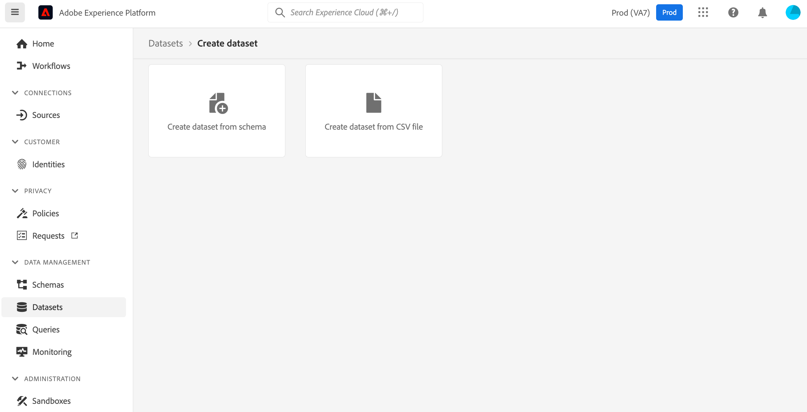

# Set up schemas and datasets

To standardize data collection for use across applications that leverage Adobe Experience Platform, Adobe has created the open and publicly documented standard, [Experience Data Model \(XDM\)](https://experienceleague.adobe.com/docs/experience-platform/xdm/home.html).

XDM provides a foundational framework to allow [Platform](https://experienceleague.adobe.com/docs/experience-platform/landing/home.html) services and Adobe Experience Cloud solutions to interoperate for reliable marketing and experience delivery use cases.


To learn more about XDM, please read the [XDM system overview](https://experienceleague.adobe.com/docs/experience-platform/xdm/home.html)​


To leverage data collection via the Experience Platform Edge Network, data has to be sent in as XDM objects. The use of non-XDM objects is currently unsupported.

In order to begin sending XDM data from your mobile application to Edge Network, you'll need to do the following:

1. [Create and configure your XDM schema](setup-schemas-and-datasets.md#create-and-configure-your-xdm-schema)
2. [Create and configure your dataset based on the previously created schema](setup-schemas-and-datasets.md#create-and-configure-a-dataset)

## Create and configure your XDM schema

### What is an XDM schema?

Schemas are a formalized description of the structure of your data. Schemas provide a standardized way of describing data in Experience Platform. This allows for all data that conforms to schemas to be reused across an organization without conflicts, or even shared between multiple organizations.

Edge Network and Adobe Experience Platform require your incoming data to have a defined schema that describes your data’s structure and provide constraints to the type of data that can be contained within each field.


To learn more about creating your own XDM schema, industry specific recommendations, or best practices, please read the document on the [basics of schema composition](https://experienceleague.adobe.com/docs/experience-platform/xdm/schema/composition.html).


### Creating a sample schema

The following steps illustrate the creation of a sample schema for mobile data collection:

1. In your browser, navigate to [Adobe Experience Platform](https://experience.adobe.com/platform) and login with your credentials.
2. Create an XDM Schema as follows:
   1. From the left panel, select Schemas
   2. Select **Create schema**.
   3. Select **XDM Experience event.**
   4. Under **Field Groups**, select **Add**; search and add the `Adobe Experience Edge Autofilled Environment Details`, `AEP Mobile Lifecycle Details` and other pre-created or custom field groups as needed.
   5. Set a **Display Name** for this schema and select `Save`.

## Create and configure a dataset

Data ingested into Adobe Experience Platform is stored \(in the Data Lake\) as datasets that conform to the aforementioned mentioned XDM schema \(setup in the step above\).


To learn more about datasets in Adobe Experience Platform, please read the [datasets overview](https://experienceleague.adobe.com/docs/experience-platform/catalog/datasets/overview.html).


The following steps illustrate the creation of a sample dataset for mobile data collection:

1. In the browser, navigate to [Adobe Experience Platform](https://experience.adobe.com/platform) and login with your credentials.
2. Create a new dataset as follows:
   1. From the left navigation panel, under **Data Management**, select **Datasets**.
   2. Select **Create dataset from schema**.
   3. Select the XDM schema previously created and select **Next**.
   4. Set a name for the dataset and select **Finish**.

