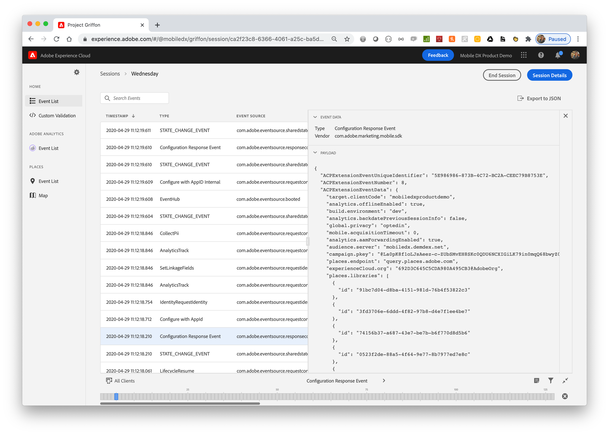
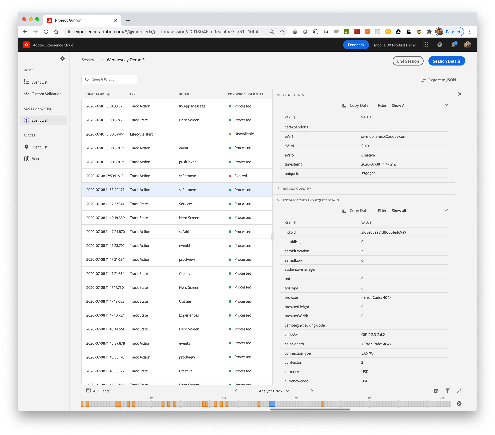
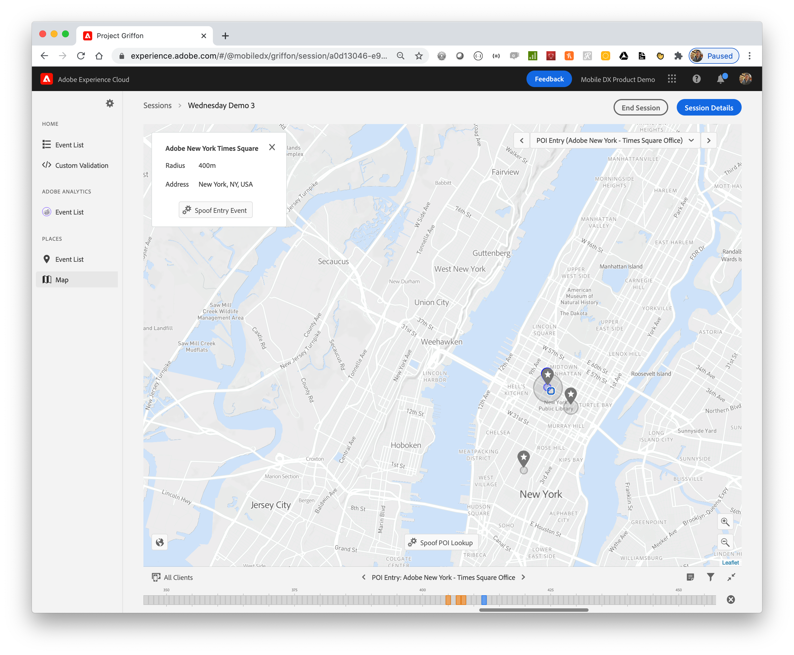

# Validation

As you begin to add solution APIs to your mobile implementation, you are going to want to validate that specific actions and experiences work as intended. Adding [Project Griffon](../beta/project-griffon/#what-can-project-griffon-do-for-you) to your application at the begging of your implementation provides a way to quickly check to make sure the SDK has been instrumented properly and that data is flowing to Adobe Analytics and other solutions.

Project Griffon is available across all [SDK platforms and frameworks](https://aep-sdks.gitbook.io/docs/resources/upgrading-to-aep/current-sdk-versions). Installation and setup instructions are available [here](../beta/project-griffon/#quick-setup).

Once you have Griffon integrated, you can create a [new session](https://aep-sdks.gitbook.io/docs/beta/project-griffon/using-project-griffon#creating-sessions) either by scanning a QR code, or by following a unique deep link URL.

The main interface for Griffon will show a running event list of all SDK events, including a configuration response event that will provide a readout of all configuration values obtained from Adobe Experience Platform Launch.

## Adobe Analytics View

The [Adobe Analytics](../beta/project-griffon/using-project-griffon/adobe-analytics-and-project-griffon.md#using-project-griffon-for-adobe-analytics) event list offers a focused view of just analytics events triggered in the application. You can easily sort through all of the track action and track state calls. What is unique to the [analytics view in Griffon](../beta/project-griffon/using-project-griffon/adobe-analytics-and-project-griffon.md) is the ability to see both the raw hit request sent to analytics and the post-processed details.

## Places Service View

Testing and validating actions based on geofence data can be incredibly difficult and time consuming. Project Griffon helps ease the pain in testing point of interest entries and exits. The Places event list provides a focused view showing all events related to Places Service, including user authorization level granted and requests for nearby points of interest \(POIs\). While a device is connected to an active Griffon session the map view will show a timeline of POI entries and exits. If you would like to test actions or experiences triggered by geofence entries and exits, the map view will allow you to spoof or simulate your location by clicking on any area within the map.

To learn more about Places Service see: [Places Service overview](https://docs.adobe.com/content/help/en/places/using/home.html)

To learn more about Project Griffon see: [Project Griffon setup](../beta/project-griffon/set-up-project-griffon/)

