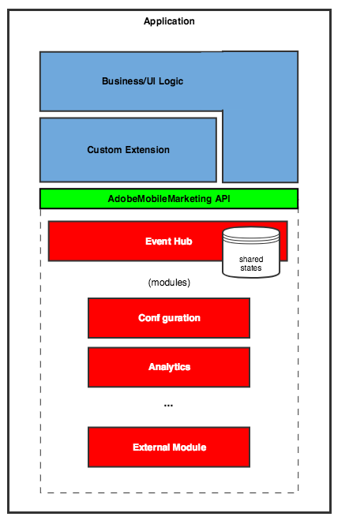

# Building mobile extensions

To support customer-specific features, and allow for the greatest flexibility, Adobe Experience Platform Mobile SDK provides an interface that allows customers to integrate with the Mobile Core at a much lower level. This interface allows customers to define extensions, which are similar in capabilities to the extensions that Launch has written for Adobe's internal services. The Mobile Core allows all extensions to access the events and data being sent through the Experience Platform SDK.

Extensions allow customers to extend the Experience Platform SDKs with their own code. This includes listening for and dispatching events, reading the shared state of any registered extension, and sharing the state of the current extension. The application can use the extension to monitor for information that Adobe does not expose by default. It can also use the extension to modify Experience Platform SDK internal operations. For example, the application can use the extension to add additional data to messages that are sent or by sending data to other systems.

## Namespace conventions

Components or data that are provided by Adobe must be clearly distinguished from the components or data that are provided by external parties. Inconsistent naming conventions impact module naming, event type, source names, and event data keys.

Here are the naming rules for extensions:

* The `ADOBE_PREFIX` is `com.adobe`.
* The `THIRDPARTY_PREFIX` is `com.`. The prefix `com.adobe.*` is reserved for Adobe.
* Third parties must prefix their extension name and any custom event types or sources they create with the `THIRDPARTY_PREFIX` followed by their company name.
* By convention, Adobe will not prefix shared state keys or event data keys.  These names will be in the global namespace. For example: `mid`.
* Adobe internal module names follow the pattern `ADOBE_PREFIX.module.{moduleName}`. 
* Adobe event types follow the pattern `ADOBE_PREFIX.eventType.{eventType}`. 
* Adobe event sources follow the pattern `ADOBE_PREFIX.eventSource.{eventSource}`. 
* Shared state **names** (not **keys**) must equal the module name. 
* All constants will be named using `lowerCamelCase`, and cases are normalized internally to make comparisons case-insensitive.  For example, if you use `Com.Adobe.moDule.AnAlytiCS` it will be internally converted to `com.adobe.module.analytics`. An exception to this rule is that shared state names that are used in rules are compared in a case-sensitive manner. This means that when registering an extension, the actual case is retained internally, so that rule comparison can succeed.


You should use ASCII characters even if your company name contains non-ASCII characters.


## Extension architecture

### Error handling

When using an extension, you can get asynchronous or synchronous errors.

#### Synchronous errors

Synchronous errors are caught outside the Experience Platform SDK and may occur for the following reasons:

* When registering a class with the incorrect parent class.
* When passing empty strings to certain parameters. Examples include an extension name, an event type, or a shared state name.
* When passing malformed JSON `data.Synchronous` errors are returned immediately on the same thread. 


In iOS, a `@false` value is returned to indicate an error and filling in an optional `NSError` out parameter.


#### Asynchronous errors

Asynchronous errors are caught in the Experience Platform SDKs. When they occur, the error is handled with a callback function, which can be called back on a different thread.

Asynchronous errors may occur for the following reasons:

* When registering an extension with a name that duplicates an internal module or a previously registered extension.
* When using a deprecated shared state name.
* When registration is attempted during extension shutdown.
* When an event is being dispatched while the extension is being shut down.
* When a callback from the Experience Platform SDKs to the external code throws an exception.
* When an internal error occurs, or an unexpected exception is thrown.


In iOS, asynchronous errors are handled by using the `unexpectedError` method that is defined in the `ACPExtension` class.

