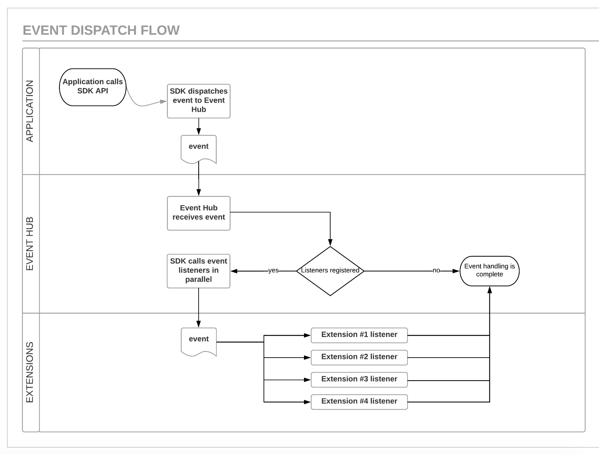

# Event processing

An event is composed of the following information:

* A name, which is used for debugging.
* An event type, which defines what kind of event this is and determines who is notified when this event occurs.
* An event source, which is where the event originated and is used to determine who is notified when this event occurs.
* Event data, which is the structured data that is associated with this particular event.   This data is retrievable as a JSON blob.
* Versioning information, which is used to synchronize a group of events with the associated shared data, is not directly exposed to extensions.  This information is implicitly used when getting shared states.

**Tip**: Extensions use the ACPExtensionEvent (iOS) / Event (Android) class to create events to dispatch to the extensions in order to make requests or retrieve data.

In the Adobe Experience Cloud Platform SDK, the strings  like extension name, event type and source strings are converted and stored in lowercase. When you compare strings use java.lang.String.equalsIgnoreCase() method.

Here are some examples of potential events:

* The Adobe Experience Cloud Platform SDK configuration changed.
* Data was requested by the application.
* Data was collected by the application.
* An action was requested by the application.
* Data was requested by an extension or internal module in response to another event.

Events are closely tied to shared states, which also have versions. This is why events can be passed when requesting a shared state; this process ensures that the state that is retrieved matches the event that is associated with this state. This also means that events can be associated with each other, and as a result, these events share the same versioning information.

## Event Hub

The event hub is the core data structure to which the SDK extensions and other components are tied, and it maintains the following data:

* A list of registered extensions and internal modules.
* A list of registered event listeners.
* A shared state database.

The event hub is responsible for receiving events that are dispatched by the application or by the extensions, processing events, and dispatching these events to registered listeners. The event hub is accessed from the application and from the extensions by using the `MobileCore` API that is exposed in the SDK. The application dispatches events indirectly, by calling API methods that cause events to be dispatched in the Adobe Platform SDKs. The extensions and internal modules dispatch events directly by calling into the event hub.

## Order of Event Processing

Here is the lifecycle of an event:

1. The event is created and dispatched by the extension or application.
2. The event is received by the event hub.
3. The event is compared against the registered event listeners.  The event is passed to every listener that matches, in parallel.

