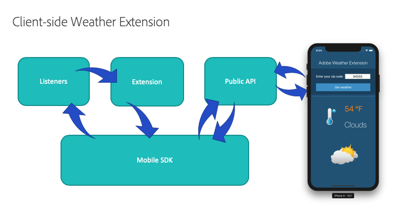

# Mobile extension samples

## Skeleton Extension

To help in getting started with your first Adobe Experience Platform Mobile Extension, we've created a Skeleton Extension template for both iOS and Android. 

The Skeleton Extension is a bare bones third party extension that contains a framework for building your own custom extension. Inside the project you'll see well commented examples of how to register your extension with the Mobile Core event hub, and how to setup listeners to hear specific events passed through the SDK. The Skeleton Extension also shows how to set a shared state and publish an event back onto the Mobile Core event hub. 



## Weather Extension

The Weather Extension example for both iOS and Android shows a complete client-side and Launch UI extension that uses an API to fetch weather information from [https://openweathermap.org/](https://openweathermap.org/). The weather conditions are published onto the Mobile Core event hub and are saved as a shared state. The Launch UI extension shows how an extension can be used to not only pass configuration values to the client-side extension, but can also be used to integrate with the Adobe Launch workflow rules engine.

#### Client-side iOS and Android Weather Extension



#### Launch UI Weather Extension



