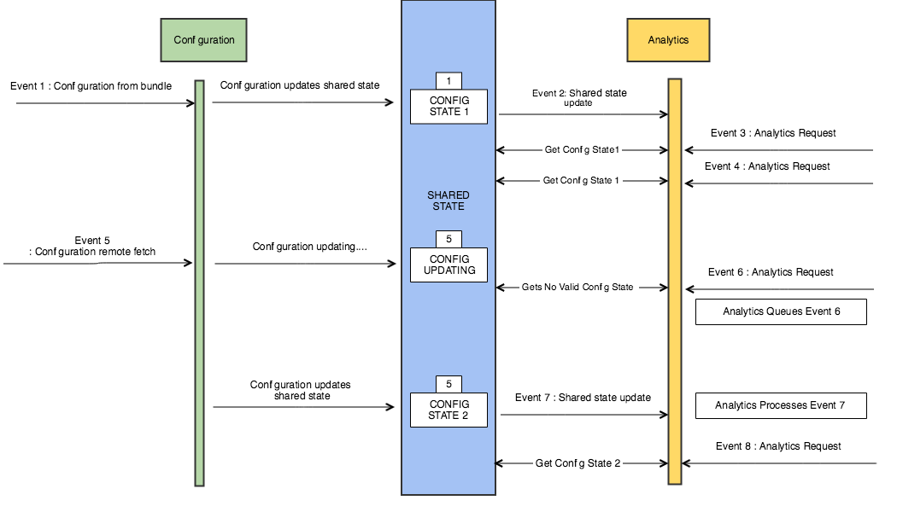

# Shared states and events

A shared state is composed of the following:

* A name, which is the name of the extension or module that owns this shared state.
* An event , which is an event that contains data that an extension wants to expose to other extensions or modules.

**Important**: Every event does not result in an updated shared state. Shared states have to be specifically set, which causes events to be sent that the extensions and internal modules can listen for to be updated.

## Using a shared state

Modules and extensions use events and shared states to communicate with each other. The events allow modules to be relatively decoupled, but shared states are necessary when you have a dependency on a module’s information.

A module that receives an event for which it is listening, for example, when Analytics listens for Configuration changes, might trigger some asynchronous work in response to that event, for example, a network request. When the results of that work results in another event being dispatched, the second event that was dispatched is tied to the original event that started the cycle. This process allows downstream listeners to retrieve the same shared state with the same event data that caused the additional work to occur.

**Important:** An event might be received under some circumstances when the shared state that it represents has not yet become available. In this case, calling `getSharedEventState` returns a null value, which indicates the pending status. In this case, you should ignore the state change event and continue listening.

Here is an illustration of the workflow:

