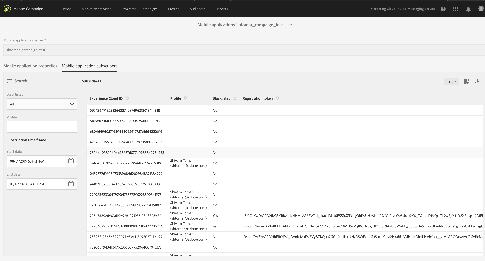

#                         Push Notification Implementation and Tracking Troubleshooting
                         
## To set up server key/APNS server certificate in the campaign instance, complete the following steps:

### To set up Android server key

   1. To configure the app in Google Firebase, go to the Google [Firebase Console](https://console.firebase.google.com/) and sign in using your Google Developer credentials. 
   2. Add a project and add your app under that project using the application ID that you used in app.  
   For more information, see [Add Firebase to your Android project](https://firebase.google.com/docs/android/setup#console).
   3. Add the generated **“google-service.json”** to the project and set up the project and module level gradle files.  
   For more information, see [Add Firebase to your Android project](https://firebase.google.com/docs/android/setup#console).
   4. Verify that Firebase server key is configured in the Campaign instance.
   5. To verify, click _Adobe Campaign -> Administrator -> Channels -> Mobile App (AEP SDK)_.
   6. Select the mobile app from the list and verify that the push channel settings status for Android is _Android key set up success_.  
   
   
  
### To set up APNS server certificate

   1. Add Push Notification entitlement to your app.  
   For more information, see [Enable the Push Notifications Capability](https://developer.apple.com/documentation/usernotifications/registering_your_app_with_apns?language=objc).
   2. To configuring the APNS certificate, register the app on Apple developer account and generate server certificate.  
   For more information, see [Establishing a Certificate-Based Connection to APNs](https://developer.apple.com/documentation/usernotifications/setting_up_a_remote_notification_server/establishing_a_certificate-based_connection_to_apns?language=objc).
   3. Verify that the APNS server certificate is configured in the Campaign instance.  
   4. Verify this by clicking _Adobe Campaign -> Administrator -> Channels -> Mobile App (AEP SDK)_. Select the mobile app from the list and verify that push channel settings status for iOS is _iOS certficate with filename *.pem is successfully uploaded_.  
 
 Verify that you are using production certificate for production version of app and debug certificate for debug version of app.
 
   
   
   
> For more information about configuration, see [Channel specific application configuration in Adobe Campaign.](https://helpx.adobe.com/campaign/kb/configuring-app-sdk.html#ChannelspecificapplicationconfigurationinAdobeCampaign).  
  
## To set up Android/iOS app for receiving push notifications  

### To set up Android app  

   1. Create the Firebase Messaging Service and add it to the Android Manifest file.  
   For more information, see [Set up a Firebase Cloud Messaging client app on Android](https://firebase.google.com/docs/cloud-messaging/android/client)
   2. Verify this step in Project Griffon.
   For more information, see [Set up Project Griffon](https://aep-sdks.gitbook.io/docs/beta/project-griffon/set-up-project-griffon) and [Use Project Griffon](https://aep-sdks.gitbook.io/docs/beta/project-griffon/using-project-griffon).  
   3. Generate a push token for app using FireBase Instance Id class.  
   4. Set the push token to the Expereince Platform SDK by calling Set [Push Identifier](https://aep-sdks.gitbook.io/docs/using-mobile-extensions/adobe-campaign-standard/adobe-campaign-standard-api-reference#set-up-push-messaging).     

### To set up iOS app  
  
  1. After you launch the app, register the app to receive the APNS token by calling `registerForRemoteNotifications`.  
  This API generates the APNS token and returns token through the delegate function `didRegisterForRemoteNotificationsWithDeviceToken`.    
  For more information, see [Registering Your App with APNs](https://developer.apple.com/documentation/usernotifications/registering_your_app_with_apns?language=objc)
  2. In `didRegisterForRemoteNotificationsWithDeviceToken`, set the Push identifier by calling the `setPushIdentifier`.  
  For more information, see [setPushIdentifier](https://aep-sdks.gitbook.io/docs/using-mobile-extensions/adobe-analytics-mobile-services#set-up-push-messaging).
 
### To verify that push token is successfully synced with ECID service, complete the following steps:


If SDK privacy status is`optedout`, the push identifier will not be set.


   1. Verify push token sync with the Experience Cloud Identity service.  
   2. To verify Launch your app with the device connected to a Project Griffon session.   
   3. In the list of events, verify that you have an event with type _SetPushIdentifier_. In the details panel on the right, verify the value of the push token for this device. The value in pushIdentifier is the same value that is sent to the ECID service. For more information, see screenshot below.

   2. Verify that app’s push token is in the Campaign instance that was mapped with the correct Experience cloud id(mid) by clicking _Adobe Campaign -> Administrator -> Channels -> Mobile App (AEP SDK)_.
   3. Launch your app and, under the mobile application subscribers, review the list of all Subscribers of app.
   4. Verify the Experience Cloud ID and Registration Token for the user is displayed.
   
   
   
   5. If you are using Charles, verify that the push token is successfully synced with the ECID service. Check for the **demdex request** which is marked with the red line in the screenshot below. Also verify the successfull resposne(200) for this network call.  
 
 
 
 
 ## Troubleshooting push notification events tracking  

The following events are related to the tracked push notifications:
  * Impression (Notification is delivered.)
  * Click (User clicked the notification.)
  * Open (App opened in response to user's click on notification.)  
  For more information about implementing the tracking of push notification events, see [Push Tracking](https://helpx.adobe.com/campaign/kb/push-tracking.html).  
  
###  Troubleshooting using Project Griffon  

  You can Verify push token sync with the Experience Cloud Identity service on Project Griffon.  
  Launch your app with the device connected to a Project Griffon session. Receive a push notification in the device.  
  In the list of events, verify that you have an events with type CollectData. In the details panel on the right, verify the value of the action. The value action should be 7 for impression, 2 for click and 1 for open. It is shown in the screenshots below.  
  
   
   
   Shows tracking of **impression** event. It is indicated by action 7.
   
   
   
   Shows tracking of **click** event. It is indicated by action 2.
   
   
   
   Shows tracking of **open** event. It is indicated by action 1.
  
  
###  Troubleshooting using Charles  

To verify that a successfull network call is made to track the push notification interaction event, look for GET request with query string `id=broadlogID,deliveryID,action` to campaign server, see screenshots below for mopre details about what to look.  

**_Screenshot for the impression event tracking(action value 7)_**

**_Screenshot for the click event tracking(action value 2)_**

_**Screenshot for the open event tracking(action value 1)**_

