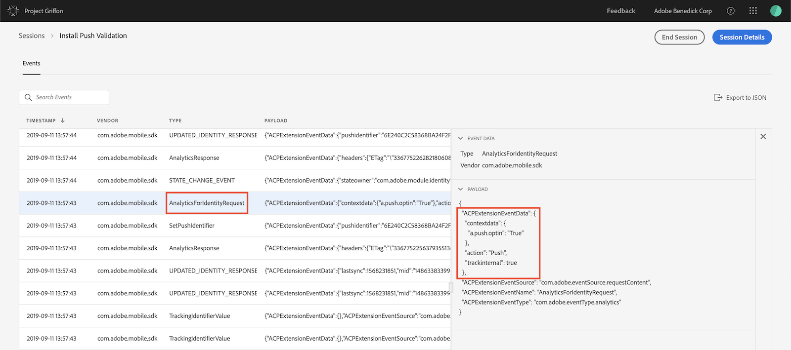
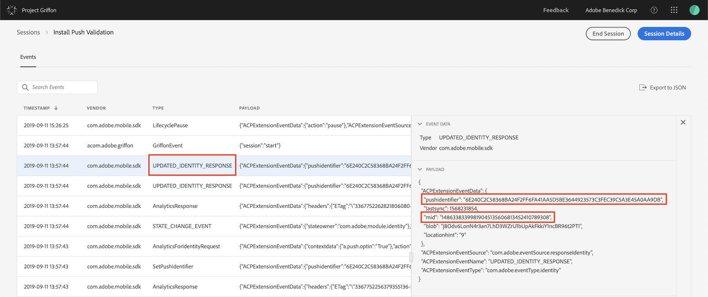

# Push Messaging


This troubleshooting guide requires [Project Griffon](../../beta/project-griffon/). Please see [documentation](../../beta/project-griffon/) for access, setup, and use.


When implementing push messaging for Mobile Services via the Adobe Experience Platform Mobile SDK, you may validate client-side implementation by verifying you've completed the following steps:

1. [Pass the device's push token to the SDK](troubleshooting-push.md#pass-the-push-identifier-to-the-sdk)
2. [Verify push token sync with the Experience Cloud Identity service](troubleshooting-push.md#validate-setpushidentifier-event)
3. [Ensure user opt in for push in Adobe Analytics](troubleshooting-push.md#validate-analytics-request-with-push-optin)
4. [Confirm user ID is correctly set \(and is same from steps 2 and 3, above](troubleshooting-push.md#validate-the-user-id-is-correct)\)

## Pass the Push Identifier to the SDK

The `setPushIdentifier` API sets the device token for push notifications in the SDK. This results in a few network calls made to requisite Adobe servers to associate the user with the push token.


If SDK privacy status is`optedout`, the push identifier will not be set.


### setPushIdentifier



### Java

#### Syntax

```java
public static void setPushIdentifier(final String pushIdentifier);
```

#### Example

```java
// retrieve the token from either GCM or FCM, and pass it to the SDK
MobileCore.setPushIdentifier(token);
```



### Objective C

#### Syntax

```objectivec
+ (void) setPushIdentifier: (nullable NSData*) deviceToken;
```

#### Example

```objectivec
// pass the deviceToken that the APNS has assigned to the device
[ACPCore setPushIdentifier:deviceToken];
```

### Swift

#### Syntax

```swift
Void setPushIdentifier(deviceToken: Data?)
```

#### Example

```swift
// pass the deviceToken that the APNS has assigned to the device
ACPCore.setPushIdentifier(deviceToken)
```



### Javascript

#### Example

```jsx
ACPCore.setPushIdentifier("pushIdentifier");
```



## Verify push token sync with the Experience Cloud Identity service

Launch your app with the device connected to a [Project Griffon session](../../beta/project-griffon/). 

In the list of events, verify that you have an event with type `SetPushIdentifier`. In the details panel on the right, you may verify the value of the push token for this device. The value in `pushIdentifier` is the same value sent to the Adobe servers.


## Ensure user opt-in for push in Adobe Analytics

Launch your app with the device connected to a [Project Griffon session](../../beta/project-griffon/).

In the resulting list of events, verify that you have an event with type `AnalyticsForIdentityRequest`. In the details panel on the right, you can see that there is a value sent to Analytics that opts this user in to receive push notifications.



## Confirm user ID is correctly set

Launch your app with the device connected to a [Project Griffon session](../../beta/project-griffon/).

In the list of events, verify that you have an event with type `UPDATED_IDENTITY_RESPONSE`. In the details panel on the right, confirm that two values are correct:

* The value for `pushidentifier` should match the value sent in step 2 above.
* The value for `mid` should match the value for `mid` that is sent to Analytics. If you are using a [custom visitor identifier](../../using-mobile-extensions/adobe-analytics/analytics-api-reference.md#setidentifier), this payload should also contain a `vid` variable with a matching value of that used to identify this user.



After completing these steps, your app is correctly configured and is ready to send push messages via the SDK and Adobe.

