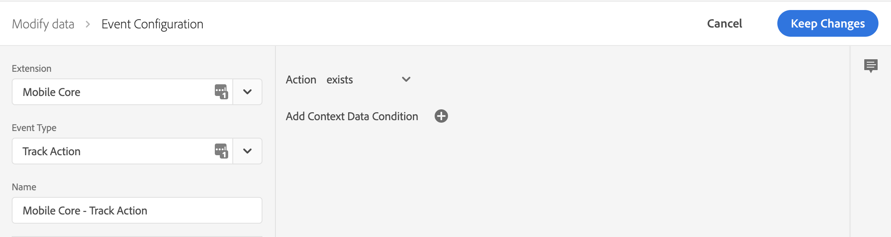
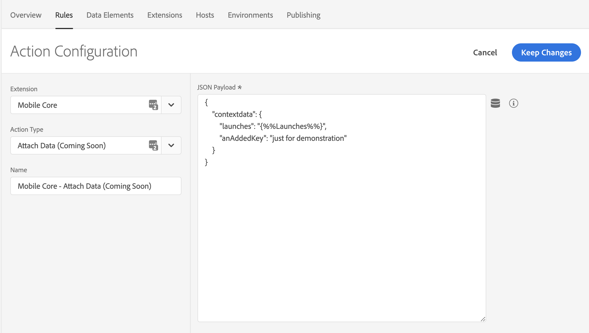
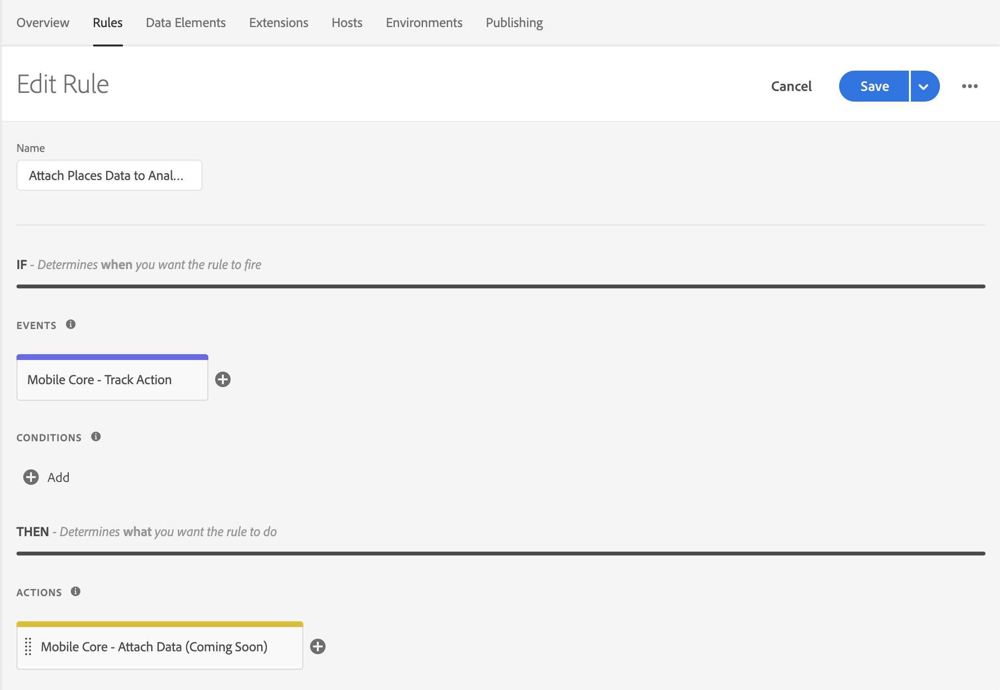

# Using the Attach Data Rules Action

The _attach data_ rule action is supported in [Mobile Core](../../using-mobile-extensions/mobile-core/) starting version 2.1.8 \(iOS\) and 1.1.8 \(Android\). This action is powerful and complex and enables advanced use cases.

To use this action, we'll provide context on how events flow in the Adobe Experience Platform Mobile SDK and how they interact with the SDK's [rules engine](../../using-mobile-extensions/mobile-core/rules-engine/). Then, we'll show how you can use the action along with relevant examples.

## Context

### What are SDK events?

In the Experience Platform Mobile SDK, events hold all data that is required by other extensions to complete their necessary actions. Events have the following properties:

| Property | Description |
| :--- | :--- |
| Type | Describes the event. Example: Analytics, Target, Lifecycle, etc. |
| Source | Indicates cause of or directionality of the event. Example: request or response. |
| Event data | Additional data required to define the event. Example: context data on an Analytics event. |

Extensions that register with [Mobile Core](../../using-mobile-extensions/mobile-core/) will also register event listeners. A listener is defined by an event _type_ and _source_ combination. When the SDK event hub processes an event, it notifies all listeners that match the provided combination.

### How are events created in the SDK?

Events are created by an extension and are then dispatched to the SDK event hub. Each published rule created in Adobe Experience Platform Launch is then evaluated against the current event. Finally, the event is passed to each of the listeners for Events with this _type_ /_source_ combination.


Events are created and dispatched when an SDK public API is invoked. Attach data action use cases are meant to act on these types of events.


### What is the rules engine?

The rules engine lives in aforementioned SDK event hub. Before listeners are notified, the rules engine evaluates each Launch rule against the triggering event. A rule is defined by 3 properties:

| Property | Description |
| :--- | :--- |
| Event | Trigger for the rule. |
| Condition | Definition of criteria to compare against the triggering event. |
| Action | The resulting action to happen if evaluation of rule is positive. |


A rule may be read out loud like so: _If_ SDK _**Event** occurs_ and _**Condition\(s\)**_ are met, then perform the _**Action\(s\)**._


## Using the attach data action

Attach Data is a type of Rule Action that allows you to add Event Data to an SDK Event. The modification of data happens in the Rules Engine before Event listeners are notified of the Event.


Attach Data Rule Actions will only add data to the Event, and they will never modify or remove data.

If there is a conflict between the data that is defined in your Rule and the data in the Event, the data in the Event will always have preference.


### Defining a payload for the attach data action

When defining a payload for the attach data action, the payload must match the format of the triggering event. For example, if you want to add context data to an Analytics event, you will need to know where the context data is defined on that event and match the format in your rule. For this reason, it is strongly recommended that you enable verbose logging in the SDK and carefully study the format of the event to which you attach data. If the format does not match, it is unlikely that the expected results will be received.

## Example - attaching data to an Analytics event

The following sample shows how to _attach data_ to all outgoing `TrackAction` Analytics network requests. To create this type of rule, select your property in Launch and complete the following steps:

1. [Create a new **Rule**](attach-data.md#create-a-rule)\*\*\*\*
2. [Select the **Event** you wish to trigger the rule](attach-data.md#define-the-action)
3. [Select the **Action** to Attach Data and define your payload](attach-data.md#define-the-action)
4. [Save and rebuild the property](attach-data.md#save-the-rule-and-rebuild-your-property)

### Create a Rule

1. On the **Rules** tab, click **Create New Rule**.


If you do not have existing rules for this property, the **Create New Rule** button will be in the middle of the screen. If your property has rules, the button will be in the top right of the screen.


### Select an event

1. Give your rule an easily recognizable in your list of rules. In this example, the rule is named **Attach Places Data to Analytics Track Action Events**.
2. Under the **Events** section, click **Add**.
3. From the **Extension** drop-down list, select **Mobile Core**.
4. From the **Event Type** drop-down list, select **Track Action**.
5. Click **Keep Changes**.

### Define the action

1. Under the **Actions** section, click **Add**.
2. From the **Extension** drop-down list, select **Mobile Core**.
3. From the **Action Type** drop-down list, select **Attach Data**.
4. On the right pane, in the **JSON Payload** field, type the data that will be added to this Event.
5. Click **Keep Changes**.

On the right pane, you can add a freeform JSON payload that adds data to an SDK event before an extension that is listening for this event can hear the event. In this example, some context data is added to this event before the Analytics extension processes it. The added context data will now be on the outgoing Analytics hit.

In the following example, **launches** and **anAddedKey** keys are added to the **contextdata** of the Analytics event. Values for the new keys can either be hardcoded in the rule, or dynamically determined by the SDK when this event processes by using Data Elements.

### Save the Rule and rebuild your property

After you complete your configuration, verify that your rule looks like the following:

1. Click **Save**
2. Rebuild your Launch property and deploy it to the correct Environment.

