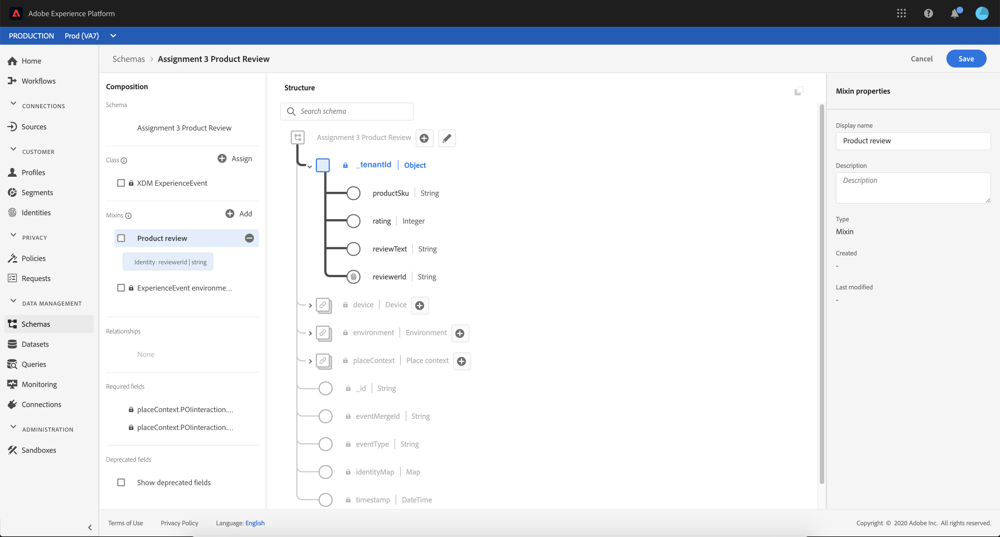

# Sample XDM Implementation

## Prerequisites for this tutorial

Before starting this tutorial, please read and follow the steps in the [getting started with Adobe Experience Platform tutorial](./).

### Download the sample application



#### Java

Download the Android Sample application from the [Adobe Experience Platform SDK GitHub](https://github.com/adobe/aepsdk-sample-app-android/archive/beta-assignment-3.zip).

To get started, follow the steps described in the installation section of the [Adobe Experience Platform SDK GitHub](https://github.com/adobe/aepsdk-sample-app-android/tree/beta-assignment-3#installation).



#### Swift

Download the iOS Swift Sample application from the [Adobe Experience Platform SDK GitHub](https://github.com/adobe/aepsdk-sample-app-ios/archive/beta-assignment-3.zip).

To get started, follow the steps described in the installation section of the [Adobe Experience Platform SDK GitHub](https://github.com/adobe/aepsdk-sample-app-ios/tree/beta-assignment-3#installation).



### Set up the configuration

In [Adobe Experience Platform Launch](https://experience.adobe.com/launch), go to the **Environments** tab in the previously created mobile property and click on the Development icon \(\). Find the Environment File ID at the top and copy it.

Set the `LAUNCH_ENVIRONMENT_FILE_ID` to the copied Environment File ID in the `MainApp` \(Android\) / `AppDelegate` \(iOS\) class.

## Create schema and dataset for product reviews

1. In the browser, navigate to [Adobe Experience Platform](https://experience.adobe.com/platform) and login with your credentials.
2. Create an [XDM Schema](https://experienceleague.adobe.com/docs/experience-platform/xdm/tutorials/create-schema-ui.html?lang=en) as follows:
   * From the left panel, select **Schemas**
   * Select **Create schema**, followed by **XDM ExperienceEvent**
   * Set the name for this schema as "Product Reviews".
   * Select the **Add** button \(+\) to add field groups
     * Select **Environment Details** from the "Use existing field groups" section then select **Add field group**.
   * Select the **Add** button \(+\) to add field groups
     * Select **Create new field group** and set the name as "Product review", then select **Add field group**.
   * In the Schema structure, select the "Product review" field group and select the plus icon \(+\) next to the schema name "Product Reviews".
   * Start adding fields as follows. After each, select **Apply**, then plus icon \(+\) to add the next field.

     | Field name | Display name | Type | Required |
     | :--- | :--- | :--- | :--- |
     | productSku | Product SKU | String | Yes |
     | reviewText | Review Text | String | No |
     | rating | Rating | Integer | Yes |
     | reviewerId | Reviewer ID | String | Yes |

   * Select the `reviewerId` and enable it for Identity , enable **Primary Identity** and select Identity namespace "Email".
   * Select **Save**.



1. The previously created schema wil be used for the profiles you are about to create.
   * Select the Schema name, then from the right panel enable the **Profile** toggle.
   * When the **Enable for Profile** pop-up is displayed, select **Enable**.
2. Create a dataset for the schema:
   * Select **Datasets** from the left panel, followed by **Create dataset** and **Create dataset from schema**.
   * Search for the previously created "Product Reviews" schema and select it.
   * Select **Next** and name the dataset "Product Reviews", followed by selecting **Finish**.
3. Finally, you will want to include this dataset with Real-time Customer Profile:
   * Select the previously created "Product Reviews" dataset.
   * From the right panel, enable the **Profile** toggle.

## Send product review

### Build XDM objects

You can now implement the product review functionality in the sample application. Navigate to `EdgeViewController.swift` \(iOS\) / `EdgeTab.java` \(Android\) and implement the `sendProductReviewXdmEvent` function.

1. Create the XDM Experience Event using the `XDM IdentityMap` containing the reviewer `Email` and the review information.



#### Java

```java
// TODO - Assignment 3
Map<String, Object> xdmData = new HashMap<String, Object>();

// 1. Add Email to the IdentityMap.
// Note: this app does not implement a logging system, so authenticatedState ambiguous is used
// in this case. The other authenticatedState values are: authenticated, loggedOut
Map<String, Object> identityMap = new HashMap<String, Object>();
identityMap.put("Email", new ArrayList<Object>() {{
  add(new HashMap<String, Object>() {{
    put("id", reviewerId);
    put("authenticatedState", "ambiguous");
  }});
}});
xdmData.put("identityMap", identityMap);

// 2. Add product review details in the custom field group
// Note: use your _tenantId here as specified in the Product Reviews Schema in Adobe Experience Platform
xdmData.put("_tenantId", new HashMap<String, Object>() {{
    put("productSku", product.sku);
    put("rating", rating);
    put("reviewText", text);
  put("reviewerId", reviewerId);
}});
```



#### Swift

```swift
// TODO - Assignment 3
var xdmData : [String: Any] = [:]

// 1. Add Email to the IdentityMap.
// Note: this app does not implement a logging system, so authenticatedState ambiguous is used
// in this case. The other authenticatedState values are: authenticated, loggedOut
xdmData["identityMap"] = ["Email": [["id": reviewerEmail,
                                     "authenticatedState": "ambiguous"]]]

// 2. Add product review details in the custom field group
// Note: use your _tenantId here as specified in the Product Reviews Schema in Adobe Experience Platform
xdmData["_tenantId"] = ["productSku": products[productIndex].sku,
                         "rating": reviewRating,
                         "reviewText": reviewText,
                            "reviewerId": reviewerEmail]
```



**Note:** When sending XDM data for custom field groups, use your **\_tenantId** as shown in the schema.


Use the knowledge from Assignment 1 and connect to an Assurance Session to verify if the XDM data sent from the sample app is in the correct format.


### Override the default dataset

1. Send the Experience Event using the Adobe Experience Platform Edge extension and specify the dataset identifier for "Product Reviews". 
   * Copy the `<DatasetIdentifier>` from the "Product Reviews" dataset in Platform and replace it in the sample app implementation where indicated below.



#### Java

```java
// 3. Send the XDM data using the Edge extension, by specifying Product Reviews Dataset identifiers as
// shown in Adobe Experience Platform
// Note: the Dataset identifier specified at Event level overrides the Experience Event Dataset specified in the
// Datastream configuration
xdmData.put("eventType", "product.review");
ExperienceEvent event = new ExperienceEvent.Builder()
  .setXdmSchema(xdmData, "<DatasetIdentifier>")
  .build();
Edge.sendEvent(event, new EdgeCallback() {
  @Override
  public void onResponse(Map<String, Object> data) {
    Log.d("Send XDM Event", String.format("Received response for event 'product.review': %s", data));
  }
});
```



#### Swift

```swift
// 3. Send the XDM data using the Edge extension, by specifying Product Reviews Dataset identifiers as
// shown in Adobe Experience Platform
// Note: the Dataset identifier specified at Event level overrises the Experience Event Dataset specified in the
// Datastream configuration
xdmData["eventType"] = "product.review"
let experienceEvent =
ExperienceEvent(xdm: xdmData, datasetIdentifier: "<DatasetIdentifier>")
Edge.sendEvent(experienceEvent: experienceEvent)
```



### Run the sample application

Run the sample app on a device or simulator in Xcode / Android Studio. Click on the `Edge` tab and start testing the Product Review implementation.

1. Select a Product from the list.
2. In the "XDM Product Review Example" section:
   * Fill in the **Reviewer email** with a sample email address.
   * Add the rating for the selected product.
   * Write your comment.
   * Click **Submit Review**.
3. Repeat these steps multiple times to "collect" product reviews.

## View the product reviews in Adobe Experience Platform

After using the sample demo application to send product reviews as XDM Experience Events, query the data in Adobe Experience Platform.

**Note:** It may take up to 15-20 minutes before the data shows up in Adobe Experience Platform.

Query the dataset which stores the commerce data by doing the following:

1. Log in to [Adobe Experience Platform](https://experience.adobe.com/platform) using your Adobe credentials.
2. Select your Adobe Experience Cloud organization to the organization ID used to configure the demo application.
3. On the navigation panel, under Data Management, select **Datasets** and select the dataset you created at the beginning of this tutorial. From the right panel, copy the `Table name` value.
4. From the left panel, select **Queries**.
5. Click the **Overview** tab, then click **Create query**.
6. In the text box, enter a SQL query against your dataset table. Here is an example:

   ```sql
   select * from paste_your_table_name_here 
       where eventType = 'product.review' LIMIT 10
   ```

7. Select the "Play" icon to run the query. The results will appear in the **Results** tab at the bottom.

## View the Real-time Customer Profile

The customer profile can be viewed in [Adobe Experience Platform](https://experience.adobe.com/platform).

1. Select **Profiles** from the left panel.
2. Select **Browse** and search for the email you sent from the sample app.
   * Select the merge policy `_xdm.context.profile` Private graph Timestamp ordered
   * Select "Email" as the identity namespace.
   * For the identity value, enter the same email as you sent from the app.
   * Select the Profile ID found in the table.
3. Inspect the customer profile.
   * Notice that the client-side ECID and the email\(s\) you sent in XDM format using the Edge extension are now displayed in the Detail view, under the **Linked identities** section, as well as in the **Attributes** view.
   * In the **Events** tab you can view the events sent to the dataset\(s\) enabled for Profile for the selected customer profile.

To learn more about the Adobe Customer Profile, see the [Identity Service overview](https://experienceleague.adobe.com/docs/experience-platform/identity/home.html) and the [Identity namespace overview](https://experienceleague.adobe.com/docs/experience-platform/identity/namespaces.html).

## Extra credit: Create segment based on Identity Authentication State

Create a segment in [Adobe Experience Platform](https://experience.adobe.com/platform) for the customer profiles where the `Authenticated State = Ambiguous`.

1. Select **Segments** from the left panel, followed by **Create segment**.
2. Select **Events**, followed by **XDM Experience Event** and **Identity Map** and add the **Authenticated State** element in the **Start building segment** section.
3. Select **Include Identity Map** within email where `Authenticated State` equals `Ambiguous`.
4. Set the name for this segment, for example "Users with email and authenticated state ambiguous".
5. Select **Save**.
6. Once the segment is computed, you can see how many users qualify for this segment.

For more details about segmentation in Adobe Experience Platform, see the [Segment Builder user guide](https://experienceleague.adobe.com/docs/experience-platform/segmentation/ui/segment-builder.html).

