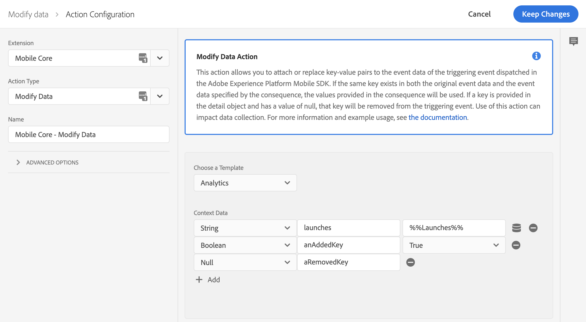
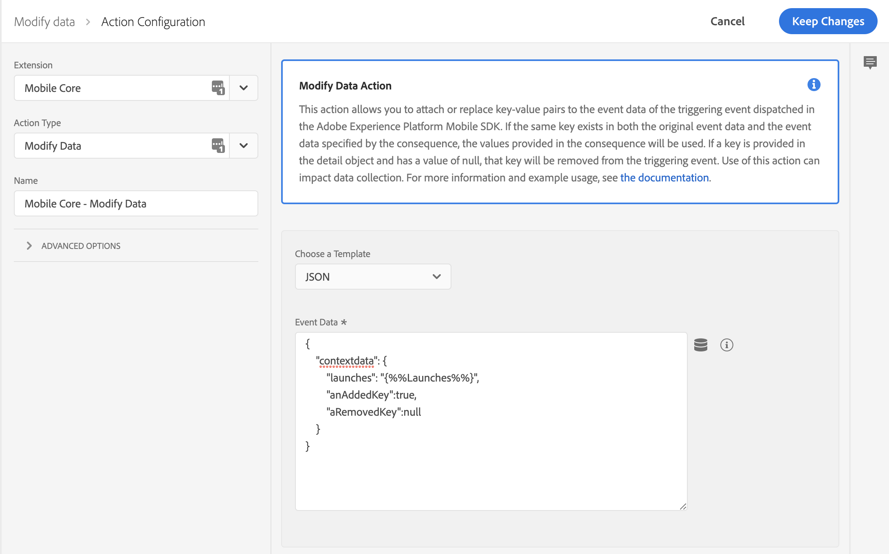
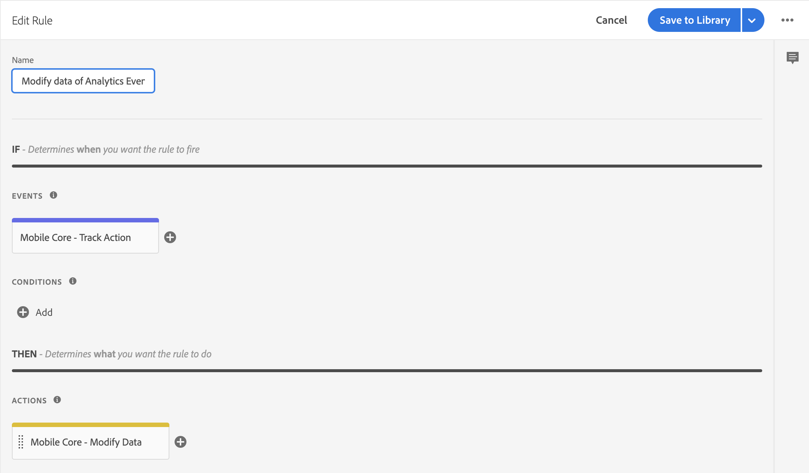

# Modify data in SDK events

The modify data rule action is supported in [Mobile Core](../../foundation-extensions/mobile-core/) starting from version 2.1.14 (Launch), version 2.7.0 (iOS), and 1.5.5 (Android). This action is powerful, complex, and enables advanced use cases.

To use this action, you need to learn how events flow in the Adobe Experience Platform Mobile SDK and how they interact with the [rules engine](../../foundation-extensions/mobile-core/rules-engine/).

## Context

### What are SDK events?

In the Experience Platform Mobile SDK, events hold all the data that is required by other extensions to complete the necessary actions. Events have the following properties:

| Property | Description |
| :--- | :--- |
| Type | Describes the event. Examples include Adobe Analytics, Adobe Target, and Adobe Lifecycle. |
| Source | Indicates the cause of or directionality of the event. For example, a request or a response. |
| Event data | Additional data is required to define the event. For example, context data on an Analytics event. |

Extensions that register with [Mobile Core](../../foundation-extensions/mobile-core/) will also register event listeners. A listener is defined by a combination of event type and source. When the SDK event hub processes an event, it notifies all listeners that match the provided combination.

### How are events created in the SDK?

Events are created by an extension and are dispatched to the SDK Event Hub. Each published rule that is created in Adobe Experience Platform Launch is evaluated against the current event. Finally, the event is passed to each of the listeners for events with this type / source combination.


Events are created and dispatched when an SDK public API is invoked. Attach data action use cases are meant to act on these types of events.


### What is the Rules Engine?

The Rules Engine lives in the SDK Event Hub. Before listeners are notified, the Rules Engine evaluates each Experience Platform Launch rule against the triggering event. A rule is defined by the following properties:

| Property | Description |
| :--- | :--- |
| Event | Trigger for the rule. |
| Condition | Definition of the criteria to compare against the triggering event. |
| Action | The resulting action if the evaluation of the rule is positive. |


A rule might be read out in the following way: If the SDK **Event** occurs and **Condition(s)** are met, then perform the **Action(s)**.


## Using the modify data action

**Modify Data** is a type of Rule Action that allows you to add, change, or remove event data to an SDK event. The modification of data happens in the Rules Engine before event listeners are notified of the event.


Modify data rule actions may modify or remove data from the triggering event.

If there is a conflict between the data that is defined in your rule and the data in the event, the data in the event will be overwritten.


### Defining a payload for the modify data action

When defining a payload for the modify data action, the payload must match the format of the triggering event. For example, if you want to modify context data in an Adobe Analytics event, you need to know where the context data is defined on that event and match the format in your rule.

For this reason, it is highly recommended that you use the **Template** if it is available. If not, please enable verbose logging in the SDK and carefully study the format of the event to which you will modify the data. If the format does not match, most likely the expected results will not be received.

## Example - Modifying data in Analytics event

The following sample shows how to modify data to all outgoing `TrackAction` Adobe Analytics network requests. To create this type of rule, select your property in Experience Platform Launch and complete the following steps:

1. [Create a new rule](modify-data.md#create-a-rule)
2. [Select the event you want to trigger the rule](modify-data.md#select-an-event)
3. [Select the action to modify data and define your payload](modify-data.md#define-the-action-using-freeform-json)
4. [Save and rebuild the property](modify-data.md#save-the-rule-and-rebuild-your-property)

### Create a rule

1. On the **Rules** tab, click **Create New Rule**.


If you do not have existing rules for this property, the **Create New Rule** button will be in the middle of the screen. If your property has rules, the button will be in the top right of the screen.


### Select an event

1. Give your rule an easily recognizable name in your list of rules.

   In this example, the rule is named "Modify Analytics Track Action Events".

2. Under the **Events** section, click **Add**.
3. From the **Extension** dropdown list, select **Mobile Core**.
4. From the **Event Type** dropdown list, select **Track Action**.
5. Click **Keep Changes**.

### Define the action using Template

1. Under the **Actions** section, click **Add**.
2. From the **Extension** dropdown list, select **Mobile Core**.
3. From the **Action Type** dropdown list, select **Modify Data**.
4. On the right pane, in the **Context Data** area, click the **Add** button to insert a new key-value pair. Additional key-value pairs can be added by clicking on the Add button for each key-value pair.
5. Select the **Value Type** for the value as String, Number, Boolean or Null. If the value type is selected as Null, the key will be removed from the triggering analytics event.
6. Enter the key and value that needs to be modified in the triggering analytics event.
7. Click **Keep Changes**.

### Define the action using Freeform JSON

1. Under the **Actions** section, click **Add**.
2. From the **Extension** dropdown list, select **Mobile Core**.
3. From the **Action Type** dropdown list, select **Modify Data**.
4. On the right pane, from the **Choose a Template** dropdown list, select **JSON**.
5. In the **JSON Payload** field, type the json data that will modify this event data.
6. Click **Keep Changes**.

On the right pane, you can add a payload that modifies data of an SDK event before an extension that is listening for this event can hear the event. In this example, context data of this event is modified before the Analytics extension processes it. The added context data will now be on the outgoing Analytics hit.

In the following example, the `launches` and `anAddedKey` keys are modified and the `aRemovedKey` key is removed in the `contextdata` of the Adobe Analytics event. Values for the new keys can either be hardcoded in the rule, or dynamically determined by the SDK when this event processes by using Data Elements.

### Save the rule and rebuild your property

After you complete your configuration, verify that your rule looks like the following:

1. Click **Save**
2. Rebuild your Experience Platform Launch property and deploy it to the correct Environment.

